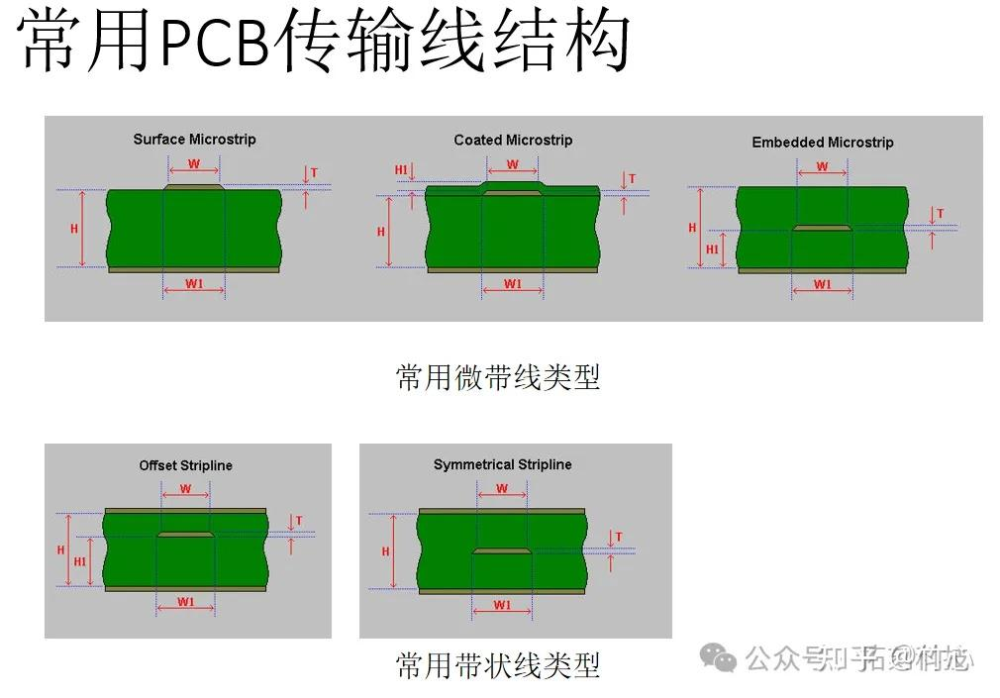
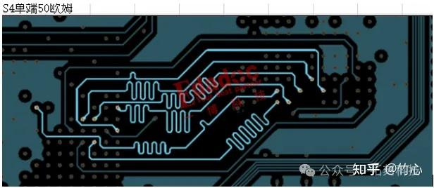
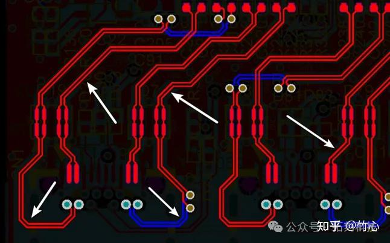
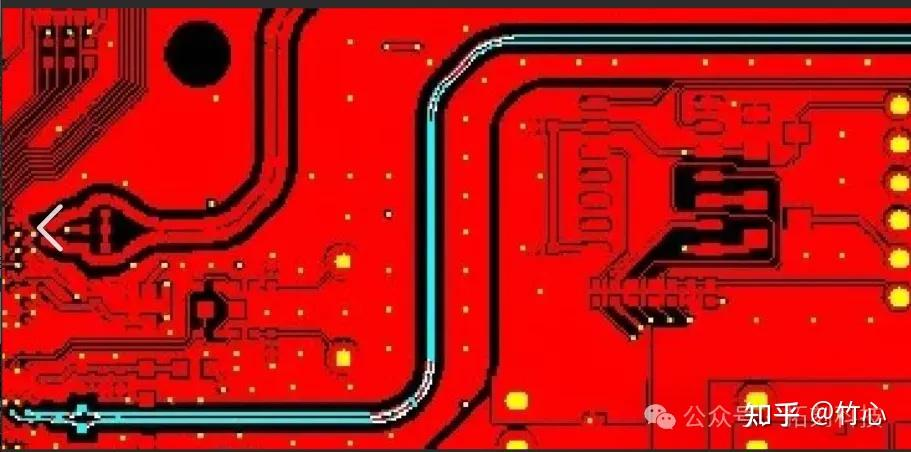

## PCB阻抗计算       
### 参数说明
对于PCB的设计来说，走线阻抗计算是相当重要的一环     
计算走线阻抗需要的参数如下：   
1. 走线线宽     
2. 走线厚度      
3, 走线间距   
3. 介电层厚度（或者叫PP层厚度）    
4. 介电层介电系数    
      
这些参数在allergo中的setup菜单中的cross_section_report中可以查询到    

### 走线类型   
另一种重要的部分是对走线的类型进行划分    
1.  微带线还是带状线      
2.  单端阻抗,差分阻抗,还是共面阻抗        

       

微带线：用电介质将导线与地（电源）平面隔开的传输线（在PCB表层，仅有一个参考平面）分两种微带线，一种是埋入的（在内层），一种是非埋入的。微带线特性阻抗由导线的厚度、宽度、基材厚度及介电常数决定。主要用于双层和多层板。   

带状线:信号线位于两层接地面（或电源）之间的介质内的导线（在内层，有两个参考平面,注意,这个参考平面只会是地平面和电源平面,不会是PP层）根据传输线与两接地平面的距离相同或不同，又分为对称带状线和非对称带状线.        
带状线的特性阻抗由导线的厚度、宽度、介电常数，及接地平面的距离有关。带状线两边都有电源或者底层，因此阻抗容易控制，同时屏蔽较好。

单端阻抗：针对单个导线的阻抗，如微带线（Microstrip）和带状线（Stripline）。       

差分阻抗：针对一对差分信号线的阻抗，常用于USB、HDMI等高速接口。像这样2根线保持一定间距并列传输的阻抗即为差分阻抗.       

共面阻抗：包括共面单端和共面差分阻抗，适用于特定结构的PCB布局。像这样，阻抗线被铜包围着的即为共面阻抗    

### 阻抗的计算   
阻抗的计算一般而言,是由是根据上面两种类型的情况加上阻抗计算软件结合来计算的  