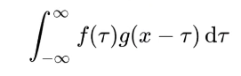
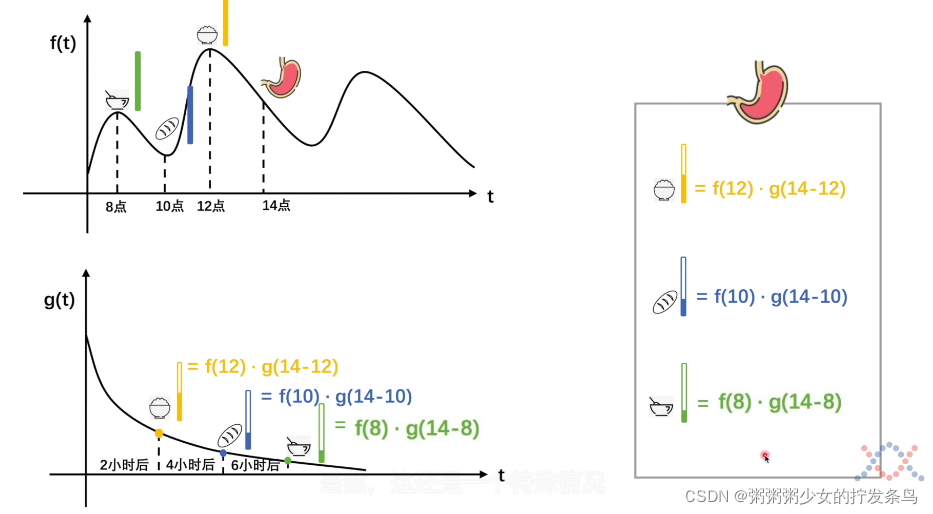
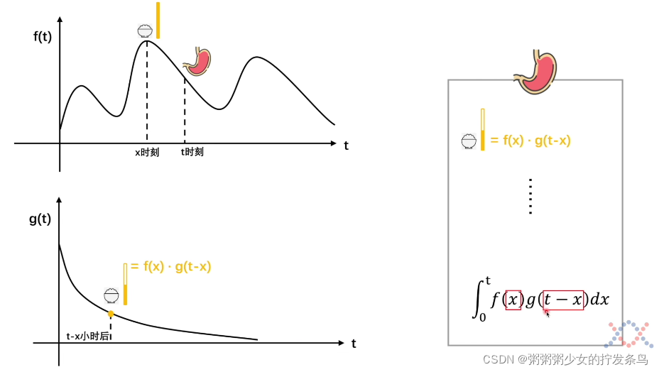
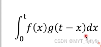
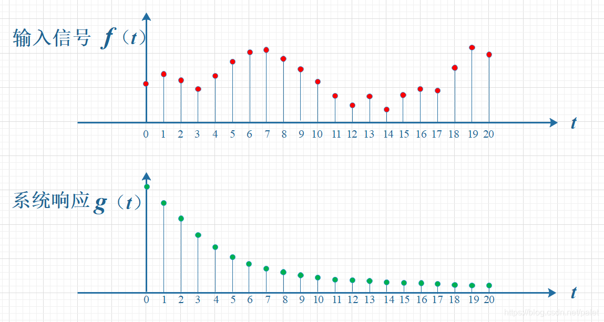

# 卷积    

## 卷积的定义   

教科书上对卷积的定义为    

先对g函数进行翻转，相当于在数轴上把g函数从右边褶到左边去，也就是卷积的“卷”的由来。

然后再把g函数平移到n，在这个位置对两个函数的对应点相乘，然后相加，这个过程是卷积的“积”的过程。        

**所谓两个函数的卷积，本质上就是先将一个函数翻转，然后进行滑动叠加**

我们对于卷积的理解可以理解为此刻的结果是前面所有输入响应后结果的叠加

## 通俗的解释    

我们以吃饭为例子     

    

我们将f(t)视为吃东西(输入),g(t)视为吃进肚子里的东西的残余量(响应) ,残余量随时间减少(消化了)       

那么我们计算在x时刻吃下去的东西最后在t时刻算胃里的食物总量     

      

我们可以计算在X时刻我们吃了饭f(x),它在t时刻的响应为g(t-x),那么f(x)*g(t-x)既是饭在t时刻的残留量      

我们对所有的实物进行相加,即可以得到所有食物在t时刻的残留量

## 例子   

上面的通俗解释,同样适用于信号,过去输入经过响应后对现在的影响

输入信号是 f(t) ，是随时间变化的。系统响应函数是 g(t) ，图中的响应函数是随时间指数下降的，它的物理意义是说：如果在 t=0 的时刻有一个输入，那么随着时间的流逝，这个输入将不断衰减。换言之，到了 t=T时刻，原来在 t=0 时刻的输入f(0)的值将衰减为f(0)g(T)。
