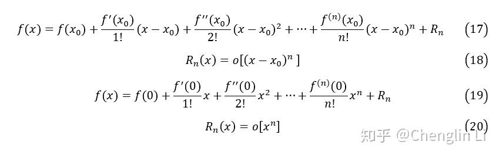
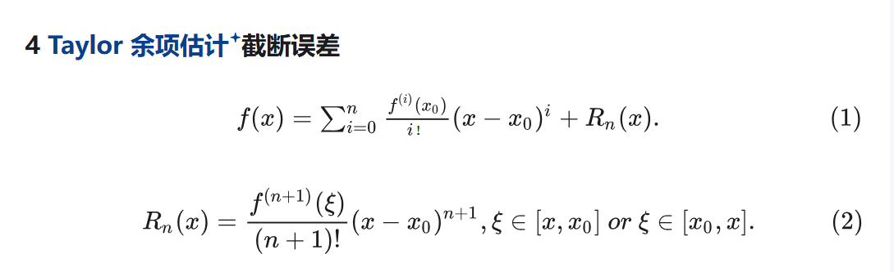
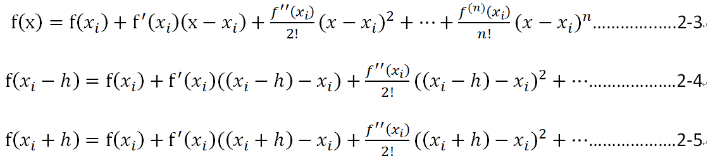
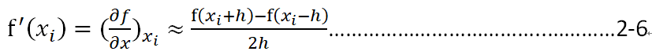

# 前置知识   

## 泰勒公式   

泰勒公式是将一个在x0处具有n阶导数的函数f(x)，利用关于(x-x0)的n次多项式来逼近函数的方法。其中X需要在这个包含X0在内可以进行n阶导数的范围内，才可以近似。    

举例：F（x）在（1~10）内包含6阶导数，1和10是奇点，我们令X0 = 2，那么对于X0来说，X0的邻域就是（1,10），对于所有处于（1,10）内的X都满足泰勒公式    

f（x） = f（X0）+f(X0)'(X-X0)...............       

误差Rn的常见表达形式是拉格朗日余项:    

# 有限差分求导   

有限差分法以变量离散取值后对应的函数值来近似微分方程中独立变量的连续取值。有限差分方法放弃了微分方程中独立变量可以取连续值的特征，而关注独立变量离散取值后对应的函数值。但这种方法仍然可以达到任意满意的计算精度。因为方程的连续数值解可以通过减小独立变量离散取值的间隔，或通过离散点上的函数值插值计算来近似得到。

有限差分法的具体操作分为两个部分：

1、用差分代替微分方程中的微分，将连续变化的变量离散化，从而得到差分方程组的数学形式；

2、求解差分方程组。

一个函数在x点上的一阶和二阶微商，可以近似地用它临近的两点上的函数值的差分来表示。如对一个单变量函数f(x)，x为定义在区间[a,b]上的连续变量，以步长 h= x将区间[a,b]离散化，得到一系列节点。

x1 = a , x2 = x1+h = a+h , … , xn+1 = a + nh = b

然后求出f(x)在这些点上的近似值。显然步长h越小，近似的精度越高。与节点xi相邻的节点有xi-h和xi+h，所以在节点xi处，可以构造如下形式的差值：

节点的一阶向前差分：f(xi+h)-f(xi)

节点的一阶向后差分：f(xi)-f(xi-h)

节点的一阶中心差分：f(xi+h)-f(xi-h)

本文使用中心差分法利用泰勒展开式求解3.3中使用的导数，现做如下推导。

函数f(x)在xi处的泰勒展开式为：

忽略平方以后的项,(xi-h)-xi = -h,(xi+h)-xi = h,联立2-4与2-5解得:   

    

不过这样的误差就是O((x-xi)^2) = O(h^2),因为上面是让x = xi-h得出的2-4    

当h = 1/2时,既是相差1的差分f'(xi) = f(x+1/2) - f(x-1/2)

因此,我们可以用差分的方法近似来进行求导,当然,这个一般是给离散函数用的