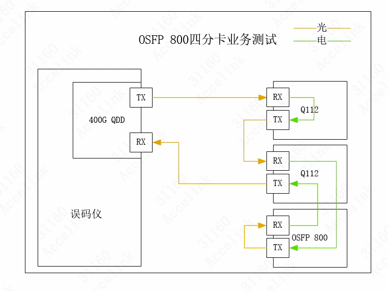

## OSFP 800G产品业务测试
对产品进行业务测试，误码仪通过光连接发送光信息到1号QSFP112G高速光模块中将其转化为电信号，1号QSFP112G高速光模块再将电信号转化为光信号传输到2号QSFP中，2号QSFP将此光信号转化为电信号传输至OSFP800G上，在OSFP内部传输后返回给2号QSFP112G，经由2号QSFP112G将信号传输回误码仪中，误码仪将输出信号和接收信号进行对比，通过比较两者的不同得出整个系统的误码率，如果误码率在可接受范围内，那么产品的业务测试通过。

