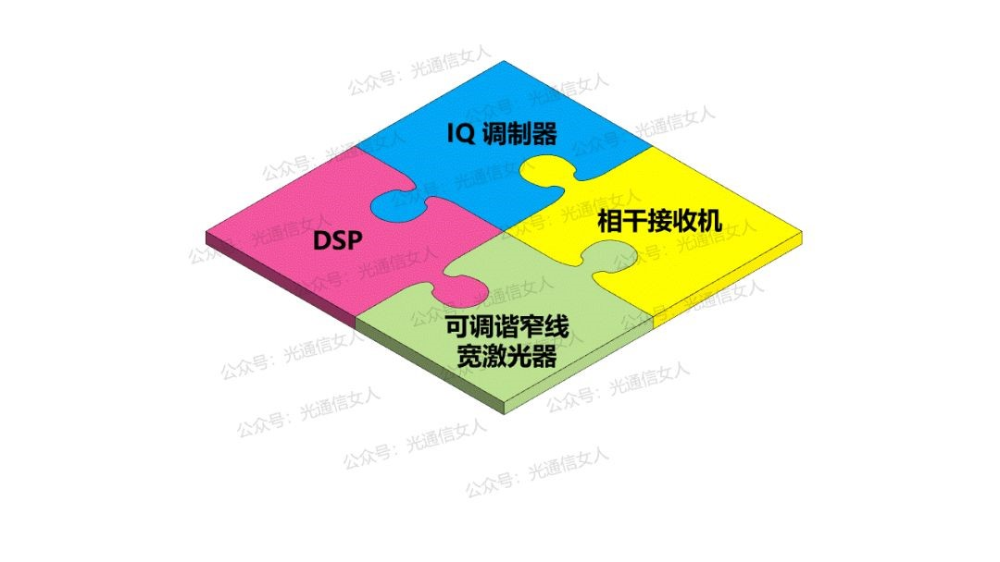
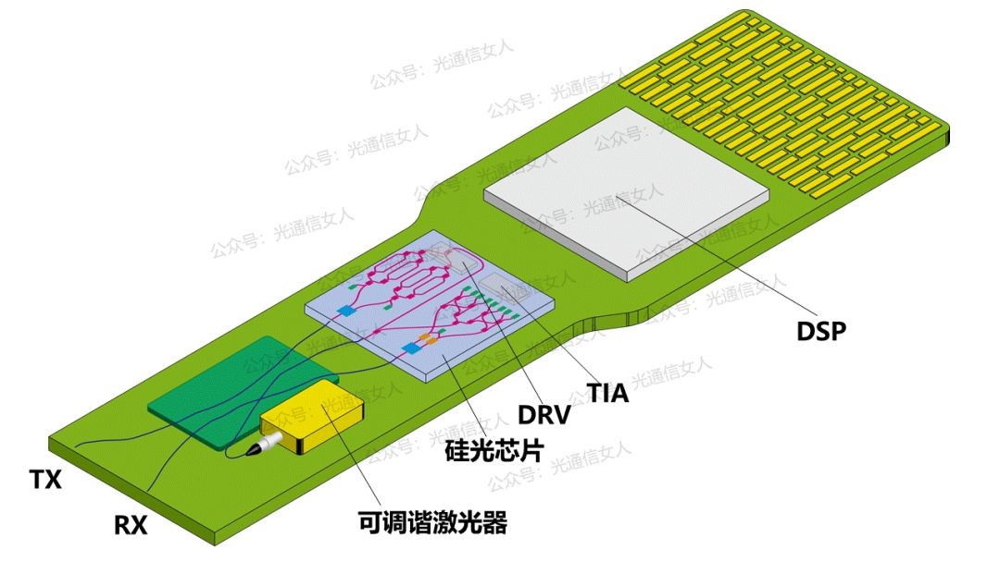
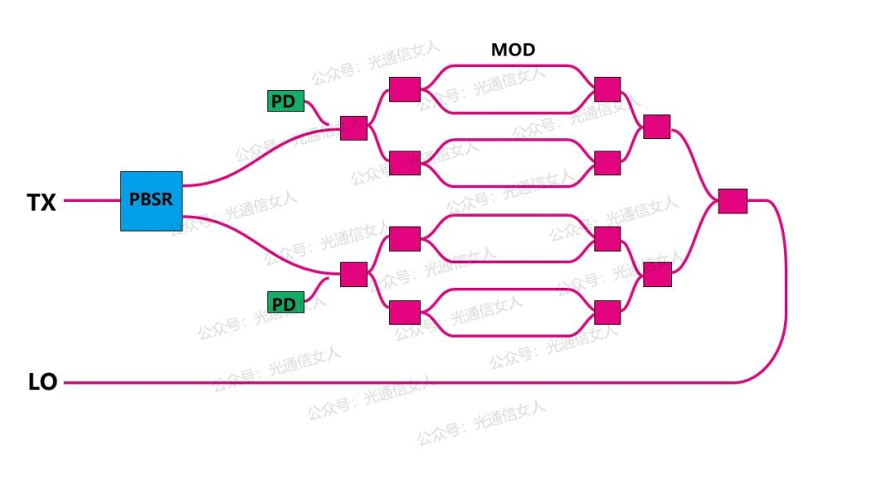
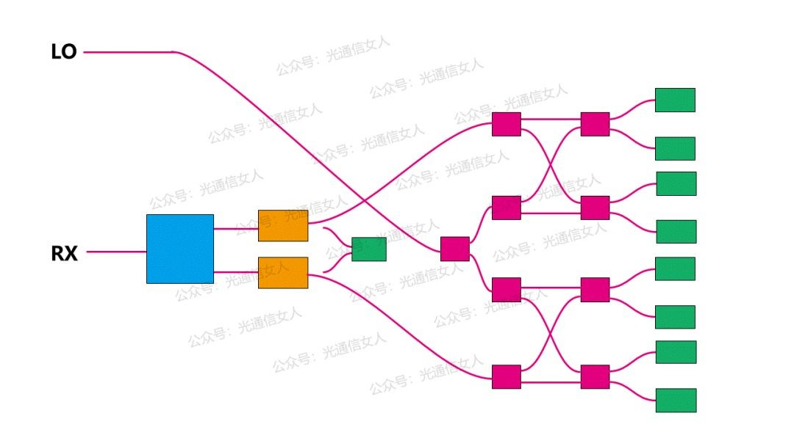
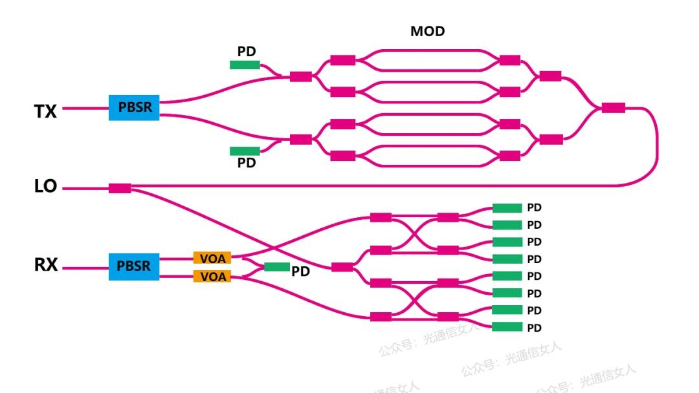
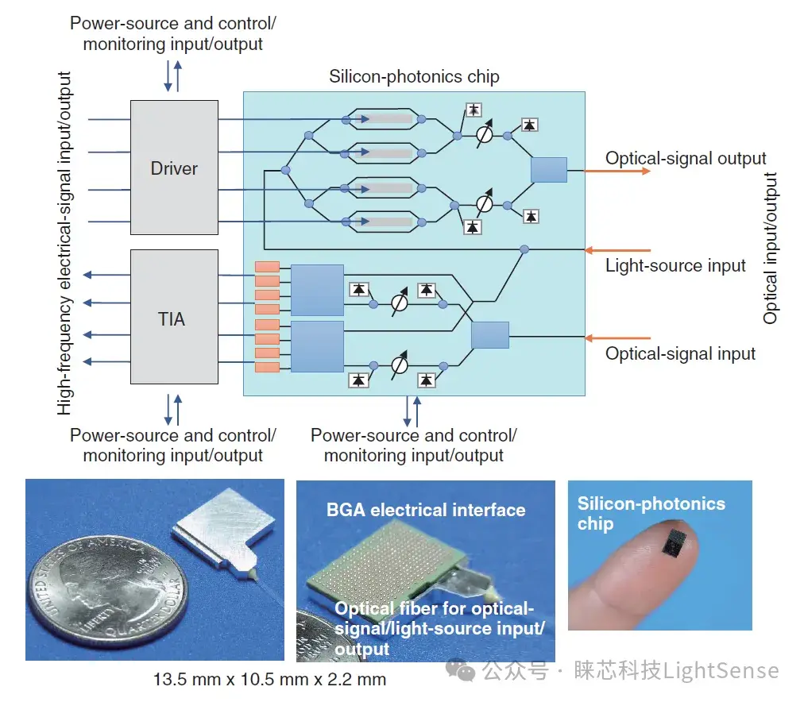

## cosa
相干模块有个词叫COSA，Coherent  Optical Sub Assembly，相干光器件    

## 光模块   
一个光模块的器件一般由一下几个部分来组合     
      

整块光模块的布局如下

其中DRV全称driver为驱动器，TIA为夸阻放大器

### IQ调制器           
IQ调制器就是做IQ调制的(笔记中有介绍），对光信号进行IQ调制后传输     
     
其中LO是本地振荡器，Local Oscillator   
通过MOD（调制器modulator）由多个调制器对相位和强度进行调制，将信号光调制进LO中     
PD或者叫MPD是光电二极管（monitor photodiode）是用来产生光电流被AD采样传输到DSP中对光强度进行检测         
PBSR：是 Polarization Beam Splitter / Recombiner（偏振分束/合束器)，用于将输入光信号按偏振态分离或合并。   

### 相干接收机  
相干接收机就是对接收到的光信号进行解调     
   
相干检测可以从光载波中通过与本地振荡器 local Oscillator （LO是本振光源 )正交相乘来得到一个具有振幅、频率和相位的信息光             

橙色的是VOA，全称是variable optical attenuator 可变光衰减器    

### DSP     
DSP负责处理复杂的信息     
### 可调谐窄线宽激光器（ITLA）    
理解为激光器即可 ，它的目的是为IQ调制器和相干接收器提供LO即可调节的振荡光   
     

## cosa组成   
对于cosa，一般是将IQ调制器和相干接收器组合在一起形成一个收发一体的器件

较为完整的COSA组成
