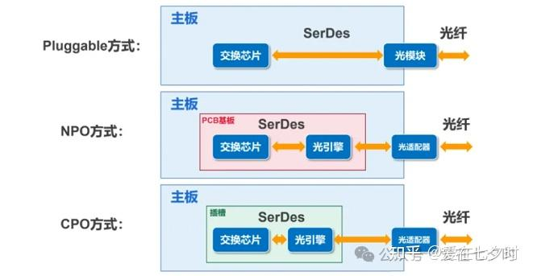
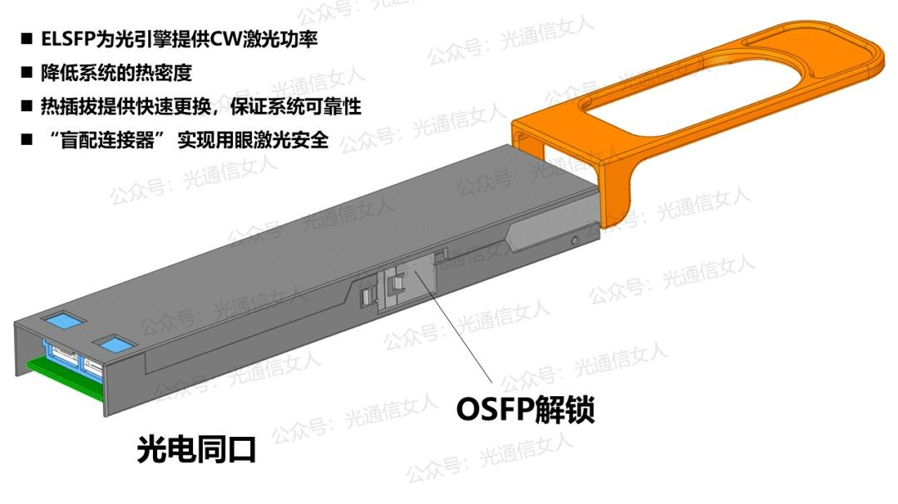
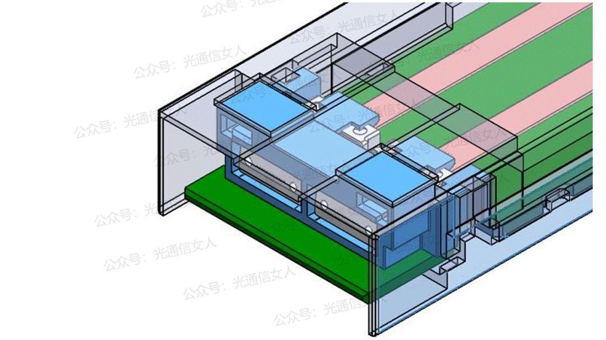
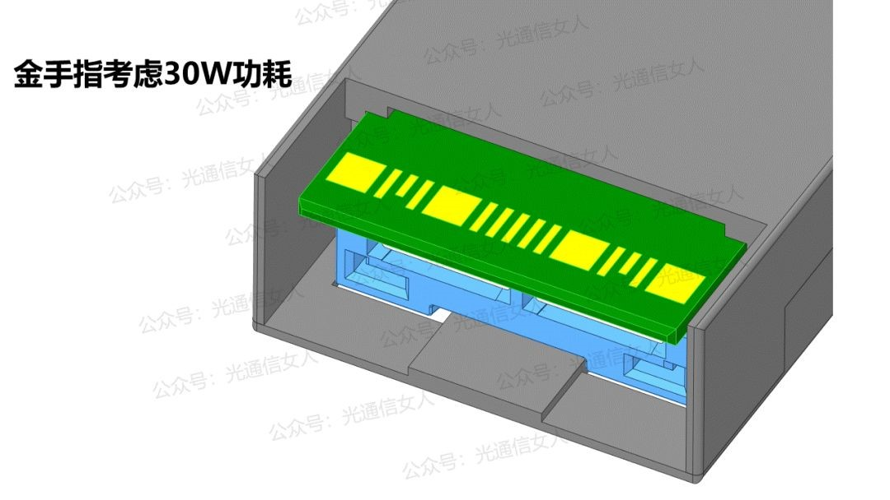
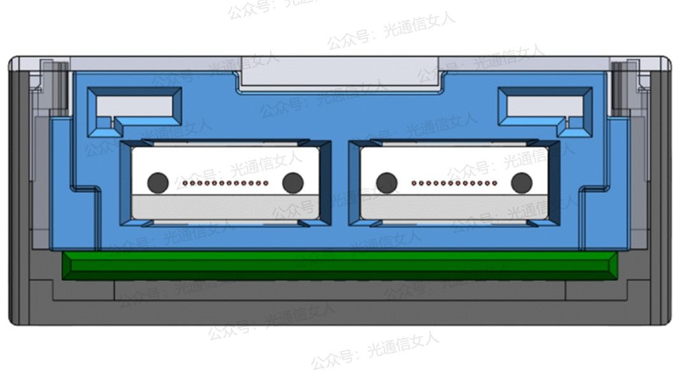
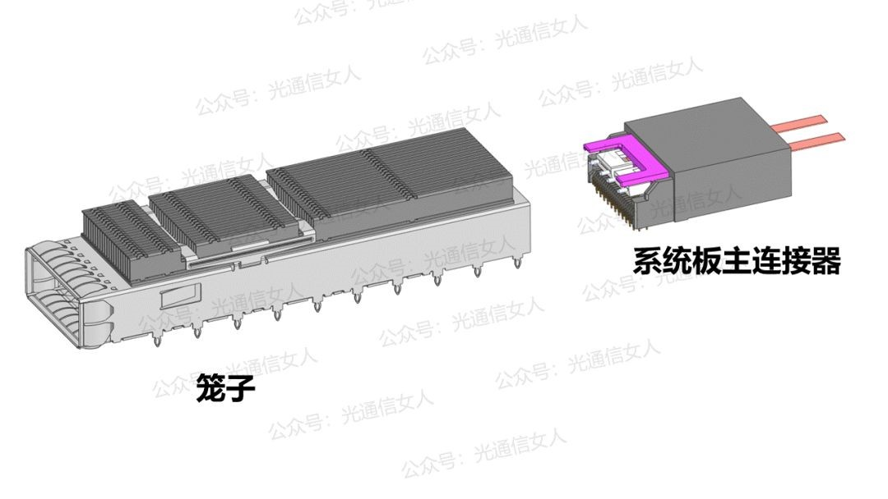
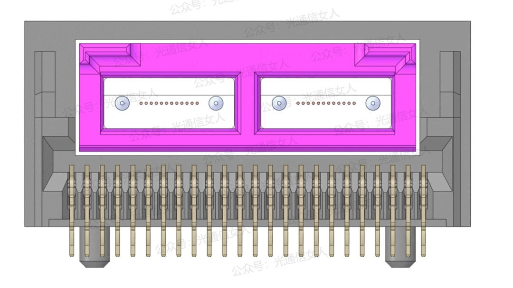
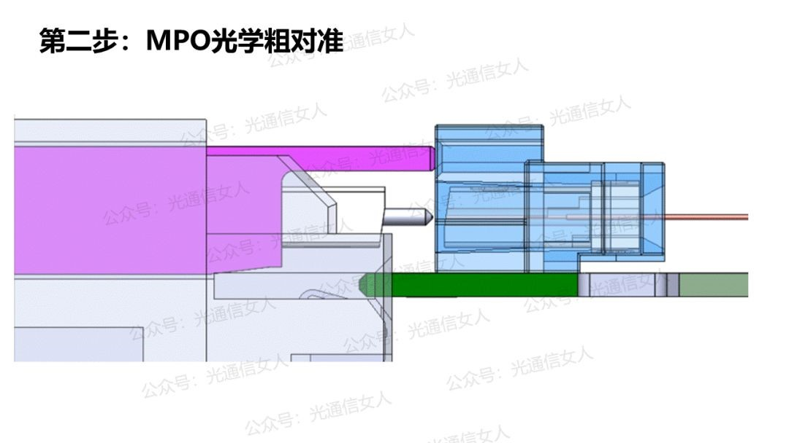
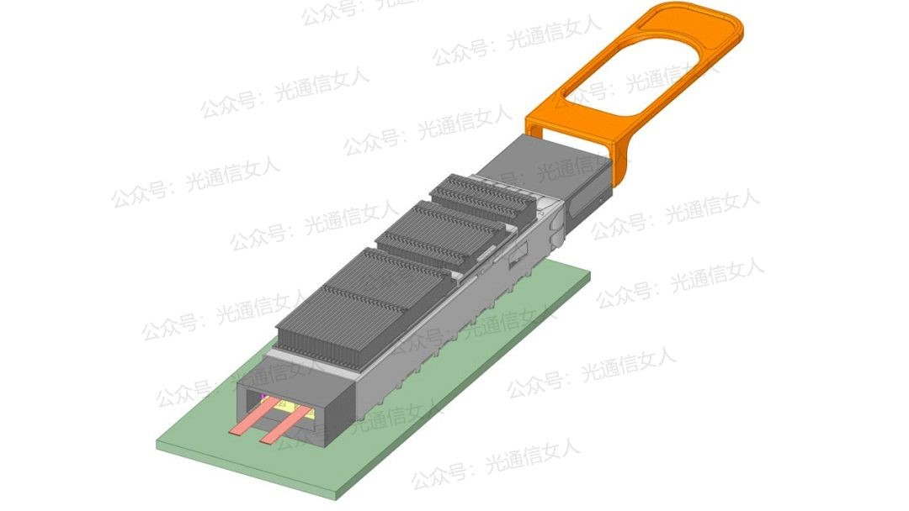

# 前置知识   

激光器：如文字表述，激光器是光源，用来产生光的

CPO：Co-packaged optics-共封装光学，也可称之为：光电共封装，CPO是将交换芯片和[光引擎](https://zhida.zhihu.com/search?content_id=247809556&content_type=Article&match_order=1&q=光引擎&zhida_source=entity)共同装配在同一个Socketed (插槽)上,形成芯片和模组的共封装。这里所说的“光引擎”（Optical Engine，简称OE，它的核心职责是实现**光电信号之间的转换**——把电信号变成光信号发射出去，同时把接收到的光信号变回电信号）的意思就是指“光模块”。

> 
>
> 最基础的就是pluggable,将光模块插在主板PCB上通过交换芯片连接   
> NPO是近封装技术,将光引擎和交换芯片封装在同一个主板上的过渡阶段         
>
> 最高级的就是使用CPO共封装技术,将交换芯片和光模块集成在一块芯片上,放在一个插槽上    

激光器和光引擎之间的关系:**激光器是“光源”，光引擎（OE）是“用光干活”的“加工中心”**。    

在传统的非CPO方案（或早期CPO方案）中，激光器通常**就是光引擎的一部分**。

- 光引擎内部集成了激光器芯片，由它产生光。
- 光引擎再通过内部的调制器，把电信号加载到激光器发出的光上，最终输出携带信息的光信号。
- 这时候，激光器是光引擎的“子组件”。   
- 而在CPO架构中,激光器被**物理上**从光引擎里拿了出来,它们是两个独立的器件

# ELSFP   

**ELSFP**是**External Laser Small Form-Factor Pluggable**（外置激光器小型可插拔模块）的缩写,从它的名字中可以知道这是一个外置的激光器    

这个外置激光器本身没有进行信号调制的能力,信号调制主要是依靠封装在PCB板上的CPO来提供    

​         

 ## ELSFP模块样式介绍        

### ELSFP样式

这是一个完整的ELSFP模块,ELSFP配置CW激光源，考虑30W功耗，由于激光器的单纤功率很大，用眼安全是个大问题，采用的“盲插”型光学连接结构(所谓的盲插就是把激光器连接的位置遮蔽起来,防止伤害到眼睛) ,ELSFP的前端接口图如下        

顶部

底部

正面

### ELSFP连接笼子/座子

而在主板上,CPO通过系统板主连接器与ELSFP连接,这个笼子是用来固定ELSFP的    

### ELSFP连接   

