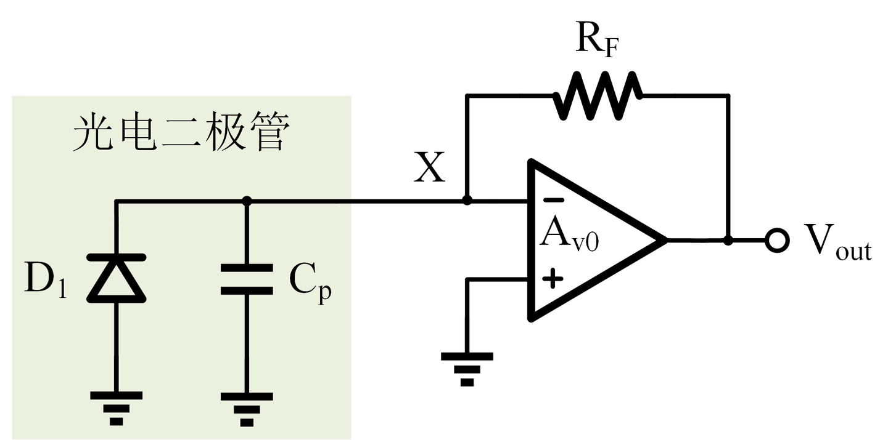

## TIA 应用场景   
跨阻放大器（Transimpedance Amplifier，简称TIA）在现代电子電路中扮演着重要角色，特别是在光通信系统和传感器应用中。   
跨阻放大器是专门设计用于将输入电流信号转换为电压信号输出的放大器。这种转换过程伴随着信号放大，使TIA在需要检测和处理微弱电流信号的应用中特别有用。     

## TIA 工作原理    
TIA的基本工作原理源于欧姆定律。当电流（Iin）流过电阻（R）时，会在电阻两端产生电压降（Vr）。这种关系可以用以下等式表示  
Vr = Iin * R       
在TIA的背景下，这一原理被用来将输入电流转换为相应的电压信号。放大器随后处理这个电压信号以产生最终输出。   
TIA在光接收器中得到广泛应用，光接收器是光通信系统中的关键组件。典型的光接收器由三个主要元素组成     
光检测器：将入射光信号转换为电流。  
放大器：在这种情况下，TIA将光检测器的电流信号转换并放大。  
信号处理线路：进一步处理放大后的信号以供后续使用。      
TIA充当光检测器和信号处理线路之间的桥梁，确保光检测器产生的微弱电流信号被转换为更强的电压信号，这些信号可以更容易地被处理和分析。    
     
其中CP是光电二极管的寄生电容      
x位点虚短电压为0V,光电二极管将接受到的调制好的光信号转化为电流信号Iin,经过反馈电阻转化,得到Vout = -Iin * Rf(因为是反向端）        

  
