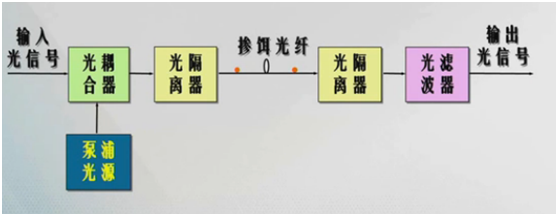

# 器件介绍   

VOA：可变光衰减器 (Variable Optical Attenuator)    

TOF：可调谐光滤波器 (Tunable Optical Filter)    

VTOF：VTOF是将以上两个器件合并后形成的一个单独的器件   

EDFA：是掺饵光纤放大器，它是由如下器件构成的   

| 器件名称                | 核心作用                                                     | 补充说明                                                     |
| :---------------------- | :----------------------------------------------------------- | :----------------------------------------------------------- |
| **掺铒光纤 (EDF)**      | **增益介质**，信号放大的场所。                               | 是EDFA的“心脏”，通常为几米到几十米长。                       |
| **泵浦光源 (Pump LD)**  | **能量来源**，为铒离子提供能量。                             | 通常使用高功率的**980nm或1480nm**半导体激光器。              |
| **波分复用器 (WDM)**    | **光合路器**，将信号光与泵浦光高效地耦合进同一根掺铒光纤中。 | 也称光耦合器，是确保泵浦能量有效传递给信号的关键。           |
| **光隔离器 (Isolator)** | **光单向阀**，确保光只能单向传输。                           | 输入端的隔离器防止反射光干扰前端；输出端的则防止反射光进入放大器产生振荡。 |
| **光滤波器 (Filter)**   | **噪声滤除器**，滤除放大过程中产生的自发辐射噪声（ASE）。    | 用于提升输出信号的信噪比，也称为增益平坦滤波器（GFF）。      |

EDFA通过“**泵浦光提供能量 → 掺铒光纤作为介质 → 信号光诱导受激辐射**”这一过程实现光信号的直接放大。其构成可简化为：**核心增益介质（掺铒光纤）+ 能量源（泵浦激光器）+ 关键无源器件（WDM、隔离器、滤波器）+ 控制电路**。

# 光路介绍   

