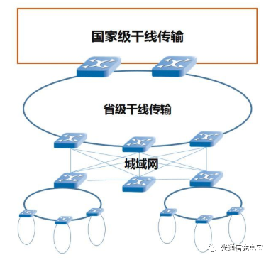
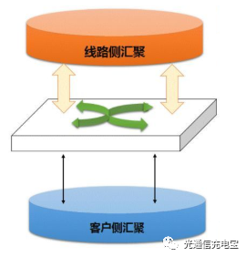

## 线路侧和客户侧光模块   

OTN，也就是我们常说的光传送网，它包括长途干线和城域网。通常把这两部分称为光传输网，而再往下的就是边缘接入网了，也就更靠近用户了。于是也就大体上能明白哪是客户侧了，通俗来讲，用于将信号汇聚到主干光纤传输网链路的设备就是[线路侧]设备了，对应的光模块就叫[线路侧]光模块，而反之如果是传输网对外接口，用来连接到用户的设备上的话就属于客户侧了。

更稍微具体一点，如下图，交换机连接的上层和下层，低速口通常对应的是接到客户侧设备上，而汇聚层的高速接口是连接到[线路侧]设备上。信号在网路中传输/路由/交换的道理其实就跟我们网购快递送货的物流过程类似，先打包送到一个个物流中转站，然后装货车，然后再送到省市的物流枢纽，然后再飞机、火车这样的更大容量的封装然后到了用户这边，进行相反的操作，根据目的地进行有选择性的再次分装，快递员用小车送达。这个过程跟下图其实也没有太本质的区别，甚至路由算法也可以用于物流规划中，说白了程序员也是通用的。

基于上面图示，也很容易理解[线路侧]和客户侧光模块的特点了。[线路侧]是面向长途骨干，要求容量大、性能好，相干、波分、放大、高阶调制这些高端的最好全都拿来用上，贵点不要紧，这银子有广大纳税人来分担的；而客户侧可能要直面你的用户，他们要热插拔、低功耗、高密度，还要便宜，替用户想一想，你也觉得卖贵了不行，市场量大丢不起。

我可以这样给你解释:

客户的数据通常较少但是数量很大,使用的时间不固定,传输距离近,所以客户侧模块通常都是速率较低的光模块,直调直检的光模块(比如强度放大的光模块)     

线路侧则是将通过交换机将客户侧的数据汇集起来进行远距离的传输,通常需要通过交换机将客户侧的不同光模块的数据汇集起来,比如8个100G的客户侧光模块的数据汇集在一个线路侧的光模块数据上,因此需要波分(提高容量),应为需要进行长距离传输因此需要相干(长距离传输,相干衰减小)