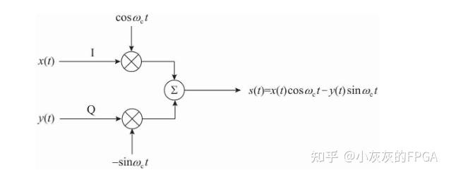
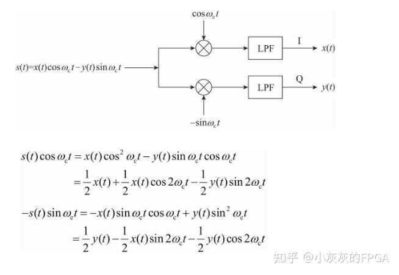

## 一、IQ调制
IQ调制,英文名称为In-phase and Quadrature Modulation，又称为正交调制。这种调制方式是一种高效的信号调制技术，广泛应用于无线通信、雷达、卫星通信等领域。IQ调制的本质是通过两路正交载波信号（余弦和负正弦）同时传输两路调制信号，从而实现并行信号传输。       

## 二、IQ调制的原理    
IQ 调制的过程可以表示为：    
S（t） =  x（t）cosωct + y（t）sinωct          
x(t)和y(t)是调制信号（I 路和 Q 路信号）。   
cos⁡(ωct)和−sin⁡(ωct)是正交载波信号。    
s(t)是调制后的信号   

    
IQ调制利用两路正交载波信号的正交性，将两路调制信号叠加到同一频段内，从而实现频谱效率的提升。至于为什么是正交信号,详细见信号与系统.         

## 三、 IQ信号解调    
IQ解调是从调制信号s(t)中恢复出原始的I路信号x(t)和Q路信号y(t)。解调过程包括：  

与载波信号相乘：
将调制信号s(t)分别与两路正交载波信号cos⁡(ωct)和sin⁡(ωct)相乘，即s(t)⋅cos⁡(ωct)和s(t)⋅sin⁡(ωct)。  

低通滤波：
通过低通滤波器滤除高频成分，保留调制信号的基带成分，从而恢复出原始的I路和Q路信号。  

 