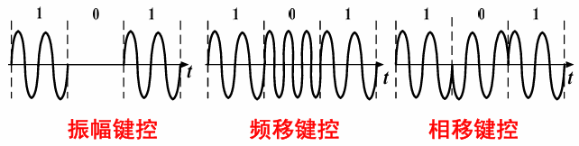

## 什么是QAM调制   
QAM调制，即正交振幅调制    
在此需要大家对幅度调制和相移调制有一个最基本的了解  

幅度调制就是根据码元的不同，来决定载波的不同幅度  

相移调制就是根据码元的不同，来决定载波的不同相位  
    
   

## 16QAM星座图

我们以16QAM信号即16进制的正交振幅调制信号来说明一下星座图是什么

        
16QAM顾名思义是16进制的，因此16QAM信号应该有16种不同的形式，如果用0/1二进制电平来表示16种不同的信号，需要4个二进制电平，因此如果要表示一个16QAM符号，同样也需要有4个0/1符号来表示

      
这就是16QAM映射的原理，如果有一串足够长的二进制0/1信号传来，我们想要辨别他们分别对应的是什么16QAM符号，就需要将这串0/1信号每隔四个信号截断然后组成一组，这样每四个0/1信号就对应了一个16QAM符号，因此就可以由一串0/1码元获得一串16QAM的符号，由四个0/1符号对应获得16QAM符号的过程也称为映射

        
下面是一种常见的16QAM的星座映射图
   

因此可知，每一个QAM符号有唯一的横坐标与纵坐标与之对应（A通常可以取1）

        
这与之前说的每一个QAM符号都有唯一的和与之对应相同，同时经过观察也可以发现，I和Q实际上就对应了QAM符号的横坐标与纵坐标

        
由于信号在传输过程中总会有信道噪声的影响，从而导致接收的信号的坐标并不固定在定义的点上，总会在点的附近有所偏移，从而看上去像星座一样，这也是星座图名称的由来，这在之后的仿真中也有有所涉及
