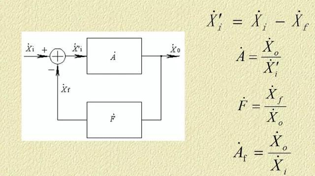
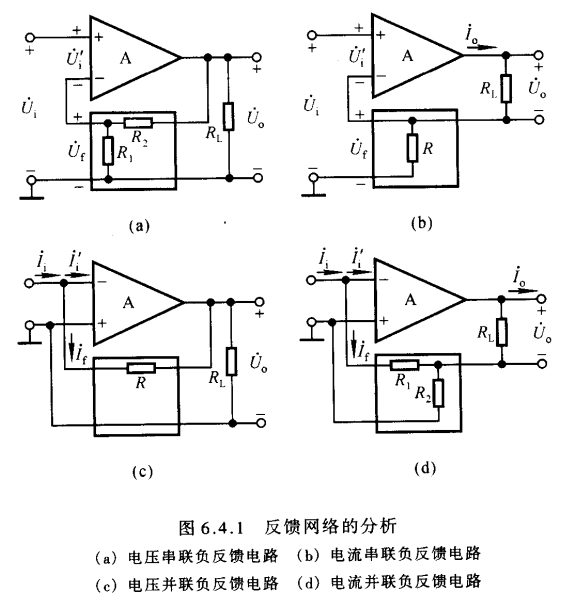
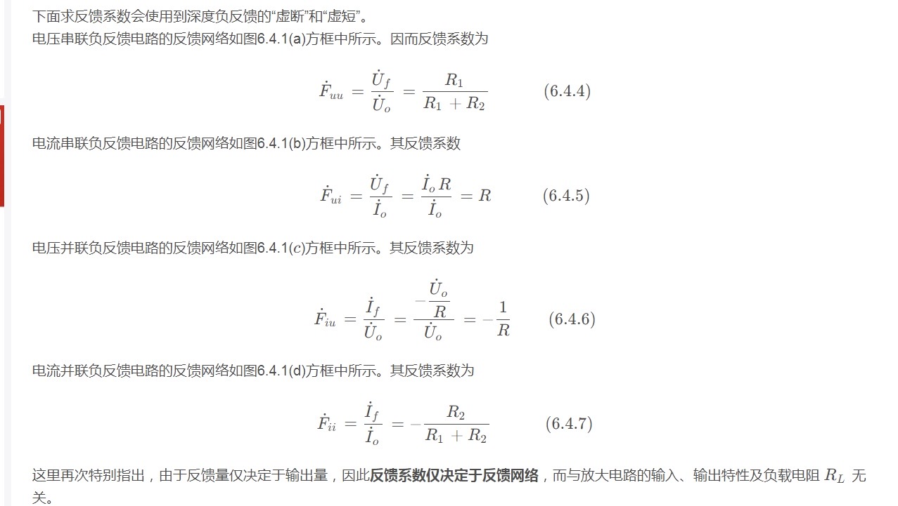

## 负反馈计算框图  
    

## 反馈组态(这个很重要,是用来计算反馈系数的)    
   
    
> 注意电流会从输入流向输出是因为输入接在负端上,放大的是负电压



### 电压电流反馈判断    
只有同时满足两个条件：反馈直接连到Uo输出端；输出电压为零，或者负载电阻RL两端电压为0时 ，反馈信号不存在了，那就是电压反馈。   
其他全都是电流反馈！   

### 串联并联反馈判断  
判断方法一：
若反馈信号为电压量，与输入电压求差而获得净输入电压，则为串联反馈；
若反馈信号为电流量，与输入电流求差而获得净输入电流，则为并联反馈。

判别方法二：
并联反馈：反馈信号与输入信号在同一节点引入，或是并接在放大器的同一个输入端上。
串联反馈：反馈信号和输入信号不在同一节点引入或反馈信号和输入信号加在放大器的不同输入端上。
