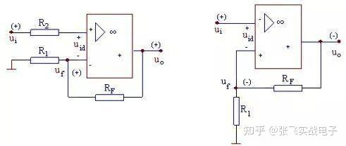
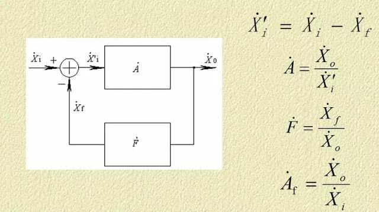
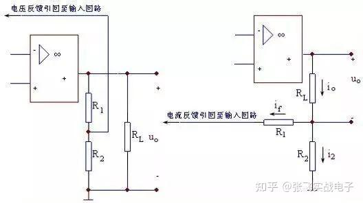
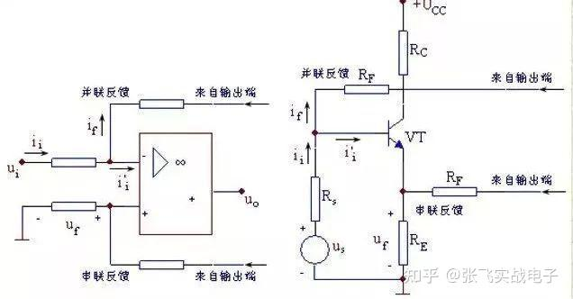
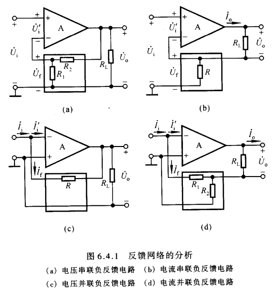
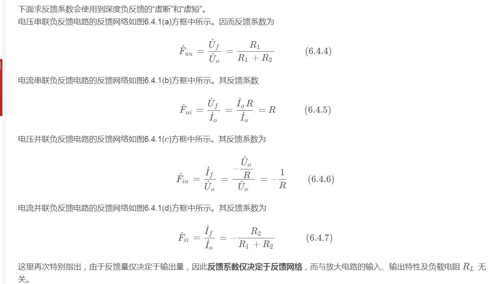
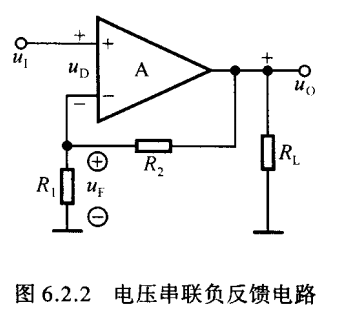
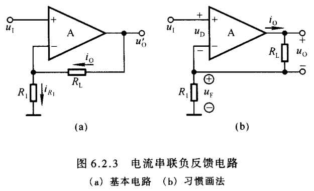
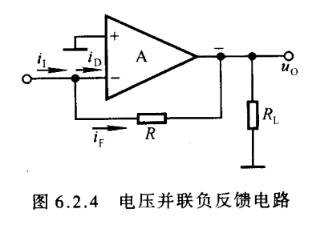
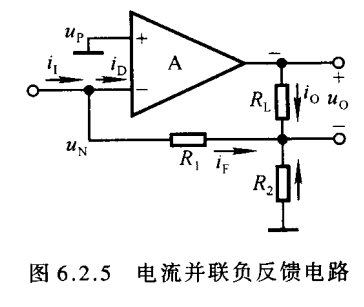

## 正负反馈   
正反馈和负反馈使用瞬时极性法来判断    
   
图 (a) 负反馈 图(b) 正反馈

## 负反馈计算框图  
       

## 反馈组态(这个很重要,是用来计算反馈系数的)    

### 电压电流反馈判断     
判断方法一：     
只有同时满足两个条件：    
1. 反馈直接连到Uo输出端；    
2. 输出电压为零，或者负载电阻RL两端电压为0时 ，反馈信号不存在了，那就是电压反馈。其他全都是电流反馈！      

判断方法二:  
反馈信号与输出电压成正比为电压反馈，即电压完整的从运放的输出端分压部分反馈到输入端，不经过RL负载（如果经过，那么RL上会有压降，而负载需要的电压是无法确定的，那么就不是和完整的Vout成正比，所输出的电压Vout就会变的无法确定）      
反馈信号与输出电流成正比为电流反馈，即电流完整的从运放的输出端经过分流反馈到输出端，需要经过RL负载（如果不经过RL负载，而是像电压反馈那样，负载所取走的电流是无法确定的，那么Iout在一开始就会被分流，那么后面再次进行的分流就不是与完整的Iout，所输出的电流就会变得无法确定）
      

电压电路反馈是决定输出端是电压稳定还是电流稳定,反馈的是电压那么输入端就会根据电压的变化来稳定输出端,反馈的是电流,那么输入端就会根据电流来稳定输出端

### 串联并联反馈判断  
判断方法一：  
若反馈信号为电压量，与输入电压求差而获得净输入电压，则为串联反馈；   
若反馈信号为电流量，与输入电流求差而获得净输入电流，则为并联反馈。   

判别方法二：  
并联反馈：反馈信号与输入信号在同一节点引入，或是并接在放大器的同一个输入端上。   
串联反馈：反馈信号和输入信号不在同一节点引入或反馈信号和输入信号加在放大器的不同输入端上。      

判断方法三:   
反馈信号与输入信号以电压的形式相加，即反馈信号与输入信号串联，即是串联反馈；   
如果反馈信号与输入信号在放大电路输入回路中以电流的形式相加，即反馈信号与输入信号并联，则是并联反馈。   
    

串并联决定了反馈是通过影响输入端的电压还是电流来控制输出端,如果是串联反馈,则由于电压为串联相加,所以通过影响电压来控制输出端,如果是并联反馈,则由于电流为并联相加,所以通过影响电路来控制输出端    

### 反馈组态
   
    
> 注意电流会从输入流向输出是因为输入接在负端上,放大的是负电压         

#### 电压串联反馈    
       
反馈：Uf = R1/(R1+R2) * Uo      
放大倍数: Uo = Ui * (1+R2/R1)      

#### 电流串联反馈
       
反馈: Uf = Io * R1     
放大倍数: Io = Ui/R1      

#### 电压并联反馈     
      
反馈: If = - Uo/R     
放大倍数: Uo = If * R       

#### 电流并联反馈     
        
反馈: If = - R2/(R1 + R2) * Io     
放大倍数: Io = Ii(1+R1/R2)

### 反馈组态的作用   
1. 串联反馈
作用：提高输入电阻，增强对输入信号的获取能力，适合用电压源驱动的输入场景。     

原理：反馈信号与输入信号在输入端以电压形式叠加，增强输入回路的阻抗。
      
应用：常用于高输入阻抗的放大电路，如运算放大器的同相放大。
      
2. 并联反馈
作用：降低输入电阻，增强对输入电流的获取能力，适合用电流源驱动的输入场景。      

原理：反馈信号与输入信号在输入端以电流形式叠加，减小输入回路的阻抗。
      
应用：常用于电流型输入的放大电路，如运算放大器的反相放大。        

3. 电压反馈
作用：稳定输出电压，降低输出电阻，使输出更接近理想电压源。
       
原理：采样输出电压，当输出电压波动时，反馈信号会反向调整，从而稳定电压。
        
应用：需要稳定电压输出的场合，如稳压电源、电压放大器。
        
4. 电流反馈
作用：稳定输出电流，提高输出电阻，使输出更接近理想电流源。
       
原理：采样输出电流，当输出电流波动时，反馈信号会反向调整，从而稳定电流。       

应用：需要稳定电流输出的场合，如恒流源、电流放大器。        

   

   

