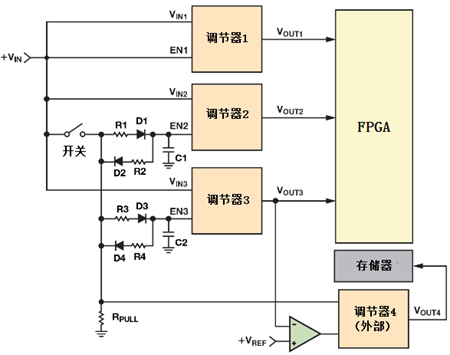
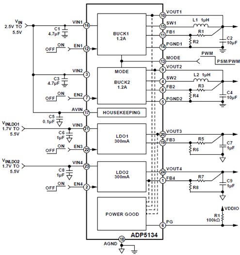
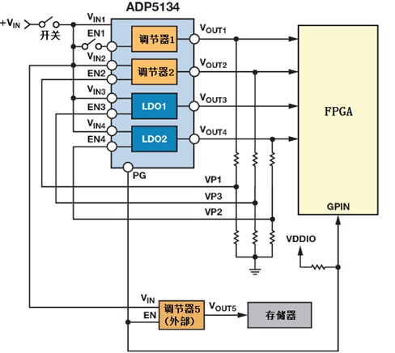
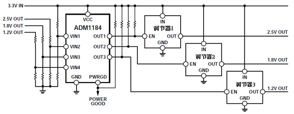

## 时序控制   
在系统设计中经常需要考虑FPGA、微控制器、DSP、ADC 和一些需要多个电压轨供电的器件上电时的序列问题。   
因此如何控制上电时序很重要

### 利用无源器件控制电源时序   
    
进行电源时序控制的简单方法是用无源元件（如电阻、电容和二极管）将信号延迟到调节器的使能引脚上，如下图2所示。当开关闭合时，D1导通而D2保持开路状态。 电容器C1充电，EN2处的电压以R1和C1确定的速率上升。 当开关断开时，电容器C1通过R2、D2和R,PULL向地放电到地。 EN2处的电压以R2，R,PULL和C2确定的速率下降。 更改R1和R2的值会改变充电和放电时间，从而设置调节器的开启和关断时间.    

### 使能输入控制时序    
  
ADP5134内部每个调节器都有一个单独的使能输入。当使能输入的电压升至VIH_EN（最小值为0.9V）以上时，器件便会退出关断状态，并且管理处理模块打开，但不会激活调节器。它的使能输入的电压与精确的内部基准电压（典型值为0.97 V）进行比较。一旦使能引脚上的电压超过精确使能阈值，调节器就会被激活，输出电压开始上升。在输入电压和温度转折处，基准电压的变化仅±3％。这一小范围确保了精确的时序控制，解决了使用无源元件时出现的问题。

当使能输入的电压降至基准电压以下80mV（典型值）时，调节器将被停用。当所有使能输入上的电压降至VIL_EN（最大0.35 V）以下时，器件进入关断模式。在该模式下，功耗降至1µA以下    

### 电阻分压简易控制时序  
  

### 高精度电压控制器控制时序  

对于不具有精确使能功能的调节器, 可以考虑借助外加高精度电压监控器。

如ADI的ADM1184四通道电压监控器，通过精度为0.8%的比较器来监控不同电压水平。这类电压监控器可以用在监测FPGA、微控制器、DSP系统的电压电源，确保系统每次使能都按顺序正确启动、上电和关断。    

### 优劣对比
|系统要求|方案|
|---|---|
|一般的时序控制|简单使用无源元件|
|精确的时序控制|利用调节器的精密使能输入进行时序控制既简单又轻松，每个通道只需要加上两个外部电阻即可|
|更精确的时序控制|通过外加高精度电压监控器来监控不同电压水平|
