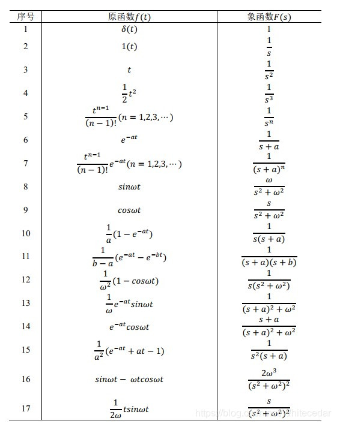
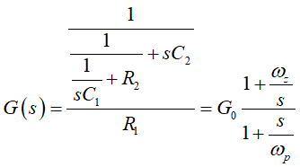
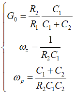
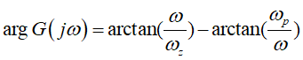
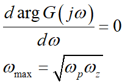
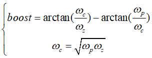
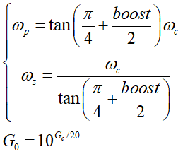

# TYPE-2型补偿器 原理介绍    

## 前提介绍   

type-2型补偿器是用在DC-DC直流电压上使用的(这个很重要)    

首先电阻分压比须满足

Vout*Rlower/(R1+Rlower) = Vref

此关系(直流条件)，后面的一切才能正常运行

才能保证运放工作在线性区。        

## 原理讲解       

### 直流条件下   

在直流条件下,由于C1和C2在直流条件下可以视为断路,此时为开环增益,运算放大器正负端无电压差,所以输出为0.      

### 存在交流条件下   

当Vout存在抖动时,会等效于

Vout = Vdc + Vac       

将Type-2型补偿器,转化为小信号模型    

那么就有

Vref = 0(交流等效0V)    

那么Rlower的电流就是0A(由欧姆定理),所有交流电流从反馈回路流出    

那么有

Iac = Vac/R1    

设补偿网络的阻抗为Z(S)(拉式变换中的阻抗) ,Vac 拉式变换为 V(S),Iac拉式变换为I(S) 

> 拉式变换中,电容阻抗为1/SC,电阻阻抗为R,电感阻抗为SL    
>
> 附一张拉式变换表   
>
> 
>
> 

那么就会有   

Vcon(S) = I(S) * Z(S)   

那么传递函数G(S)就为   

Vcon(S) = V(S)/R1 * Z(S)    

Vcon(S)/V(S) = Z(s)/R1    

其中wz，wp就是二型补偿的一对零极点

可以通过对G(S)这个系统进行分析,来得到这个系统提供的增益和相位    

其中wz，wp就是二型补偿的一对零极点，正是这对零极点提供了一个相位补偿的作用，使得我们可以设计更高的截止频率

系统的相位补偿为:   

假设我们希望取其能提供的最大相位，也就是对w求导  

这样很直观得到了二型补偿器的参数：   

boost为你希望提升的相位，wc为你设计的截止频率

那么最后二型补偿器的零极点设计和补偿增益设计为下：

