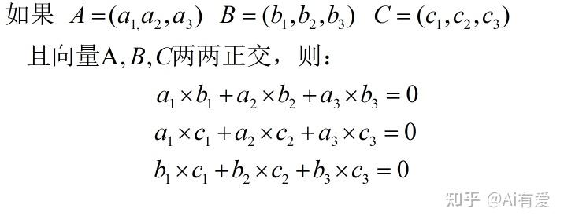

## 向量正交
如果我想表示的不是平面（二维）上的向量呢？而是三维的呢？显然需要三个不线性相关的向量A,B,C,才能表示出三维空间上的任意一个向量V= αA+βB +γC,而且要三个两两正交的向量，这样才能更好地求出α，β，γ。正交即对应坐标相乘的和为0；
   

如果是四维呢?显然要四个不线性相关的正交向量来表示四维空间的任意向量；五维，六维，也是如此。  

我们在回到二维平面看一下，如果我们知道A，B两两正交，那当我们知道有另外一个向量P与向量A正交，那么向量p与向量B有什么关系呢？显然P与B线性相关。  

如果是三维空间，三个两两正交向量A,B,C,当我们知道有另外一个向量P与向量A，B正交,那么P与C线性相关。  

如果是四维空间，如果有一个向量P与四个两两正交向量其中的三个向量正交，P必定与剩下的一个向量线性相关。  

如果是n维空间，如果有一个向量P与n个两两正交向量其中的(n-1)个向量正交,P必定与剩下的一个向量线性相关。  

## 函数正交   
其实函数的本质就是向量（个人的理解而已），连续函数就是无穷大维的向量，离散函数可以是无穷大维的向量，也可以是有限维向量.     
    
上面已说，这M个M维向量两两正交，于是我们就很容易就得出了这几个函数是正交函数    
这时，相信你已经理解了什么是正交函数，简单的说，如果两个函数在[a,b]正交，就是两个函数在[a,b]区间的每一个点的函数值相乘的和为零。

 

