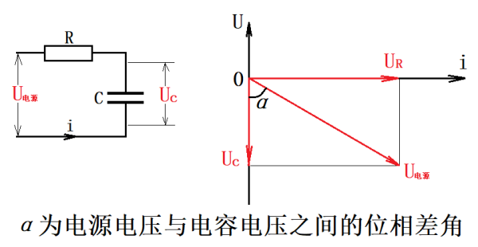

# 电压电流超前滞后计算  
## 电容式计算  
电容和一个电阻串联，则电容两端的电压和电源电压变化不同步，存在位相差。电阻的电压和流过的电流相位相同，流过电容的电流相位超前电压相位90°，这个是基础知识，以此为计算。   
   
根据这个可以得到电容和电源的向量夹角,以此判断超前滞后   

## 分压计算公式  
Xc = -j * 1/2πfc     
> 注意这里是以欧姆为单位     

Vout = Vin * (Xc / \sqrt{R^2 + Xc^2})

     