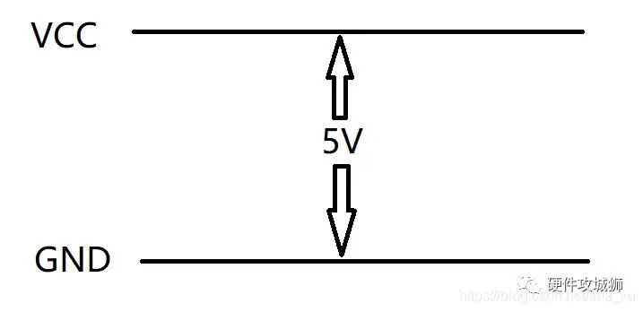
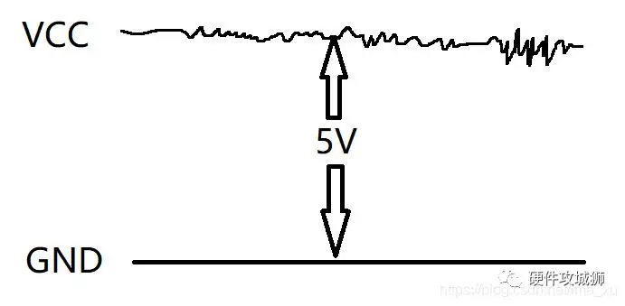
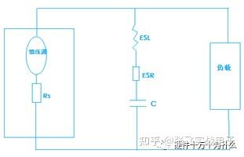
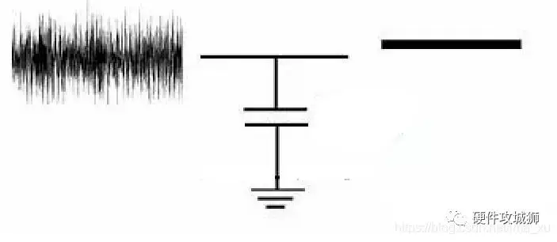
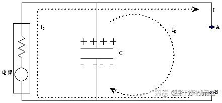
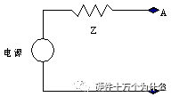
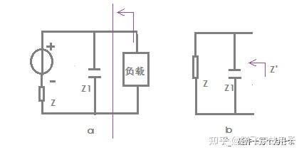
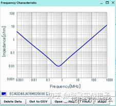
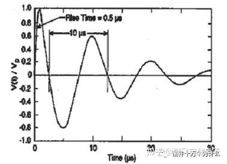

## 电路中的电容     

## 去耦电容         

你有没有遇到过这样的情况？电路板明明按原理图连得一丝不苟，电源也稳稳当当，可一上电，芯片就是工作不稳定——时而复位、时而死机，示波器一看，电源轨上全是“毛刺”。

别急着换电源模块或怀疑PCB厂工艺， 问题很可能出在那些不起眼的小电容身上：去耦电容 。

它们看起来简单，焊上去也不费劲，但如果你以为“随便并个0.1μF就行”，那系统出问题几乎是迟早的事。   
尤其是在高速数字电路、FPGA、ADC/DAC前端或者射频系统中，一个没设计好的去耦网络，足以让整个项目卡在调试阶段动弹不得。  

今天我们就来深挖一下这个“小元件大作用”的经典话题—— 去耦电容的真正机制与工程实践 。不是照搬手册，而是从实际痛点出发，讲清楚它为什么必须存在、怎么选、怎么放、又该如何验证效果。   

###  为何负载电流增加，电压就会变得不稳定          

理想情况下,对于某个负载,其电源   

   

但是电路板上各个负载的工作都要动态地吸收电流，造成的供电电压的不稳，变成了下面这样子  

     

也就是在5V的DC上叠加了各种高频率的噪声，这些噪声是由于器件对供电电流的需求导致的电压波动，可以看成是在DC 5V上“耦和”了由于器件工作带来的AC噪声。

这样耦和了AC的DC供电电压不仅会影响本负载区域内的电路的工作，也会影响到其它连接在同一个VCC上的其它负载的工作，有可能导致那些负载的电路工作出现问题

我们使用的电源可以等效成一个理想的电压源和和一个内阻的串联来表示实际的电源     

电源的输出Vo = E（电动势） - I*R    

对于理想电压源而言电动势E是不变的，当输出电流Io增加时，内阻r上分担的电压Io*r也会增加，Vo就会减小，随后电源通过内部的调节网络，减小内阻r使得Vo又上升回来。反之，当Io减小时，内阻r上分担的电压Io*r也会减小，Vo就会减增加，随后电源通过内部的调节网络，增加内阻r使得Vo又上升回来。（这种调节的情况一般是使用电压转换芯片后才有的，比如使用12V转3V3芯片，芯片内部可以调节输出为3v3）

### 参数   
一般真实的电容是不会等于理想的容值的,一般也需要参考ESR,ESL,SRF      
ESR:  等效串联电阻,决定损耗和发热,影响阻尼特性    
ESL: 等效串联电感,主导高频性能,限制可用带宽    
SRF: 由电容和等效串联电感形成的自谐振频率,超过此频率后电容变"电感",失效   
这几个参数直接决定了电容的去耦能效    
例如随着频率上升，电容的阻抗先下降（容性区），到达最低点（SRF处），然后开始上升（感性区）。一旦进入感性区，它不仅不能滤噪，还可能放大某些频段的噪声      
- 一个标准0805封装的0.1μF X7R陶瓷电容，ESL约为1.5nH，SRF约在20–30MHz；  
- 同样容值但用0402封装，ESL降到0.6nH左右，SRF可推高至80MHz以上；  
- 若再使用0201甚至倒装结构（如LGA），ESL还能进一步压缩到0.3nH以下，适合GHz级应用。

   

因此， 越小的封装，越低的ESL，越高的有效频率范围 。这也是为什么现代高速设计普遍采用0402及更小尺寸MLCC的原因      

### 什么是耦合？什么是去耦    
#### 耦合（Coupling）
定义：耦合是指两个或多个电路元件之间存在相互影响或相互作用的现象。这种相互影响可以是正向的，也可以是负向的。  
作用：耦合可用于增强信号传输、提高系统灵敏度、实现能量传递等。      
应用场景：   
电容耦合：通过电容元件连接两个电路，使得信号可以通过电场传播，而不会直接让电流通过。这通常用于高频信号的传输，因为电容对低频信号的阻抗较大。     

电感耦合：通过电感元件实现耦合，通常是在变压器中使用。这种耦合方式通过磁场传递能量，在电路之间实现信号或功率的传输。

直接耦合：两个电路直接连接，没有任何中介元件。比如，两个放大器直接连接，信号会通过导线直接传输。

变压器耦合：通过变压器将两个电路连接。变压器的工作原理基于电磁感应，通过线圈之间的磁场传递能量。

耦合的方式不同，电路之间的传递特性也有所不同。例如，电容耦合通常用来阻止直流分量而只传递交流信号，而变压器耦合则可以改变电压的幅度、频率等。

耦合还涉及到耦合度和隔离度等参数，影响信号传递的效果和电路之间的干扰。    

#### 去耦（Decoupling）   
定义：去耦是指通过某些方式减少或消除电路中不需要的耦合现象，使电路元件之间的相互影响尽可能小，保持电路稳定性。    
作用：去耦可用于降低噪声、提高系统的抗干扰能力、减少信号失真等。   
应用场景：      
1. 退耦电容是最常见的一种方式。它们通过与电源并联，提供低阻抗路径来滤除电源上的噪声和波动。不同类型的电容器适用于不同的频率范围：

高频退耦：通常使用小电容值（如0.1μF到0.01μF）陶瓷电容器，主要用于滤除高频噪声。

低频退耦：对于较低频率的噪声，使用大电容（如10μF或更高）电解电容器或钽电容器。

退耦电容通常会放置在电源引脚和地之间，靠近电源引脚的位置，以最大限度地降低噪声的耦合。(PCB时要注意)   
2. 去耦电感（电源线滤波）

去耦电感通常与退耦电容一起使用，通过提供对高频噪声的阻抗，阻止噪声信号通过电源线传递到电路中。电感能够有效地隔离电源噪声，尤其在高频电路中非常有效。（高频）

3. PCB布局优化
   

合理的PCB布局是实现有效退耦的重要手段之一。通过优化电源层和地层的布置，减少电源和地线之间的阻抗，可以有效减小噪声传播的路径。

4. 电源滤波器  
电源滤波器（如LC滤波器）通常用于更强的电源噪声抑制。它们由电感和电容组成，形成一个低通滤波器，可以有效地过滤掉高频噪声信号。适用于对电源质量要求较高的系统。

5. 分隔电源和地

有时候，特别是在复杂的多电压电路中，会采用将不同电源（如模拟和数字电源）分隔的方式，确保它们的噪声不会互相干扰。这通常需要在PCB上设计专用的电源层和地层，以便将不同区域的电源信号隔离开来。（用模拟地和数字地使他们形成不了回路）   

6. 隔离变压器

在某些高频或高电压的应用中，使用隔离变压器可以有效地断开电源系统和电路之间的耦合路径。变压器通过磁耦合将信号从一个电路传递到另一个电路，同时隔离电源噪声。

7. 使用低噪声电源   
选择低噪声的电源或稳压芯片，也是减少电源噪声和提高退耦效果的一个有效方法。例如，专为低噪声设计的LDO（低压差稳压器）或DC-DC转换器，可以提供更干净的电源，减少外部噪声的影响。    

8. 数字电路中的退耦    
在数字电路中，退耦通常需要特别注意高速信号对电源噪声的影响。数字信号的高频成分可能会通过电源传输并影响模拟电路，因此需要精确设计电源引脚的退耦电容和适当的接地布线。

选择适合的退耦方式可以有效降低电源噪声，保持电路的稳定性和性能。在实际设计中，通常会结合多种方法来实现退耦效果。   

### 为什么要去耦   
我们常听说：“给每个电源引脚加个0.1μF电容。”但这句话背后隐藏了一个关键前提： 主电源并不能实时响应瞬态电流需求。   

举个例子：一块FPGA在配置瞬间，成千上万个I/O同时翻转，电流可能在几纳秒内从几十mA飙升到几安培。这种剧烈变化带来的 di/dt （电流变化率）极大。   

而任何导线都不是理想的，哪怕是一段短短的PCB走线，也有寄生电感。假设这段路径有5nH电感（非常保守估计），当 di/dt 达到 1A/ns 时，根据公式：   
V = L*di/dt = 5*10(-9次方) * 10(9次方) = 5V    
这意味着仅因路径电感，就会在电源线上产生高达5V的感应电压！虽然这是极端理想化计算，但在现实中， 几百毫伏的电压下冲（droop）和振铃（ringing）极为常见 ，足以让1.2V核心电压的芯片进入欠压锁定状态。    
这时候，远端的LDO或DC-DC转换器根本来不及反应——它们的反馈环路响应时间通常在微秒级，而数字开关动作发生在纳秒级。    
于是， 去耦电容的角色就凸显出来了：它是一个“本地能量仓库” ，能在主电源还没意识到“出事了”的时候，第一时间补上这口“真气

### 去耦电容的原理作用      

我们可以把去耦电容理解为一个 高频旁路 + 局部储能 的双重装置。

1. 高频噪声短接到地

对于高频干扰信号来说，电容呈现低阻抗通路。电源上的高频噪声（比如来自开关电源的纹波、数字信号串扰）会被直接“导入”地平面，而不是沿着电源线四处传播，污染其他器件。

这就是所谓的“旁路”功能，尤其对MHz以上的噪声特别有效。       

从电源上看，没有去耦电容的时候如左侧的波形，加上了去耦电容之后变成了右侧的样子，供电电压的波形变得干净了，我们称该电容的作用是去掉了耦和在干净的DC上的噪声，所以该电容被称之为去耦电容，当然也可以被称之为旁路（Bypass）电容，因为该电容将DC上耦和的噪声给旁路到地上去了，只留下干净的DC给后续的电路   

2. 提供瞬态电流支持

更关键的是它的“去耦”能力。当IC突然拉电流时，去耦电容就近放电，承担了大部分瞬态供电任务，从而避免了远端电源路径上的大电流突变引发电压塌陷。   
注意：这里的关键是“近”。如果电容离芯片太远，连接路径本身的电感反而会削弱其响应速度，甚至形成谐振回路，适得其反。

所以一句话总结：

去耦电容的本质，是在时间和空间两个维度上弥补主电源响应延迟，维持局部电压稳定。

更加深刻的原理介绍        
从储能的角度来理解去耦电容
由I = C*du/dt 可知    
只要电容量C足够大，只需很小的电压变化，电容就可以提供足够大的电流，满足负载瞬态电流的要求。这样就保证了负载芯片电压的变化在容许的范围内。这里，相当于电容预先存储了一部分电能，在负载需要的时候释放出来，即电容是储能元件。储能电容的存在使负载消耗的能量得到快速补充，因此保证了负载两端电压不至于有太大变化，此时电容担负的是局部电源的角色。    
这样的话我们一般认为电容越大越好,但是在实际电路中,由于存在寄生电感和电阻,所以并不一定.
假设在低频段，比如几十khz，由于低频信号在电感上产生的感抗可以忽略，所以在低频段电容的ESL可以近似等于0。当负载瞬间（几十khz）需要大电流的时候，电容可以通过ESR向负载供电，供电的实时性很高，eSR只是消耗了一部分电量，但不影响供电的实时性。由于频率比较低，所以放电时间也比较长（频率的倒数），所以需要电容的容量较大一些，可以长时间放电。所以低频段储能好理解。  

同样大的电容，假设负载突变的频率较高（几十Mhz或者更高），那么当负载瞬时变化的时候（几十Mhz或者更高），ESL上形成的感抗不容忽视，这个感抗会产生一个反向电动势去阻止电容向负载供电，所以负载上实际获得的电流的瞬态性能比较差，即，电容的电流无法供应瞬间的电流突变，尽管电容容量很大，但由于ESL较大，此时的大容量储能发挥不了作用。实际上，频率较高，电容给负载供电的时间缩短（频率的倒数），也不需要电容有那么大的储能。对于高频，关键的因素是ESL，要降低电容的ESL，选择小封装的小电容，ESL显著降低，这就是为什么我们高频选择小电容的原因，另外走线长度引入的电感也会折算到ESL参数里，所以小电容一定要靠近pin。    
从储能的这个角度理解甚至可以扩展到pF级电容。理论上假设不存在ESR，ESL以及传输阻抗为0，则一颗大电容完全胜任所有频率。但这种假设并不存在。所以电路中需要大小电容合理搭配去应对不同频率下的负载的能力供给。而且电容越靠近负载，传输线的等效电感，电阻的影响就越小.      
从储能的角度来理解电源退耦，非常直观易懂，但是对电路设计帮助不大。因为不好从量化角度去考量，适合定性分析。从阻抗的角度理解电容退耦，能让我们设计电路时有章可循。实际上，在决定电源分配系统的去耦电容量的时候，用的就是阻抗的概念

从阻抗的角度来理解退耦    
分析如下电路图:   
     
从AB两点向左看过去，稳压电源以及电容退耦系统一起，可以看成一个复合的电源系统。这个电源系统的特点是：不论AB两点间负载瞬态电流如何变化，都能保证AB两点间的电压保持稳定，即AB两点间电压变化很小    
我们可以用一个等效电源模型表示上面这个复合的电源系统，如图3，恒压源与内阻的串联模型。   
   
V = Z*I    
假设供电源是一个理想的电压源，即Z=0，且假设传输途径的阻抗也为0，那么负载不论怎么变化，变化速度有多快，电压源都能够反应过来，并且确保A，B两点电压始终恒定。但实际上电源内阻并不为零(有复阻抗导致电流电压不是瞬时变化)，而且传输线也不是理想的，而且这些影响因素是个复数，与频率相关，所以就出现了电源的PDN阻抗。
我们的最终设计目标是，不论AB两点间负载瞬态电流如何变化，都要保持AB两点间电压变化范围很小，根据公式，这个要求等效于电源系统的阻抗Z要足够低,而我们要实现这一点,就需要耦合电容来降低Z值的大小     
因此从等效的角度出发，可以说去耦电容降低了电源系统的阻抗    
实际上，电源分配系统设计的最根本的原则就是使阻抗最小。最有效的设计方法就是在这个原则指导下产生的。       

 

### 如何使用    
没有哪个单一容值能覆盖从kHz到GHz的全频段去耦需求。正确的做法是采用“ 阶梯式容值组合 ”即多级去耦，形成宽频低阻抗的PDN（Power Distribution Network)     
常用的三级去耦策略如下:    
1-100uf:低端储能,应对慢速负载变化      
0.1-1uf:中频主力,覆盖几十Mhz以内      
10Pf-1nf: 高频去耦,抑制GHZ级噪声       
这些电容并联后，各自的SRF错开，在整个目标频段内共同拉低PDN阻抗，实现“广谱去耦”。

### 去耦电容值的计算    
对电源输出阻抗的分析: 断开负载，从负载端看进去，恒压源短路，横流源断路    
      
并联电容后从负载端看过去电源的内阻发生新的变化，即Z’=Z//Z1,其中Z1为电容的容抗。可见新的内阻Z’<Z，故电源端电源随负载的变化量减小，但Z’是个复数，随频率相关，不同的频率下内阻不一样，电源PDN做的就是如何在各个频率段下阻抗尽可能小。理论上，并联无数个电容，电源内阻总可以无限接近于0，从而电源无限接近于恒压源或恒流源。        
在包含了ESR和ESL下，电容的阻抗随频率变化图如下：   
         

这图包含了电容的容量信息，一般容量越大的电容谐振点越低，即容值越大的电容其容抗越小，电路呈现容性的频率越低。

多个不同谐振点的电容并联，就可以构成一个的同频带，保存通过的电压信号，滤过不需要的噪声和纹波信号（因为并联时的阻抗是小于单个阻抗的）   

假如我们使用阻抗特性描述电容时，千万不要再使用蓄流的概念理解，比如，PMU上使用10uF电容和使用4.7uf电容从阻抗曲线上看有一些区别，但我们可以接受，此时千万不要再以蓄流为理由说10uF比4.7uF储能多，所以效果好，两种研究方法是从不同角度去分析同一个问题，交织在一起会混乱。建议使用阻抗法分析，可以做到定量分析。

  

#### 实例分析       

面对这样的浪涌   

   

假设我们要消除如图所示的浪涌波形，需要加电容，但加多大的电容，如果从电容充放电角度去分析非常复杂，一两页纸张都不容易讲明白。但假如从阻抗角度分析，我们只需要一个简单的要求，即加一颗电容，使得图8所示的谐波被短路到GND，浪涌就消除了。怎么实现这个要求呢，必须选择一颗电容，使得该电容对于该浪涌信号的频率下的阻抗最低即可。所以思路清晰了，按照两部走：

1 确定浪涌信号的频率。由图可以看出浪涌信号近似于正弦波，基波频率大概为100khz，只有在起始瞬间会有一些高次谐波，对于这个高次谐波可以估计一下，大概为几Mhz级别。

2 寻找两颗电容，一颗谐振点在100kHz的电容去消除浪涌信号中的基波信号。再找一颗谐振点在几Mhz的电容去消除浪涌信号中的高次谐波。假如对浪涌信号的高次谐波预估不确切，可以多加几颗其他可能的频段的电容。

####  具体数值的计算   

**电源去耦涉及到很多问题：总的电容量多大才能满足要求？如何确定这个值？选择那些电****容值？放多少个电容？选什么材质的电容？电容如何安装到电路板上？电容放置距离有什****么要求？下面分别介绍**    

目标阻抗Target Impedance：      

目标阻抗是电源系统的瞬态阻抗，是对快速变化的电流表现出来的一种阻抗特性。

目标阻抗和一定宽度的频段有关。在感兴趣的整个频率范围内，电源阻抗都不能超过这个值。阻抗是电阻、电感和电容共同作用的结果，因此必然与频率有关。感兴趣的整个频率范围有多大？这和负载对瞬态电流的要求有关。顾名思义，瞬态电流是指在极短时间内电源必须提供的电流。如果把这个电流看做信号的话，相当于一个阶跃信号，具有很宽的频谱，这一频谱范围就是我们感兴趣的频率范围。     

目标阻抗的公式为：Xmax = VDD * Ripple /  Imax    

VDD：为要进行去耦的电源电压等级，常见的有5V、3.3V、1.8V、1.26V、1.2V     

Ripple：   为允许的电压波动，典型值为2.5%

Imax：为负载芯片的最大瞬态电流变化量。该定义可解释为：能满足负载最大瞬态电流供应，且电压变化不超过最大容许波动范围的情况下，电源系统自身阻抗的最大值。超过这一阻抗值，电源波动将超过容许范围。

对于电容量的计算有两种算法   

1. 理想状况：第一种方法利用电源驱动的负载计算电容量。这种方法没有考虑ESL 及ESR 的影响，因此很不精确，但是对理解电容量的选择有好处    
2. 第二种方法就是利用目标阻抗（Target Impedance）来计算总电容量，这是业界通用的方法，得到了广泛验证。你可以先用这种方法来计算，然后做局部微调，能达到很好的效果，如何进行局部微调，是一个更高级的话题。    

方法一：   

设负载（容性）为 30pF，要在 2ns 内从 0V 驱动到 3.3V，瞬态电流为：    

由I = C*dv/dt = 30pf * 3.3V / 2ns = 49.5ma    

如果共有36 个这样的负载需要驱动，则瞬态电流为：36*49.5mA=1.782A。假设容许电压波动为：3.3*2.5%=82.5 mV，所需电容量为   

C=I*dt/dv=1.782A**2ns/0.0825V=43.2nF   

> 注意上面那个30pf的C是负载电容,这个C是滤波电容

所加的电容实际上作为抑制电压波纹的储能元件，该电容必须在2ns 内为负载提供1.782A 的电流，同时电压下降不能超过82.5 mV，因此电容值应根据 82.5 mV 来计算。记住：电容放电给负载提供电流，其本身电压也会下降，但是电压下降的量不能超过82.5mV（容许的电压波纹）。**这种计算没什么实际意义，之所以放在这里说一下，是为了让大家对去耦原理认识更深。**    

方法二:   

为了清楚的说明电容量的计算方法，我们用一个例子。要去耦的电源为1.2V，容许电压波动为2.5%，最大瞬态电流 600mA:    

计算目标阻抗:   

Xmax = 1.2*0.025/0.6 = 50m欧    

确定稳压电源频率响应范围:   

和具体使用的电源片子有关，通常在 DC 到几百 kHz 之间。这里设为 DC 到 100kHz。在100kHz 以下时，电源芯片能很好的对瞬态电流做出反应，高于 100kHz 时，表现为很高的阻抗，如果没有外加电容，电源波动将超过允许的 2.5%。为了在高于 100kHz 时仍满足电压波动小于 2.5%要求，应该加多大的电容？   

开始计算:      

当频率处于电容自谐振点以下时，电容的阻抗可近似表示为  :Z = 1/(2pi*fc)    

频率 f 越高，阻抗越小，频率越低，阻抗越大。在感兴趣的频率范围内，，电容的最大阻抗不能超过目标阻抗，前面已经说过了在100kHz 以下时，电源芯片能很好的对瞬态电流做出反应,在100K以上则瞬态响应较差,因此使用 100kHz 计算（电容起作用的频率范围的最低频率，对应电容最高阻抗）    

C = 1/（2pi\*f\*Xmax)  = 31.831uf     

当频率处于电容自谐振点以上时，电容的阻抗可近似表示为：      

Zc = 2\*pi\*f\* ESL(叫它电容的阻抗是因为这个器件实际上是电容,只不过现在又感性主导)      

频率 f 越高，阻抗越大，但阻抗不能超过目标阻抗。假设 ESL 为 5nH，则最高有效频率为    

 fmax = Xmax/2\*pi\*ESL        

这样一个大的电容能够让我们把电源阻抗在100kHz 到1.6MHz 之间控制在目标阻抗之下。当频率高于1.6MHz 时，还需要额外的电容来控制电源系统阻抗.     

**注意,下面是500Mhz下的电容计算,和上面的不是一个**

如果希望电源系统在500MHz 以下时都能满足电压波动要求，就必须控制电容的寄生电感量。必须满足:  

2\*pi\*f\*Lmax < Xmax     =>     Lmax  < 0.016nh    

假设使用 0402 封装陶瓷电容，寄生电感约为 0.4nH，加上安装到电路板上后

过孔的寄生电感假设为 0.6nH，则总的寄生电感为 1 nH。为了满足总电感不大于 0.16 nH 的要求，我们需要并联的电容个数为：1/0.016=62.5 个，因此需要 63 个 0402 电容。

为了在 1.6MHz 时阻抗小于目标阻抗，需要电容量为

C =     1/(2pi\*1.6Mhz\*Xmax) = 1.9894uf    

因此每个电容的电容量为 1.9894/63=0.0316 uF。

综上所述，对于这个系统，我们选择 1 个 31.831 uF 的大电容和 63 个 0.0316 uF 的小电容即可满足要求。