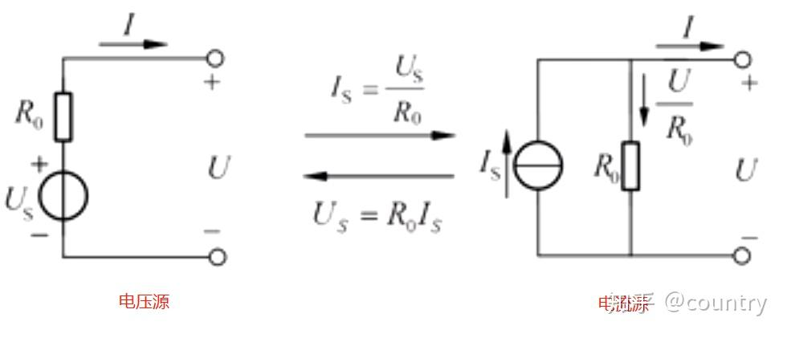

## 电路定理介绍  
### 1. 电源定理（电源等效变换定理）  
一个实际的电源可以由理想电压源和电阻串联或由理想电流源和电阻并联来代替。  
  

### 2. 叠加定理  
在线性电路中，任一支路的电流（或电压）可以看成是电路中每一个独立电源单独作用于电路时，在该支路产生的电流（或电压）的代数和.    
只包含线性元件的电路就是线性电路   
线性元件:电压和电流之间的关系可以用线性表达式表示,即用一次表达式来书写       
> 电容和电感算是线性元件吗? 算,因为其电压和电流的微分(即变换率)是一次形式,这个一次形式包含微积分  