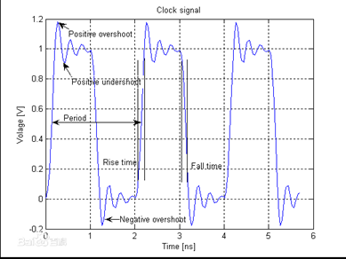
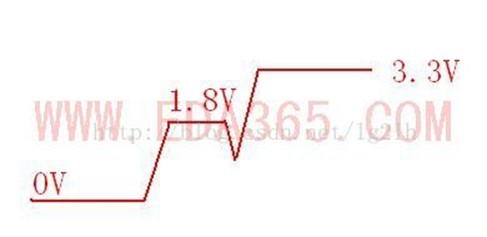

## 纹波    
纹波(ripple)的定义是指在直流电压或电流中，叠加在直流稳定量上的交流分量。

纹波是由于直流稳定电源的电压波动而造成的一种现象，因为直流稳定电源一般是由交流电源经整流稳压、滤波等环节而形成的，由于滤波不彻底，就会有剩余的交流成分，这就不可避免地在直流稳定量中多少带有一些交流成份，这种叠加在直流稳定量上的交流分量就称之为纹波。纹波的成分较为复杂，它的形态一般为频率高于工频的类似正弦波的谐波，另一种则是宽度很窄的脉冲波。

### 纹波抑制方法  
首先需要说明的是不管是哪种纹波，减小纹波最有效的方法一般有四种：

1）输出用π型电路滤波，LC滤波；

2）增大电容；

 对于输出电容，使用铝电解电容以达到大容量的目的。但是电解电容在抑制高频噪声方面效果不是很好，而且ESR也比较大，所以会在它旁边并联一个陶瓷电容，来弥补铝电解电容的不足。同时，开关电源工作时，输入端的电压Vin不变，但是电流是随开关变化的。这时输入电源不会很好地提供电流，通常在靠近电流输入端(以BucK型为例，是SWITcH附近)，并联电容来提供电流。

3）增大电感；

电感的选取，一般还要考虑到电感的额定电流大小。一般情况下在电路设计阶段需要选择比额定电感要大的电感。

4）合理布线。



## 过冲、下冲、振铃         

什么是过冲(overshoot)：过冲就是第一个峰值或谷值超过设定电压——对于上升沿是指最高电压而对于下降沿是指最低电压。   
什么是下冲(undershoot)：下冲是指过冲后的下一个谷值或峰值。过分的过冲能够引起保护二极管工作，导致过早地失效。过分的下冲能够引起假的时钟或数据错误(误作)。   
什么是振铃（ringing）：过冲非常相关的是振铃，它紧随过冲发生，信号会跌落到低于稳态值，然后可能会反弹到高于稳态，这个过程可能持续一段时间，直到稳定接近于稳态。振铃持续的时间也叫做安定时间。振荡(ringing)和环绕振荡(rounding)的现象是反复出现过冲和下冲。      
振铃原因:信号传输过程中感受到阻抗的变化，就会发生信号的反射。这个信号可能是驱动端发出的信号，也可能是远端反射回来的反射信号。根据反射系数的公式，当信号感受到阻抗变小，就会发生负反射，反射的负电压会使信号产生下冲。信号在驱动端和远端负载之间多次反射，其结果就是信号振铃。大多数芯片的输出阻抗都很低，如果输出阻抗小于PCB走线的特性阻抗，那么在没有源端端接的情况下，必然产生信号振铃


## 回沟   
    
 上电过程电源不是线性增加，而会出现电压降低的现象，如图所示，称为上电回沟。

这个问题觉得应该分两种情况分析:

1）高速电路上信号线的回钩：反射，串扰，负载瞬变。。。。

2） 电源电路上的回钩：和上电时序有一定关系。。。。

下面我们分析一下产生回沟的原因：

上电时序：线性上电时，后端的电突然起来导致有回沟。   

芯片自身的电压倒灌:上电回沟的问题，如果你认为你的上电时序设计的没问题，那么还要考察一下芯片自己的问题，打个比方，芯片有3.3V和1.5V的输入，1.5V先上电，3.3V后上电，现象是 3.3V有回沟，如果芯片自身的问题，则1.5V上电后，对3.3V有一定的倒灌，这样3.3V在没给电之前有一个台阶，是否在这个台阶上继续上升到3.3V，还是跌落一些，然后 再到3.3V，这个要看3.3V电源的输出MOS管在工作的时候，是先上管开，还是下管开，如果是先下管开，相对于对地放电，这个时候，3.3V就有回沟了。   

电源负载突然增加或者变动:芯片启动过程中，负载启动大量电流消耗造成的    

解决方法：

保证上电顺序，可以在DC/DC的EN管脚加上RC延时电路。
电源芯片的输出端加电容，用于储能蓄电。

