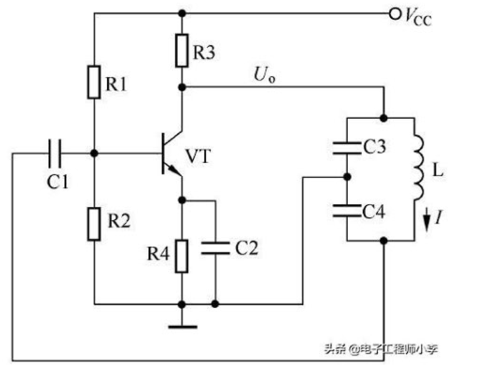
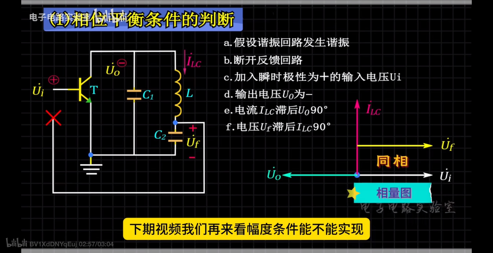

## 三点式振荡器  
### 1. 原理介绍  
下图为电容三点式振荡器  
  
画出其交流通路如下:  
  
发射谐振频率信号,LC谐振回路呈现纯阻性,应为C1端支路为容性,那么C2和L端的支路就呈现感性,谐振信号经过共射极放大电路后反相(这是共射极放大电路的特点).经过L和C2端支路,由于此支路是感性支路,因此电压超前电流90度相位,又由于反馈电压为电容C2上的电压,电容上电流超前电压90度相位,因此电容上的反馈电压和最初输入共射电路的电压同相,电路能够正反馈振荡.
