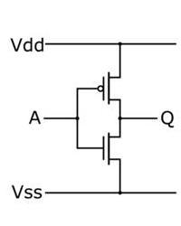
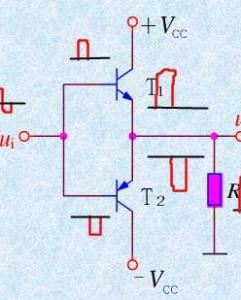

## CMOS和TTL介绍    
TTL—Transistor-Transistor Logic 三极管－三极管逻辑。双极型晶体管（三极管）为开关元件，所以又称双极型集成电路。双极型数字集成电路是利用电子和空穴两种不同极性的载流子进行电传导的器件。          
MOS—Metal-Oxide Semiconductor 金属氧化物半导体晶体管。绝缘场效应晶体管组成，由于只有一种载流子，因而是一种单极型晶体管集成电路。            
CMOS—Complementary Metal-Oxide Semiconductor互补型金属氧化物半导体晶体管     
TTL电路的电平就叫TTL 电平，CMOS电路的电平就叫CMOS电平       
CMOS电路介绍   
         
TTL电路介绍    
       

## 对比    
CMOS与TTL的区别比较  
CMOS是场效应管构成(单极性电路)，TTL为双极晶体管构成（双极性电路）

CMOS的逻辑电平范围比较大（3～15V），TTL只能在5V下工作

CMOS的高低电平之间相差比较大、抗干扰性强，TTL则相差小，抗干扰能力差

CMOS功耗很小，TTL功耗较大（1～5mA/门）

CMOS的工作频率较TTL略低，但是高速CMOS速度与TTL差不多相当

CMOS的噪声容限比TTL噪声容限大

通常以为TTL门的速度高于“CMOS门电路。影响 TTL门电路工作速度的主要因素是电路内部管子的开关特性、电路结构及内部的各电阻阻数值。电阻数值越大，工作速度越低。 管子的开关时间越长，门的工作速度越低。门的速度主要体现在输出波形相对于输入波形上有“传输延时”tpd。将tpd与空载功耗P的乘积称为“速度-功耗积”，做为器件性能的一个重要指标，其值越小，表明器件的性能越 好（一般约为几十皮（10-12）焦耳）。与TTL门电路的情况不同，影响CMOS电路工作速度的主要因素在于电路的外部，即负载电容CL。CL是主要影响器件工作速度的原因。由CL所决定的影响CMOS门的传输延时约为几十纳秒。

TTL电路是电流控制器件，而coms电路是电压控制器件。      

总体来说
TTL它具有速度高（开关速度快）、驱动能力强等优点，但其功耗较大，集成度相对较低。
CMOS它的主要优点是输入阻抗高、功耗低、抗干扰能力强且适合大规模集成

## CMOS使用注意事项    
1）CMOS电路是电压控制器件，它的输入总抗很大，对干扰信号的捕捉能力很强。所以，不用的管脚不要悬空
，要接上拉电阻或者下拉电阻，给它一个恒定的电平。

2）输入端接低内组的信号源时，要在输入端和信号源之间要串联限流电阻，使输入的电流限制在1mA之内。

3）当接长信号传输线时，在CMOS电路端接匹配电阻。

4）当输入端接大电容时，应该在输入端和电容间接保护电阻。电阻值为R=V0/1mA.V0是外界电容上的电压。

5）COMS的输入电流超过1mA，就有可能烧坏COMS。
 

## 输入输出阻抗比较   
### 输入阻抗比较    

TTL 电路
阻抗大小：低阻抗，约 1kΩ ~ 10kΩ
    
原理：由双极型晶体管（BJT）构成，输入端需要注入电流才能工作（电流控制型）    

特点：对前级是较重负载，必须提供足够输入电流      

CMOS电路     
阻抗大小：极高阻抗，约 10⁸Ω ~ 10¹²Ω（亿～兆欧级）       

原理：由 MOS 管构成，栅极是绝缘层，几乎不取电流（电压控制型）
      
特点：对前级负载极轻，静态几乎不消耗功率     

### 输出阻抗比较     
TTL 电路（图腾柱输出：其实就是推挽输出）
阻抗大小：中等阻抗，约 几十 Ω ~ 100Ω
        
驱动能力：较强，灌电流约 16mA       

特点：高低电平阻抗不对称，低电平驱动更强      

CMOS 电路（推挽输出）
阻抗大小：低阻抗，约 十几 Ω ~ 几十 Ω
          
驱动能力：标准系列较弱（约 4mA），高速 / 强驱系列可达 20mA+
          
特点：高低电平驱动对称，带容性负载能力强    
 
#### 输出阻抗低的原因     
一、TTL 输出阻抗为什么低？
     
TTL 典型是图腾柱（推拉）输出：
高电平时：上面一个三极管饱和导通
低电平时：下面一个三极管饱和导通
饱和 BJT 的特点：
饱和压降很小（0.1~0.3V）
等效导通电阻很低（几十欧量级）
因此：
TTL 输出低阻抗，来自三极管工作在饱和区，导通电阻小。
        

二、CMOS 输出阻抗为什么低？      

CMOS 是互补 MOS 推挽输出：
高电平：PMOS 导通
低电平：NMOS 导通
MOS 管工作在线性区（三极管区），相当于一个可控电阻。
设计时会把 MOS 管沟道宽度 W 做得很大：
W 越大 → 导通电阻 
R 
on
​	
 
 越小
典型可以做到 几欧～几十欧
所以：
CMOS 输出低阻抗，来自宽沟道 MOS 管的低导通电阻
