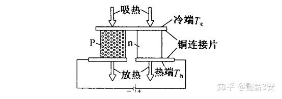

## 1、TEC的原理

TEC（Thermoelectric cooler）半导体制冷器，也叫热电制冷器，是利用珀耳帖效应，又称热-电效应制作而成的散热器件。在电路中放置P型半导体和N型半导体组成一对单元，通电时会在一端产生电子空穴对，内能减小，温度降低，形成冷端；另一端因电子空穴对复合，内能增加，温度升高，形成热端。单对PN单元产生的冷热温差有限，可以在电路中多对串联、并联，再使用陶瓷板上下封装成TEC器件，这样TEC器件的一端为冷面，一端为热面。可以理解为TEC是将冷端的热量转运到热端，在热量转运的过程中，TEC本身需要通入电流电压，也会产生热量。

