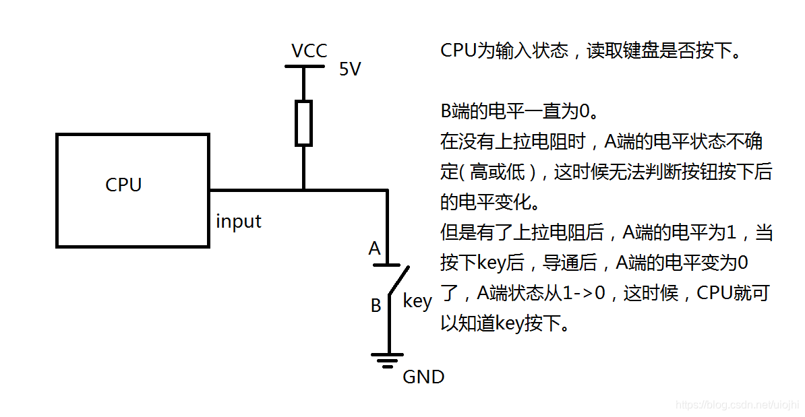
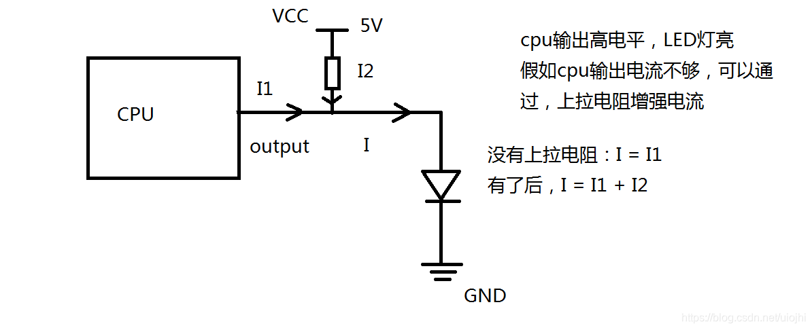
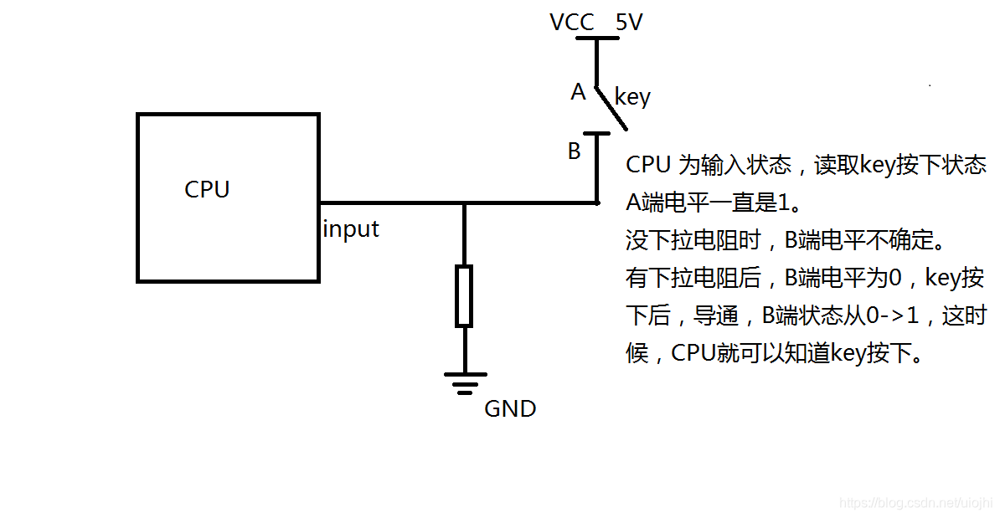
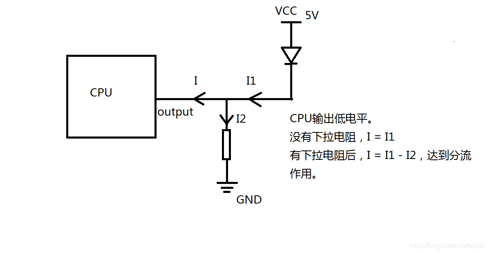

上拉电阻和下拉电阻是用在数字电路中，存在高低电平的场合。上拉电阻是用来解决总线驱动能力不足时提供电流的问题的。一般说法是上拉增大电流，下拉电阻是用来吸收电流（抵抗干扰）。上拉是将电压拉高，下拉是将电压拉低，主要用在三极管或场管的控制极的电位，因为只有满足电压差才会工作。

上拉电阻：在上拉电阻所连接的导线上，如果外部组件未启用，上拉电阻则“微弱地”将输入电压信号“拉高”。当外部组件未连接时，对输入端来说，外部“看上去”就是高阻抗的，通过上拉电阻可以将输入端口处的电压拉高到高电平。如果外部组件启用，它将取消上拉电阻所设置的高电平。通过这样上拉电阻可以使引脚即使在未连接外部组件的时候也能保持确定的逻辑电平。

下拉电阻：一个下拉电阻（Pull-down resistor）以类似的方式工作，不过是与地（GND）连接。它可以使逻辑信号保持在接近0伏特的状态，即使没有活动的设备连接在其所在的引脚上。

作用  
提高电路稳定性，避免引起误操作。  
上拉电阻就是提高输出管脚的负载能力，否则有可能引脚输出高电平极不稳定或因为负载关系无法输出高电平，下拉电阻就是达到分流作用。    

原理图示：    
   
   
   
   


拉电阻分为强拉和弱拉  
电阻越大认为拉力越弱,电阻越小认为拉力越强,可以用驱动电流的大小来判断
