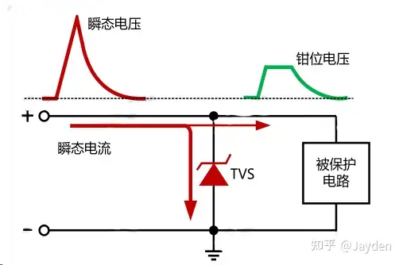
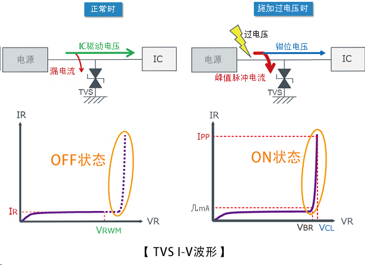
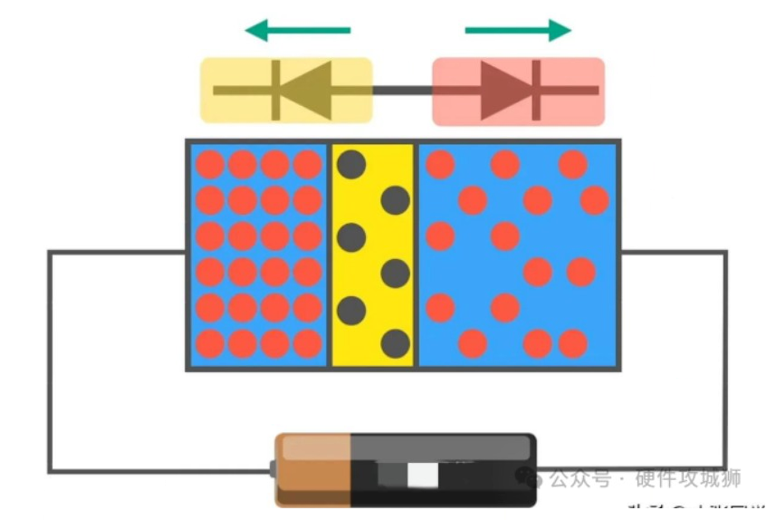
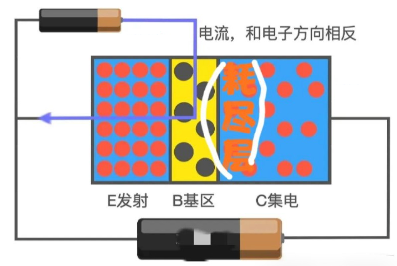
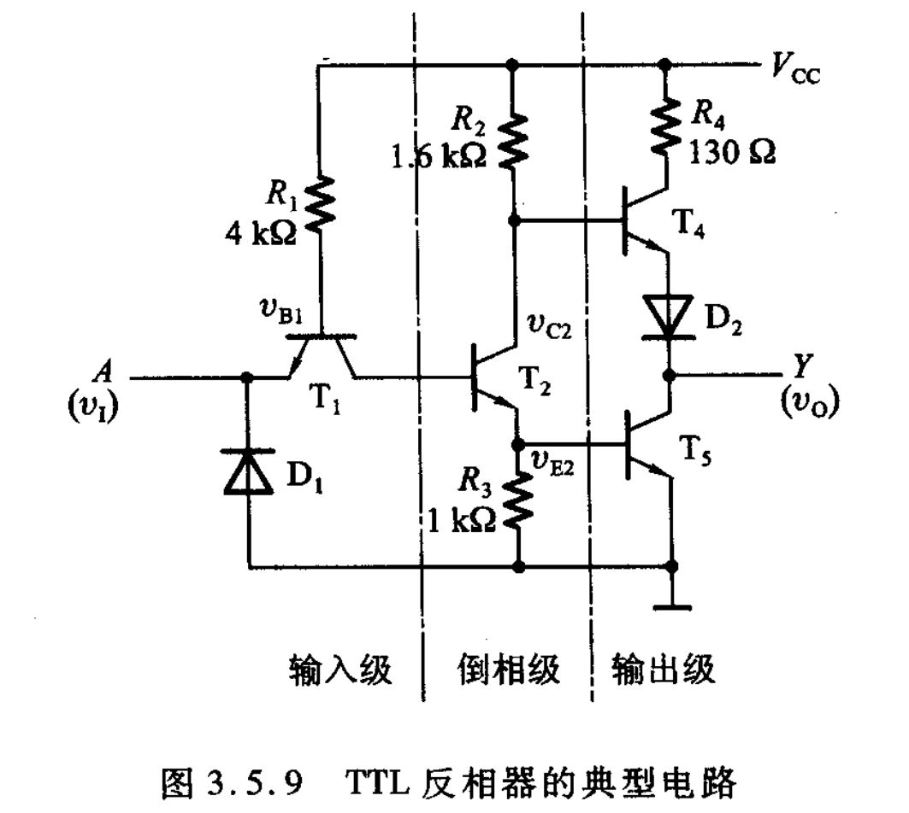
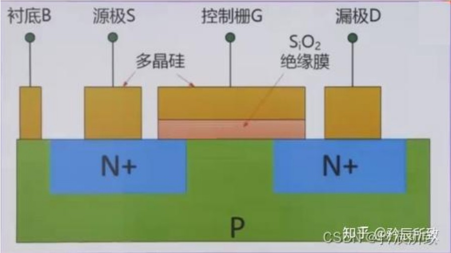
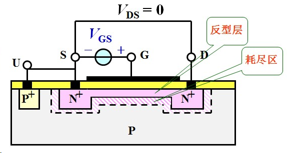
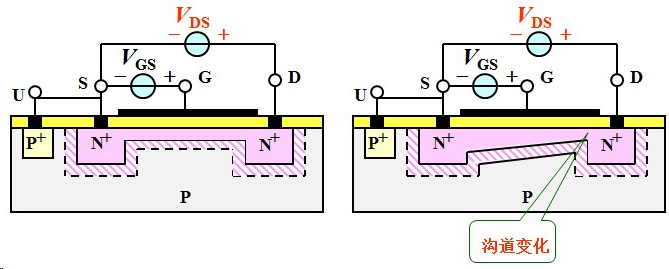
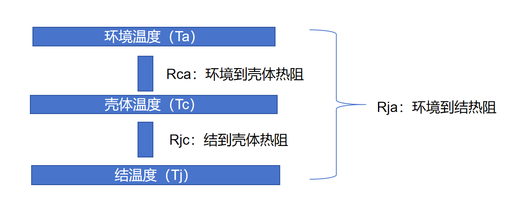

## 二极管  
### 器件介绍  
#### 1. TVS二极管  
顺态电压抑制器,也叫雪崩击穿二极,TVS 有单向与双向之分，单向 TVS 一般应用于直流供电电路，双向 TVS 应用于电压交变的电路。  
    
下图为TVS应用于直流电路时单向 TVS 反向并联于电路中管.  
  
其工作原理非常简单,当电路正常工作时，TVS 处于截止状态（高阻态）；当电路出现异常过电压并达到TVS（雪崩）击穿电压时，TVS 迅速由高电阻状态突变为低电阻状态，泄放由异常过电压导致的瞬时过电流到地，同时把异常过电压钳制在较低的水平，从而保护后级电路免遭异常过电压的损坏。当异常过电压消失后，TVS 阻值又恢复为高阻态。   
  

## 三极管  
### 原理介绍  
以NPN管为例  
  
发射极电子丰富,基极非常的薄,而集电极则是宽度最大可容纳大量电子.     
三极管就像两个相对的二极管连接在一起  
  
要想要他们可以正常导通:  
先在发射极E和基极B加上电源，这时PN结导通，发射极的电子在电场的作用下向着基极漂移,再给发射极E和集电极C加上电源，这时集电极的电子就会往右移，同时中间就会形成耗尽层，如图上画的；每当基极有一个空穴，从发射极就会涌来大量电子，但是又由于基极是非常薄的,在集电极处非常强大的电压会将基区的电子夺走,这时只有少量电子会形成基极电流，而多出来的电子会以β倍的数量会突破耗尽层，漂移到集电极。 (这些电子又可以通过电池进行循环 ,我是这么觉得的)
    

### TTL电路计算（三极管计算）    
      
输入低电平（v_I = 0.3V）    
T1 发射结导通 → v_B1 ≈ 0.3V + 0.7V = 1.0V
      
1.0V 不足以让 T2 的发射结和 T1 的集电结同时导通（需要约 1.4V）      

T2 截止 → v_B2 ≈ 0V      

输入高电平（v_I = 3.6V）       

T1 发射结反偏、集电结正偏 → v_B1 ≈ 0.7V×3 = 2.1V         

T2 饱和导通 → v_E2 ≈ 0.7V
         
v_B2 ≈ v_E2 + 0.7V = 1.4V     

可以轻易得出，三极管的计算主要在于判断钳位电压和三极管的导通，对于不确定的分路尽量的不去使用，只使用可以确定的分路，如压降多少（也可以理解为反证法）

## MOS管  
### 原理介绍  
以NPN型管为例  
  
在控制栅源上添加正电压,控制栅处吸引大量的电子,将两个N型区域相互沟通了.  
  
在VDS上添加电压,由于N沟道的存在,mos管导通,但是由于Vds电压的存在,使得导电沟道变小甚至被夹断(但是这不代表没有电流了,只是电流不会在增大了)  
   

### MOS管的热计算        

先要介绍一个概念-----热阻:**热阻指的是当有热量在物体上传输时，在物体两端温度差与热源的功率之间的比值。**    

其计算公式为:**Rja = (Tj - Ta) / P**,其单位为: **℃/W**------**每消耗1瓦功率，物体两端温度差的升高值**

MOS管通常由三层温度,环境温度(Ambient Temperature-Ta),壳体温度(Case Temperature-Tc),结温度(Junction Temperature-Tj)           

- **Ta （Ambient Temperature，环境温度）**：指远离发热器件、未被加热的空气温度。可以理解为**“房间里的气温”**。
- **Tc （Case Temperature，外壳温度）**：指三极管/MOS管**封装表面**（通常是背部散热片或塑封体表面中心点）的温度。可以理解为**“穿着衣服时的体表温度”**。
- **Tj （Junction Temperature，结温）**：指芯片内部**PN结**（硅晶圆）的实际温度。这是器件内部真正的“心脏温度”，可以理解为**“人体的核心体温（腋下/口腔温度/内脏温度）”**。

通常来说,热阻是串联关系:**Rja = Rjc + Rca **     

我们可以以此来推断MOS管是否会被热击穿,(电击穿就看Vds,Vgs之类的是否超过标称耐压值)

首先温度超过硅材料的最高结温（通常150℃~175℃），导致硅晶格断裂、金属铝融化、焊线脱落，最终管芯烧毁裂开。   

我们可以依照热阻和功率来判断MOS管是否会热击穿       

MOS功率计算:     

P = Rds(on) * I²     

> Rds(on)为导通状态下,源极和漏极之间的等效电阻     

MOS管结温计算

Tj = Ta + P×Rca + P×Rjc = Ta + P×Rja         

由此可以得到MOS管内部的大致温度,判断其是否 高于MOS管的标称值,不过一般也就是硅材料的那个最高结温,超过就热击穿了

