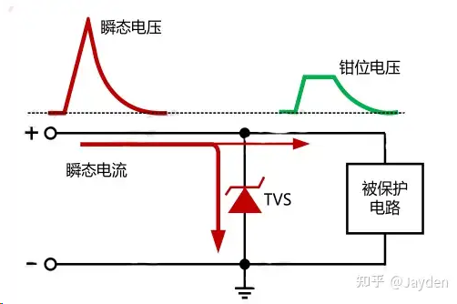
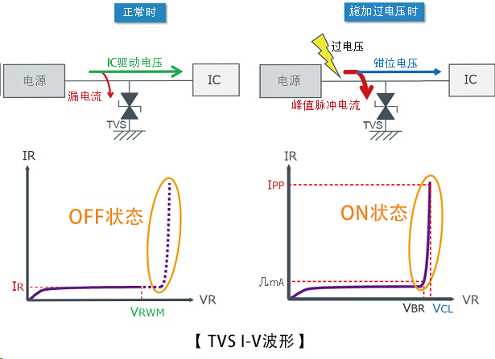
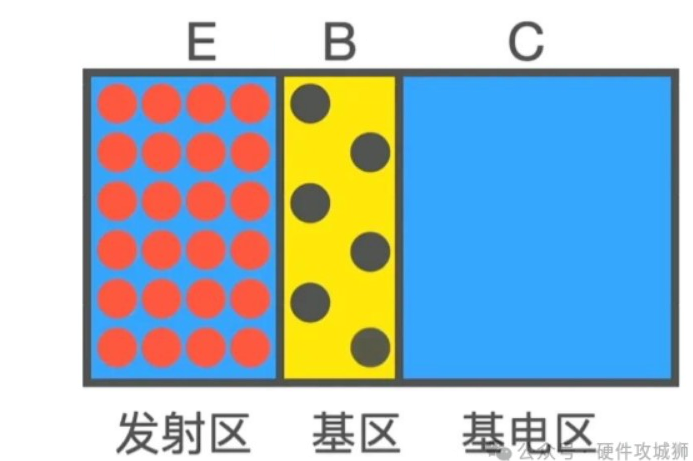
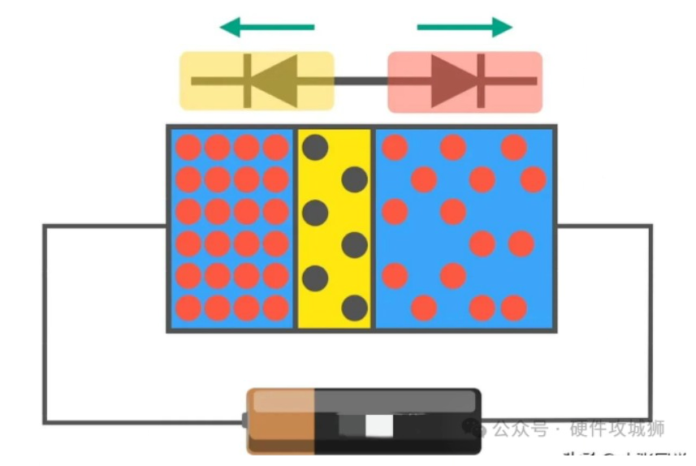
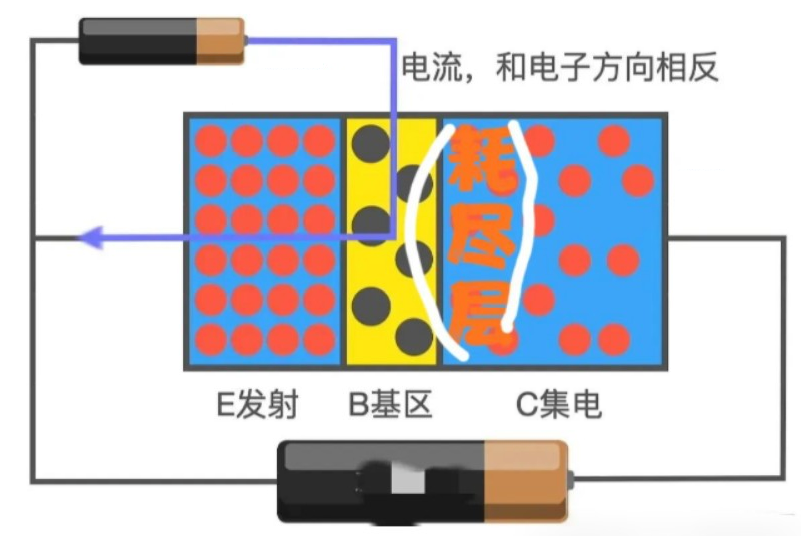
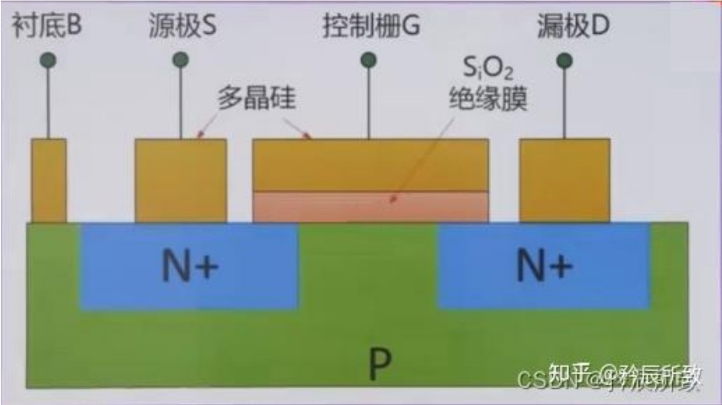
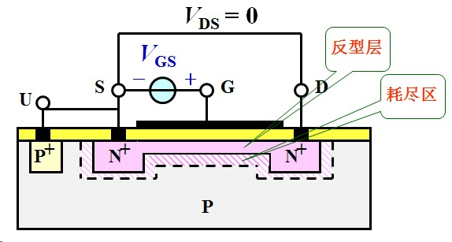
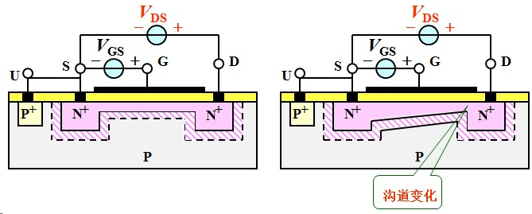

## 二极管  
### 器件介绍  
#### 1. TVS二极管  
顺态电压抑制器,也叫雪崩击穿二极,TVS 有单向与双向之分，单向 TVS 一般应用于直流供电电路，双向 TVS 应用于电压交变的电路。  
    
下图为TVS应用于直流电路时单向 TVS 反向并联于电路中管.  
  
其工作原理非常简单,当电路正常工作时，TVS 处于截止状态（高阻态）；当电路出现异常过电压并达到TVS（雪崩）击穿电压时，TVS 迅速由高电阻状态突变为低电阻状态，泄放由异常过电压导致的瞬时过电流到地，同时把异常过电压钳制在较低的水平，从而保护后级电路免遭异常过电压的损坏。当异常过电压消失后，TVS 阻值又恢复为高阻态。   
  

## 三极管  
### 原理介绍  
以NPN管为例  
  
发射极电子丰富,基极非常的薄,而集电极则是宽度最大可容纳大量电子.     
三极管就像两个相对的二极管连接在一起  
  
要想要他们可以正常导通:  
先在发射极E和基极B加上电源，这时PN结导通，发射极的电子在电场的作用下向着基极漂移,再给发射极E和集电极C加上电源，这时集电极的电子就会往右移，同时中间就会形成耗尽层，如图上画的；每当基极有一个空穴，从发射极就会涌来大量电子，但是又由于基极是非常薄的,在集电极处非常强大的电压会将基区的电子夺走,这时只有少量电子会形成基极电流，而多出来的电子会以β倍的数量会突破耗尽层，漂移到集电极。 (这些电子又可以通过电池进行循环 ,我是这么觉得的)
    

## MOS管  
### 原理介绍  
以NPN型管为例  
  
在控制栅源上添加正电压,控制栅处吸引大量的电子,将两个N型区域相互沟通了.  
  
在VDS上添加电压,由于N沟道的存在,mos管导通,但是由于Vds电压的存在,使得导电沟道变小甚至被夹断(但是这不代表没有电流了,只是电流不会在增大了)  
   

