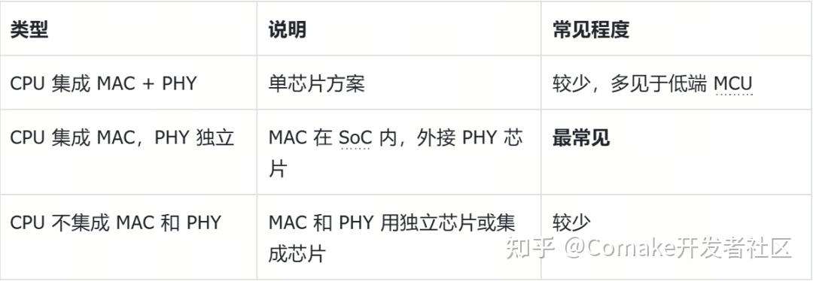
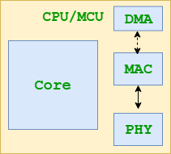
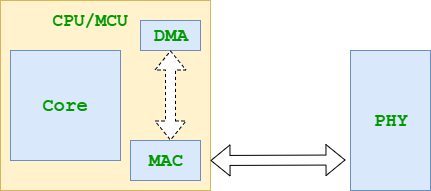
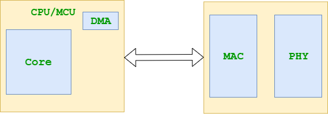
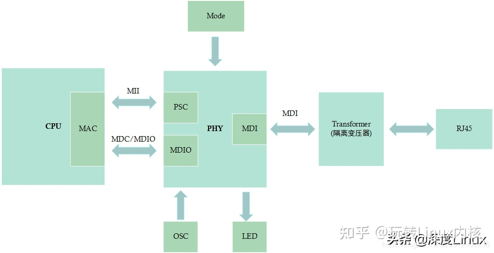
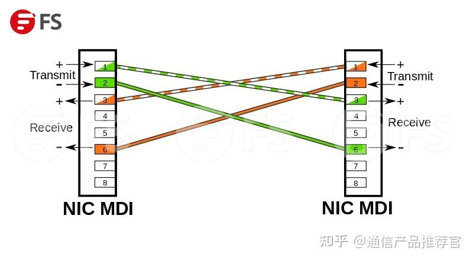
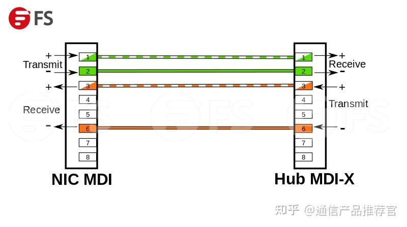
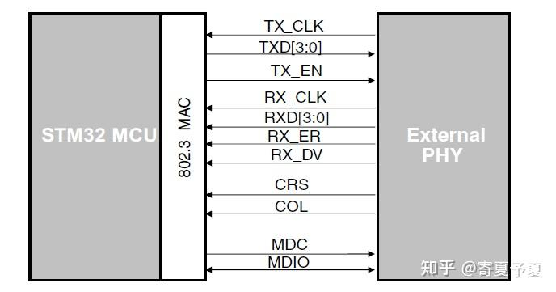
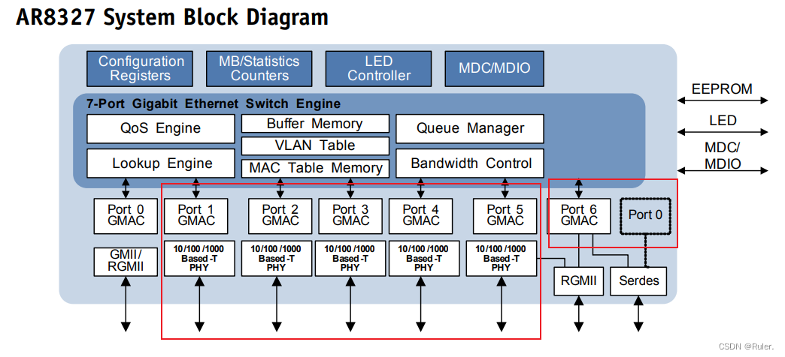

# 前置知识   
在学习交换芯片之前，有些知识需要你事先了解才能更好的理解交换芯片    

## VLAN   

VLAN(Virtual LAN)，翻译 成中文是“虚拟局域网”。LAN（局域网）可以是由少数几台家用计算机构成的网络，也可以是数以百计的计算机构成的企业网络。VLAN所指的LAN特指使用路由器分割的网络——也就是广播域。     
> LAN是Local Area Network（局域网）的缩写。它是指在一个相对较小地理范围内连接多台计算机和设备的网络  

简单来说，同一个VLAN中的用户间通信就和在一个局域网内一样，同一个VLAN中的广播只有VLAN中的 成员才能听到，而不会传输到其他的VLAN中去，从而控制不必要的广播风暴的产生。同时， 若没有路由，不同VLAN之间不能相互通信，从而提高了不同工作组之间的信息安全 性  

更详细的内容可以见:https://blog.csdn.net/weixin_43618070/article/details/122841234     

## TCAM   
### 利用简单的例子来解释TCAM    
首先，把一台路由器类比成一个巨大的物流中心，这个物流中心每天要处理几百万个包裹（网络数据包），每个包裹上都写着收货地址（IP地址）。你的任务是根据一本厚厚的地址簿（路由表、访问控制列表ACL）来决定每个包裹该走哪条传送带。这时候该怎么做呢？

通过人工的方式：

首先，物流分拣工人需要拿着一本厚厚的地址手册。   
此时，来了一个包裹，地址是：江苏省南京市雨花台区花神大道99号。    
看到包裹地址之后，分拣工人必须一页一页地翻手册，从头开始找：“江苏省...南京市...雨花台区...花神大道...99号。结果找到了，包裹送往3号传送带。   
这种方式虽然可以完成包裹的分拣，但是缺点很明显，即包裹越多，手册越厚，工人翻得时间越长。效率很低，如果手册里有1000条，最坏情况下要比较1000次。   

通过“门禁”的方式：

把所有规则都提前刻在了一面“规则墙”上。比如：第一条规则：北京市海淀区xx路xx号-> 走 1号传送带；第二条规则：江苏省南京市雨花台区xx路xx号 -> 走 3号传送带；第三条规则、第四条规则....   
此时，来了一个包裹，地址是江苏省南京市雨花台区花神大道99号。  
神奇的事情发生了：不用拿着包裹去对照墙，而是把包裹地址同时塞进墙上每一个规则的“扫描口”里， 所有规则同时判断这个地址是否和自己匹配，这样便可以很快知道该包裹需要送往3号传送带。  
此外，该方式还有一个最为关键的功能就是模糊匹配。上述规则里写的XXX就是“通配符”，意思是“不管最后几位是什么，我都匹配”。所以江苏省南京市雨花台区花神大道99号完美匹配第二条规则江苏省南京市雨花台区xx路xx号。不仅如此，这个过程是一次性的、并行的、闪电般的速度。无论你墙上有1万条规则还是10万条规则，判断时间都是一样的，快得离谱。  

小结一下，从功能角度来讲，tcam就是一个极为快速的查表模块，当时手里有一串数据时，你只需要把这串数据扔给tcam，tcam就可以很快告诉你，你手中的数据是否在tcam内部有能够匹配上的数据。如果匹配中，tcam会给出该数据在tcam中的index。

### 专业角度解释TCAM    
cam的英文全称为：Ternary Content Addressable Memory。从英文名字可知，tcam的本质是memory，但是与普通memory所不同的是，tcam支持快速的三态查找。所谓的“三态”指的是TCAM中的每一个存储单元可以处于三种状态之一，即0、1、x。状态 “x” 是TCAM的灵魂所在，它使得TCAM能够进行模糊匹配，这对于处理IP地址和子网掩码至关重要。

举个例子说明一下：

假设我们有一条ACL规则：允许所有来自192.168.1.0/24网段的流量。在TCAM中，我们将这条规则存储为一个“value-mask”对：数据 (vlaue): 11000000_10101000_00000001_00000000 (这就是网络地址)，掩码 (mask): 11111111_11111111_11111111_00000000 (掩码中1表示“需要匹配”，0表示“不关心”）。      
根据掩码，我们可以将其转换为tcam的三态格式：11000000_10101000_00000001_xxxxxxxx (这里的 x就是 “不关心”)。  
当存在ip地址192.168.1.5 用二进制表示是 11000000_10101000_00000001_00000101，很显然该IP地址就可命中上述规则。  
在上述判断是否命中的过程中，整个tcam中可能存在成千上万条规则，当我们把192.168.1.5地址送入tcam后，tcam会把该ip地址和其中的成千上万条的规则同时比对，可以在几个时钟周期内给出匹配结果。  

## QoS
QoS（Quality of Service）即服务质量。在有限的带宽资源下，QoS为各种业务分配带宽，为业务提供端到端的服务质量保证。例如，语音、视频和重要的数据应用在网络设备中可以通过配置QoS优先得到服务。

### QoS的应用    
IP网络的业务可以分为实时业务和非实时业务。实时业务往往占据固定带宽，对网络质量变化感知明显，对网络质量的稳定性要求高，例如语音业务。非实时业务所占带宽难以预测，经常会出现突发流量。突发流量会导致网络质量下降，会引起网络拥塞，增加转发时延，严重时还会产生丢包，导致业务质量下降甚至不可用。

解决网络拥塞的最好的办法是增加网络的带宽，但从运营、维护的成本考虑，这是不现实的，最有效的解决方案就是应用一个“有保证”的策略对网络流量进行管理。

QoS一般针对网络中有突发流量时需要保障重要业务质量的场景。如果业务长时间达不到服务质量要求（例如业务流量长时间超过带宽限制），需要考虑对网络扩容或使用专用设备基于上层应用去控制业务。

## EMAC与GMAC    

 EMAC是百兆mac， GMAC是千兆mac

# 交换芯片   

## 什么是交换芯片   

交换芯片是一种集成电路组件，用于在计算机网络设备中实现数据包的转发和路由决策。它具有多个端口，能够根据目的地址信息将接收到的数据包转发到相应的输出端口。

交换芯片通过对数据包进行快速处理和转发，实现网络设备之间的通信连接，确保数据的高效传输和网络的正常运行。

多网口交换芯片，内部结构是多个 MAC + 多个 PHY，主要功能是将数据在不同端口之间转发，同时留有数据接口与 SoC 对接。

## 工作原理   

1. **存储转发：**在接收到数据包后，交换芯片会先将整个数据包存储在缓存中，然后进行目的地址的解析和路由选择，最终确定数据包的转发路径，实现存储转发的功能。
2. **地址学习：**交换芯片通过学习数据包中的源MAC地址，建立MAC地址表，从而可以快速识别目的地址并进行数据包的转发。

总体流程：需要传输的数据包由端口进入交换芯片后，首先进行数据包头字段匹配，为流分类做准备；而后经过安全引擎进行硬件安全检测；符合安全的数据包进行二层交换或者三层路由，经过流分类处理器对匹配的数据包做相关动作（如丢弃、限速、修改VLAN 等）；对于可以转发的数据包根据优先级放到不同队列的缓冲管理中，再由调度器进行队列调度，并执行流分类修改动作，最终从目标端口发出    

## 交换芯片结构        

芯片通常有这几种设计方案

第一种

第二种

第三种

一般使用第二种,即CPU集成了MAC,而外部的交换芯片模拟PHY来使用

**CPU,MAC,PHY并不是集成在同一个芯片内**，由于PHY包含大量模拟器件，而MAC是典型的数字电路，考虑到芯片面积及模拟/数字混合架构的原因，将**MAC集成进CPU，而将PHY留在片外**，这种结构是最常见的。

## CPU-MAC-PHY连接方式    

PSC:物理层前端模块       

MDI:是以太网接口,分为MDI/MDIX是两种以太网接口类型,MDI 和 MDI-X 的核心区别在于，它们网线接口中用于**发送**和**接收**信号的**引脚定义是相反的**

> 
>
> 可以看到如果连接的两端都使用MDI,需要将他们的接口交叉使用,但是如果使用MDI和MDIX来连接那么就可以直接根据接口的位号连接使用    
>
>     
>
> 

SMI:SMI(串行管理接口(Serial Management Interface))_interface就是图中的MDC/MDIO,SMI也被称作MII管理接口(MII Management Interface),你可以把SMI认为是MII的子集或者控制信号    

MII:Media Independent Interface-介质无关接口     

> 
> 此为MII的接口定义,如之前所说,SMI接口为MII接口的一个子集    
> 如果说MII是MAC（媒体接入控制器）与PHY（物理层收发器)之间的一条**“高速公路”**，负责搬运大量的网络数据；那么SMI就是这条高速公路上的一条**“管理小道”**，专门用来传递控制指令和状态报告

transformer:

当我们的PHY芯片发送数据，接受到MAC层发送过来的数字信号，然后转换成模拟信号，通过MDI接口传输出去。但是我们的网线传输的距离又很长，有时候需要送到100米甚至更远的地址，那么就会导致信号的流失。而且外网线与芯片直接相连的话，电磁感应和静电，也很容易导致芯片的损坏，所以就要使用网络变压器，其主要作用是

- 传输数据,它把PHY送出来的差分信号用差模耦合的线圈耦合滤波以增强信号,并且通过电磁场的转换耦合到不同电平的连接网线的另外一端
- 隔离网线连接的不同网络设备间的不同电平,以防止不同电压通过网线传输损坏设备
- 还能使芯片端与外部隔离，抗干扰能力大大增强，而且对芯片增加了很大的保护作用，保护PHY免遭由于电气失误而引起的损坏（如雷击）

## 交换芯片有PHY-mode 和MAC-mode   

这两个mode的意思是说交换芯片的这个接口在此时是作为MAC来使用还是作为phy来使用

这个芯片一共有7个port，其中Port1~Port5是接了PHY芯片的，这些Port一般是只接终端设备(也就是会通过网线连接到PC或其他上网设备)。
而Port0和Port6就比较灵活，它们既可以接PHY，也可以接MAC，这两个Port就是CPU port。

像PROT1_PORT5,GMAC连接了PHY芯片,它就只能当PHY的控制中心(硬件本身内部的连接限制)     

如果没有PHY芯片,那么GMAC本身可以模拟出PHY模式(但是这个PHY比较差)

> 能够模拟的原因:
>
> 1. MII本身具有对称性,RX和TX可以翻转   
> 2. 外部连接的**物理层前端模块**---PCS，物理编码子层 + SerDes被设置为“反向”模式。芯片内部的**PCS模块进行了收发交叉（Loopback/Cross-over）映射**。此时，SerDes的**发送引脚被内部映射为“接收”功能**，**接收引脚被映射为“发送”功能**。同时，PCS不再从GMAC核心获取时钟，而是从外部输入的时钟恢复出参考时钟,在这种模式下，GMAC的MAC核心其实**被完全旁路了**（或处于休眠状态），真正在干活的是负责串行/解串的PCS+SerDes物理前端。它只是在电气和时序行为上，表现得像一个标准的PHY芯片。
