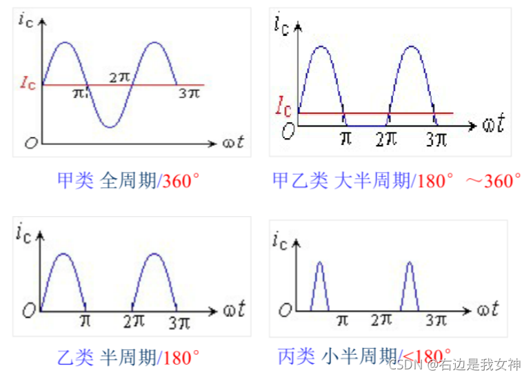
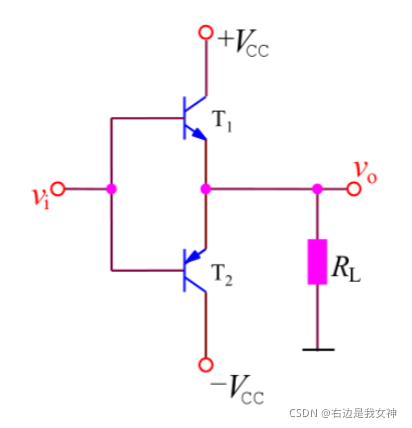
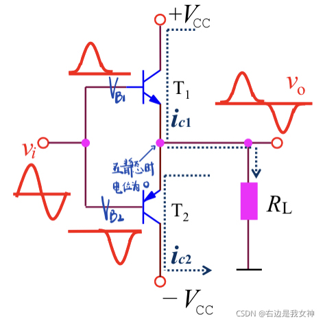
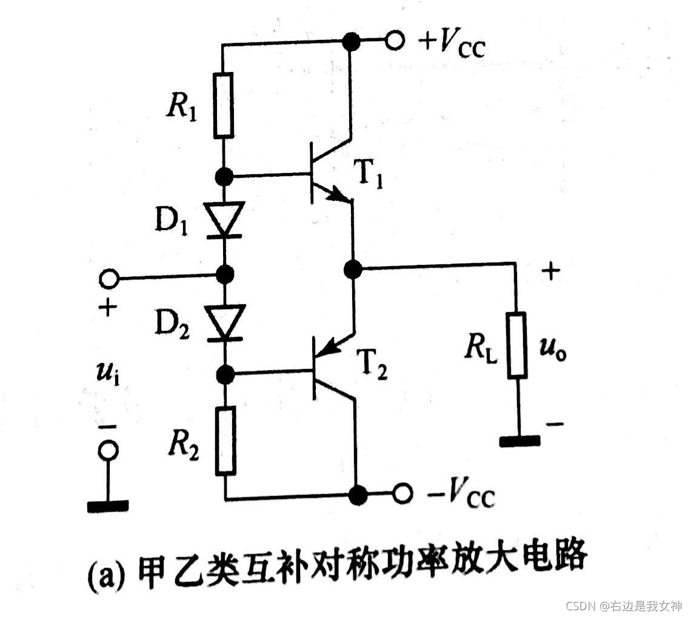

## 功率放大器 
在给定失真率条件下，能产生最大功率输出以驱动的放大器 
其工作原理为：通过三极管的电流控制作用把电源的功率转换成按照输入信号变化的电流，利用三极管的放大作用， 集电极的电流永远是基极电流的放大，所以就可以得到放大的电流，然后经过不断地电流和电压放大，就完成了功率放大  

## 各种类型的功率放大器  
   
这些放大电路各有优劣，比如甲类放大的优点是失真较小，但是他的功率却非常大（主要是要控制在静态工作点,直流功率非常大） 
### 乙类放大 
  
静态分析:信号源置零(接地)vi = 0也就是说IB1=IB2=0,根据集电极电流和基极电流的比例关系，可以得到IC1=IC2=0这相当于CE部分断路，于是VO=0 
动态分析:首先再来回顾一下PNP管和NPN管的电压关系。处于放大工作状态时，对于PNP管VE>VB>Vc；对于NPN管Vc>VB>VE。因此，当vi>0时，T1导通，T2截止，于是iL=ic1；当vi<0时，T2导通，T截止，于是iL=ic2；
 
但是这个电路存在一个问题,信号通过三极管的时候,因为三极管类似于两个二极管背靠背,所以会存在二极管的管压降,即三极管存在开启电压,导致存在交越失真. 
### 甲乙类功率放大器 
为了解决乙类功率放大器交越失真的缺陷,我们使三极管在无信号输入时处于微导通的状态,那么便形成了甲乙类功率放大器  
我们可以使用甲乙类功率放大器 
   
静态分析: 由于R1,D1 与R2,D2相互对称,因此交流输入点的电压在静态时为零,但是T1的基端由于和交流输入点之间相隔了一个二极管,因此将T1的基端拉高到0.7v,T2的基端同理,被拉到-0.7v.  
动态分析: 当交流电压输入,比如交流电的瞬时电压为0.1V时(电源的强大驱动能力),T1端二极管的P端电压就被拉到了0.8v,就克服了三极管的开启电压,低电压时同理.  