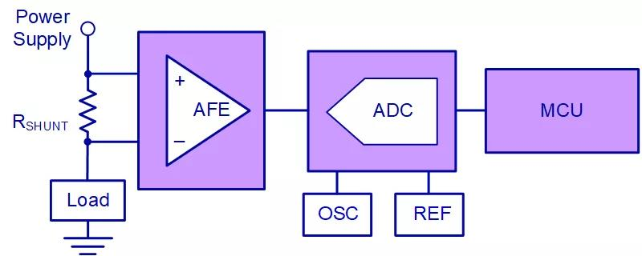
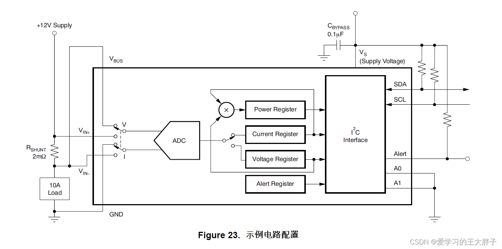

# 功率检测芯片

## 原理   

功率检测芯片的原理其实很简单，还是最基本的 

电流×电源=功率    

对几十伏电压和百安培以内的系统电流和功率信息进行评估和分析，通常首选分流电阻进行测量电流，这种方法物理尺寸小、精度高并且温度特性好。    

用于测量并转换在分流电阻上产生的信号的方法有多种。最常见的方法是采用模拟前端（Analog Front End)将电流感测电阻的差分信号转换为单端信号。然后，将单端信号连接到与微控制器相连的模数转换器 (ADC)。    

根据在分流电阻上测得的电压来推算整个流经负载的电流

## TPA626-功率检测芯片   

用实际芯片来理解其工作原理    

开始时,AD的模拟前端的两个单刀双置开关向上抬,就可以对负载的电压进行测量    

两个单刀双掷开关往下台就可以测得分压电阻的电压大小(用于推算电流)    

AD采样得到数据后,根据后面的单刀双掷开关分辨将数据写入电流和电压寄存器,然后将电流电压寄存器中的数值相乘就可以得到功率了,   

得到的功率可以通过I2C传输给控制芯片