## 降压电路       

### 简易原理介绍    
通过不停的开关达到降压的目的     
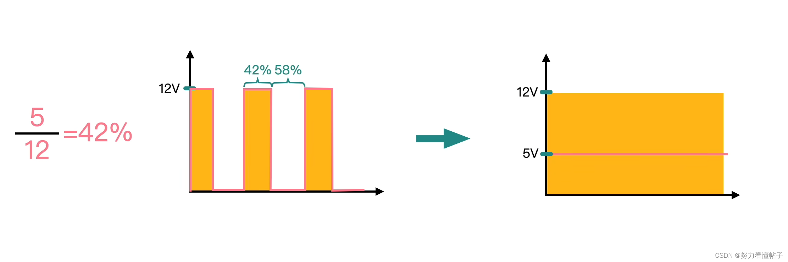    
通过调节占空比来调节输出的电压    

而对于实际的降压电路则有   
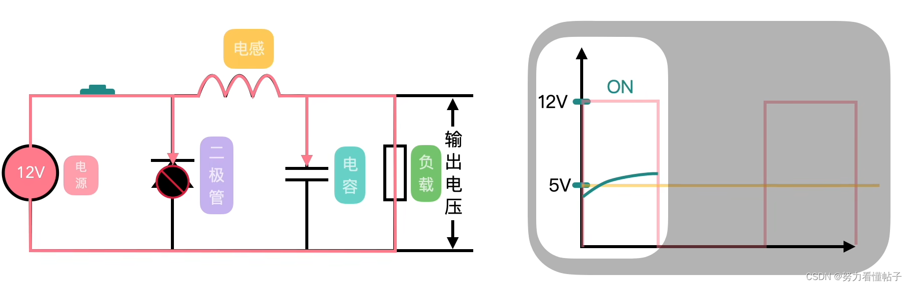    
如左图，开关闭合，
二极管截至，电源给电感、电容充电，给负载供电。  
但是通过电感上的电流不能突变，电感上感应出反向电流，使得负载端的电压不足12v     
使Vout = 12v - VL = 5V      
随时间增加，电感上电压减少，负载电压上升，若时间长，电感上电压将降为0v，负载上电压变为12v，因为电感上电流不变，则相当于一段导线。   

所以要严格控制开关通断的时间      

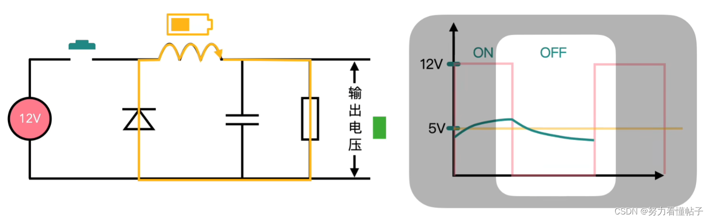   
开关断开
如右图，开关断开，电感放电。随着电感上电压减小，负载两边的电压也减小，如右图    

在周期循环下,达成如下效果    
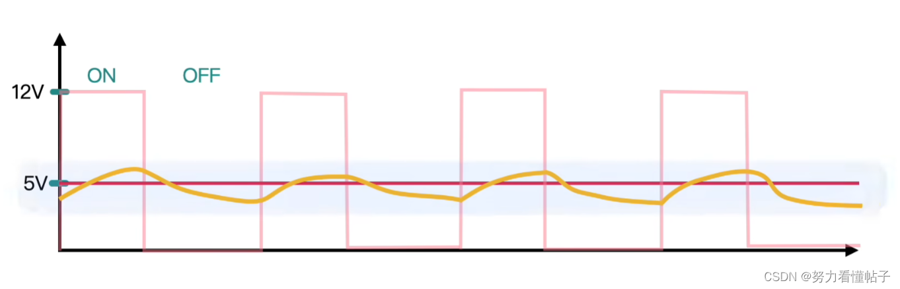    

增加电容是为了使负载两端的电压更加的平滑   
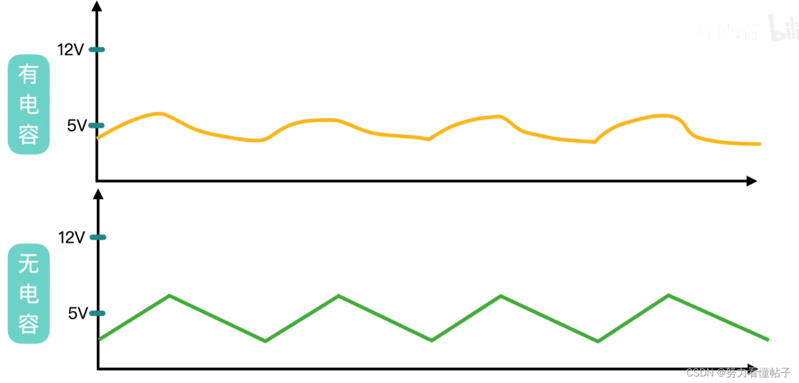

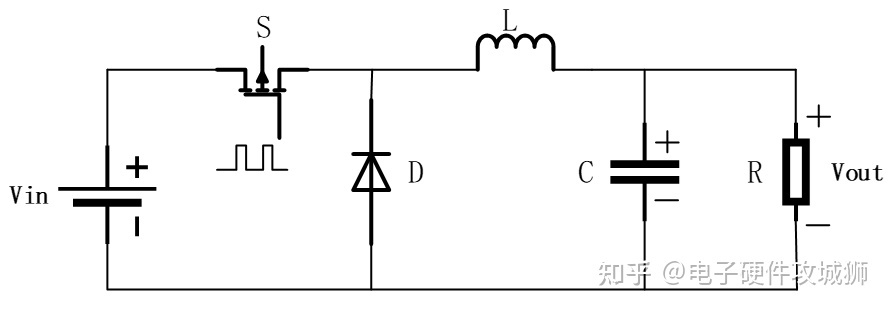        

### 关键器件
关键器件有开关管S、电感L、电容C、二极管D。
·开关管S：可以导通和关断电流，常见的开关管有三极管、MOSFET等。  
·电感L：可以将电能转换成磁能储存起来，也能将磁能转换为电能再次释放。需要注意：电感在储能和释能转换时，电感的正负极会发生反向。流经电感的电流不能突变，只能逐步变大或变小。  
·电容C：具有充放电功能，电容器两端电压高于外部电路电压时放电，反之充电。电容充放电不会发生正负极的反向。  
·二极管D：具有单向导电性，电流只能单向流过。在BUCK电路中，二极管D形成了续流回路，因此D也叫作续流二极管。    

### buck电路的工作原理    
一般通过PWM波“定频调宽”来控制开关管的通断    
开关管导通时的电流回路为：  
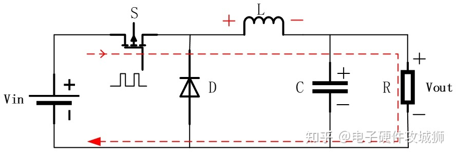    
此时有如下式子成立:  
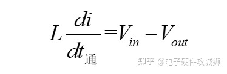      
电流开始从左边的电源Vin正极流出，流向负极。电流流经续流二极管D的负极不能通过，继续前进流经电感L，电感L将电能转换为磁能储存，电流继续前进流经电容C，电容C充电，电流继续流过负载R，回到电源Vin负极，整个电路通畅，输出端负载正常工作。

当开关管关断时的电流回路为:  
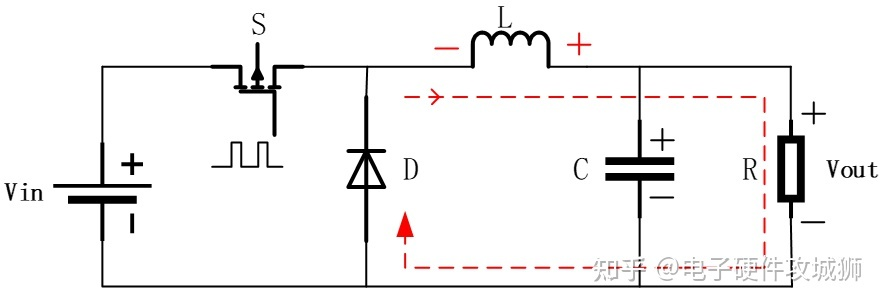    
此时有如下式子成立:  
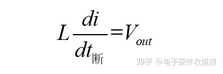   
当开关管S关断，电源Vin不再供电，电感L储存的磁能转换为电能释放，此时电感L的正负极反向（变成左负右正)，电感L变成了电路里的电源。由于电流永远是从正极流向负极，所以形成了图中所示红色回路。此时续流二极管D正向导通，电感L释放的电流会逐步由大变小   

电容C的作用：当开关管S关断，电感L不能及时给负载R供电，此时电容C立马放电给负载R供电，电容C可以起到有效抑制电源纹波的作用。   

稳态作用下的输出    
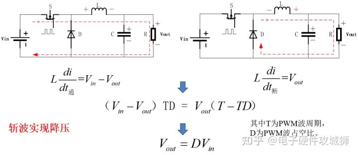    
其中D为PWM波的占空比，占空比D的取值在0~1之间，T是周期   
斩波实现降压公式推导 Vout=DVin    

升降电路电流电压图：   
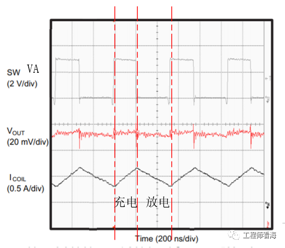     
Icoil，电感电流   
sw为PWM  

其中有几个注意点     
1.为什么认为Vout基本不变？因为这个开关周期是极快的，电容的RC极大，在进入稳态后基本不会改变电容两端电压。

## 升压电路   
### 简易升压电路介绍   
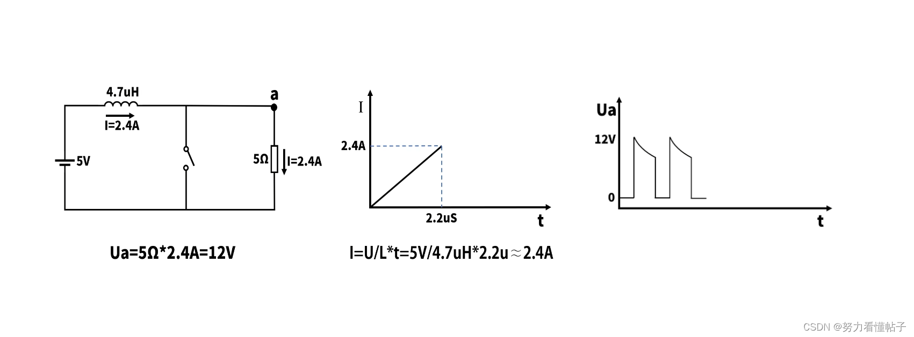 

如上图，开关闭合，电感充电，电阻短路，当2.2us后电感上电流达到2.4A。   
有U = L\* di/dt,在开关闭合的时候,电感两端电压是固定的为5V,因此在L确定的情况下，电流随时间变化的斜率di/dt是固定的为1.064,斜率乘以2.2约等于2.4,

开关断开，电源流经电感（电源电压＋电感电压，达到升压，电感放电）为电阻供电，2.4A的电流流过电阻，电阻两端电压达到12v。

但是，若开关闭合，电阻又被短路，电阻两端电压随开关闭合与断开变化    

### 复杂升压电路介绍  
在简易升压电路的基础上增添器件   
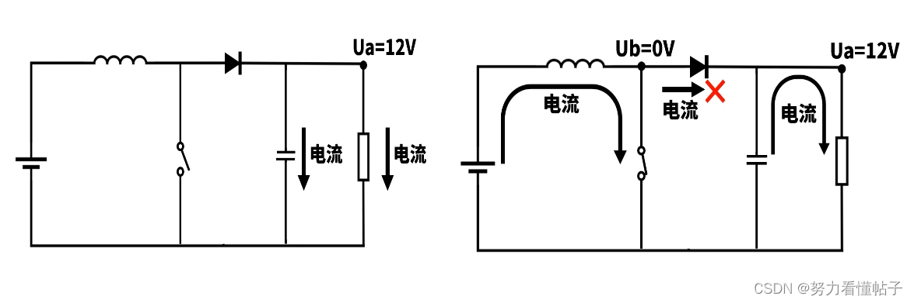    
开关闭合，电源向电感充电，电容、电阻短路。      
左图，开关断开，电源流经电感（电源电压＋电感电压，达到升压，电感放电）向电容充电，并为电阻供电。

右图，开关闭合，电源向电感充电，二极管隔离两边电路；电容（达到电源电压＋电感电压）向电阻放电。

现实，将开关换成MOS管，MOS管导通，电源给电感充电，电容给电阻放电；MOS管断开，电源电流流经电感向电容充电，给电阻供电。    

但是这种电路的输出还是要维持能量守恒   
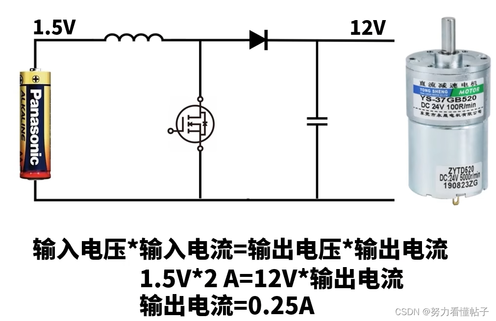   
升压到12v时，输出电流只有0.25A，不足以驱动电机。

所以需要并联许多节干电池，增加输入电流才行。可是既然有这么多干电池了，为什么不直接串联达到12v？还可以省略升压电路。   

## 自举电容   
DC-DC芯片设计中都有一个自举电容    
首先说一点，基于 Buck 拓扑的 DCDC芯片，对于这个自举电容并不是必须的    
自举电容的有无就取决于芯片设计中采用的MOS 管类型。     
要研究这个自举的由来，我们还是先看一下 MOS 的开启与关闭。从上文得知，我们首先要分别看一下 NMOS 和 PMOS 电源拓扑中的开关情况了,   
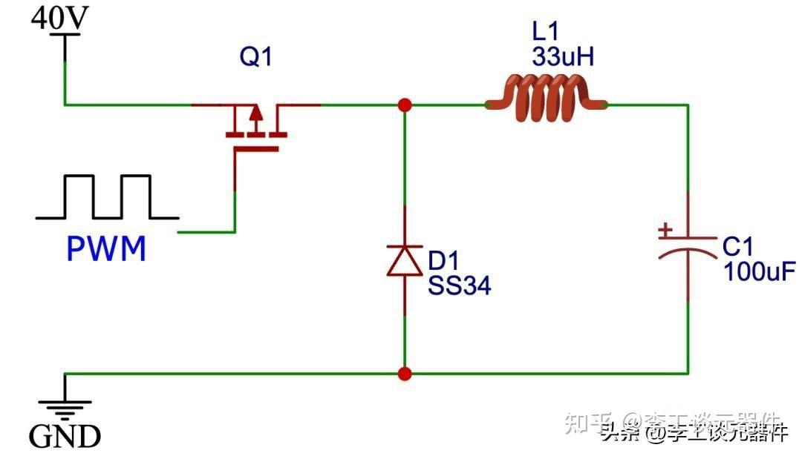    
上图中展示的 Bcuk 电路中选用的是 PMOS 来作为开关管进行斩波控制，因此，我们知道只需要在 Q1 的 Vgs 施加负电压就可以顺利打开 MOS 管 Q1。
但是，从MOS 管的生产工艺上我们了解到，PMOS 的导通电流往往做不到很大，相同成本下，NMOS 的导通电流可以做到更大，也就是 Rdson 可以做到相对较低

因此Buck 电路中会将开关管从 PMOS 更换为 NMOS，如下图所示  
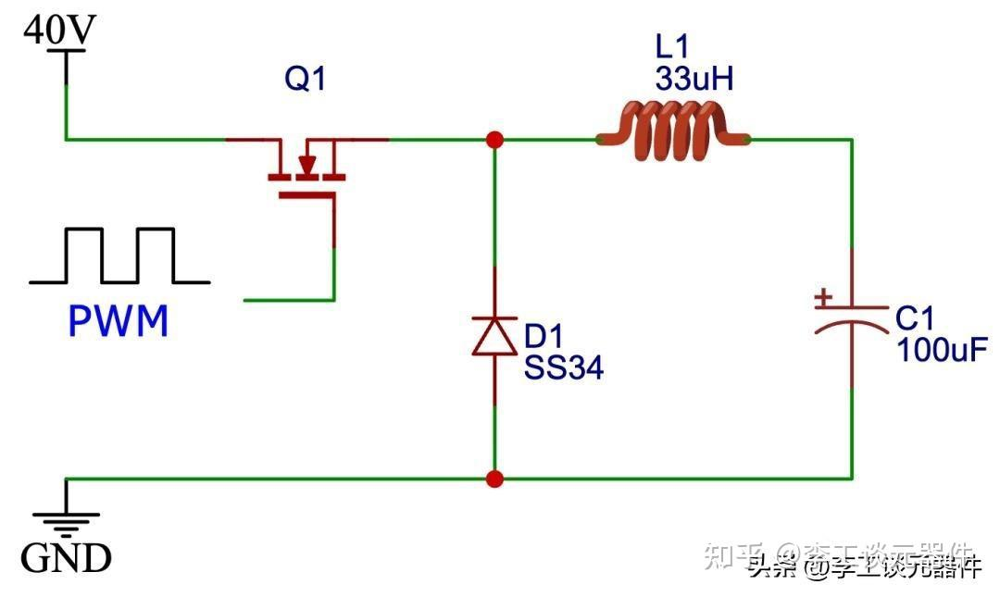    
那么问题来了，当我们把 Bcuk 电路中的 PMOS 换成 NMOS 之后，我们如何在 MOS 管 Q1 上给出一个高电平呢？

系统最高电压是 40V，从上图看，我们需要在 MOS 的栅极给出 45V 以上的电压才能使得 Q1 完全导通。

因此，在高边 MOS 使用 NMOS 的 DC-DC 芯片设计中，就需要一个电路来进行自举，也就是产生一个高于系统输入电压的电压来打开高边的 NMOS。又因为电容的体积问题，很难集成在 IC 内部，因此绝大部分的 DC-DC 芯片要求使用者在外面放置这个自举电容     

### DCDC电路中的自举电容   
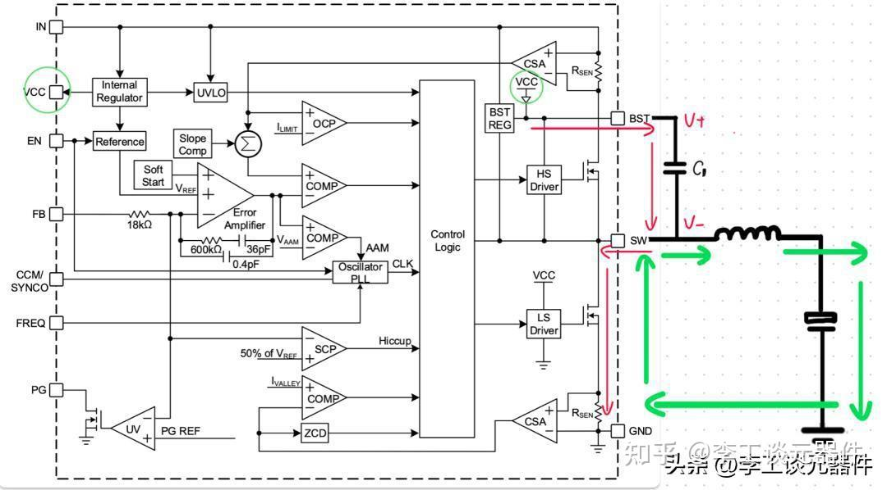   
框图中，两个绿色圆圈的 VCC 是 DC-DC 芯片内部稳压出来的一个可以驱动 MOS 开启的电压，也可以供芯片内部其他逻辑电路使用，这里你可以理解为输入电压 12V。

当低边 MOS 管通过 LS Driver （这里可以直接用 VCC 驱动，因为是低边的 NMOS）导通时，自举电容的回路通过红色箭头的回路进行充电，将自举电容两端电压 V+和 V-之间充到 VCC 的电压。

此时，buck 电路处于续流状态，因此绿色箭头表示的是电源输出与负载回路的续流回路。

当续流完毕，低边 NMOS 将被关闭，高边 NMOS 将由 HS Driver 选择将 C1 电容直接并接在高边 NMOS 的 GS 两端，高边 NMOS 打开为电感补充能量。

如果 DC-DC 中的高边 NMOS 换成一个 PMOS 的话，我们就没有必要大费周折的去给一个电容充电了，直接给一个比系统输入电压 VIN 低一些电压就可以打开高边的 PMOS 了。