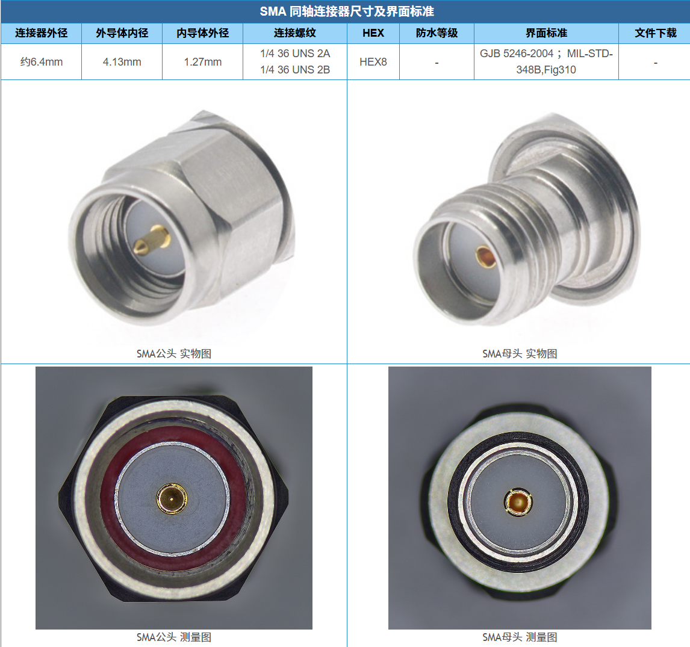
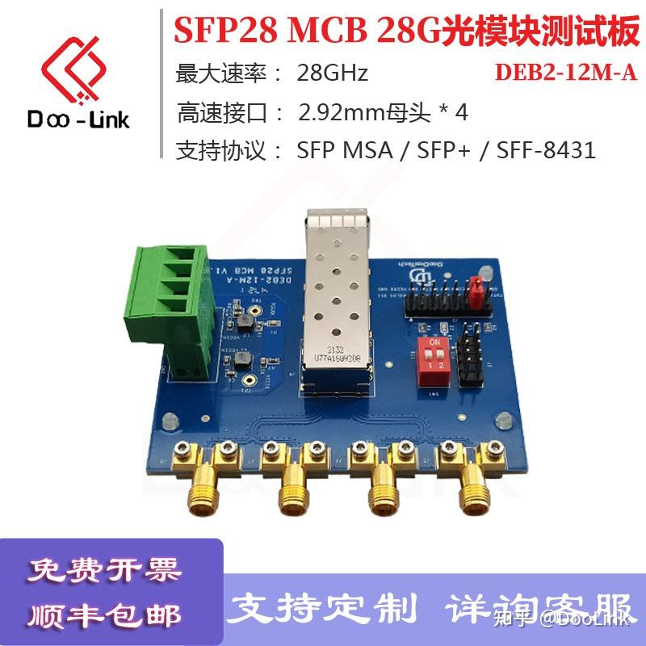
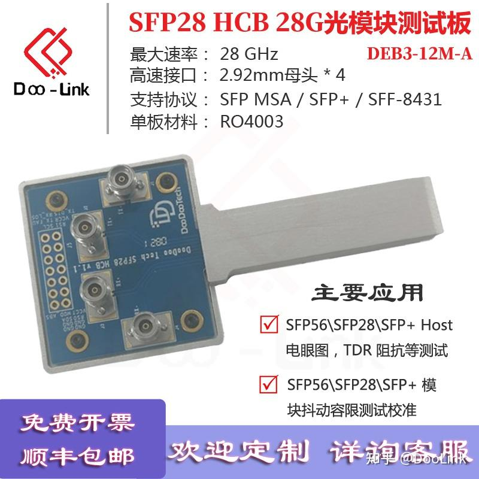

# 夹具       

## 什么是夹具    

工作了这么久，一直有个问题盘绕在我的心头，什么是夹具？    

**夹具就是一种“辅助工具”，它的核心作用是固定、连接或模拟被测试的对象，让测试能够顺利、标准地进行。**     

## 夹具的功能（对于光模块）    

1. **物理固定（“夹”住）**：把容易松动、尺寸很小的光模块或测试板卡，牢固地连接在测试平台上，防止因接触不良导致测试失败。

2. **接口转换（“转”接）**：光模块或板卡上的信号通常是密集的、微小的（比如金手指）。夹具内部有精心设计的电路走线，把这些微小信号引导并转换成标准的**SMA射频同轴连接器**（就是那种带螺纹的圆柱形接头），这样就能用标准的射频线缆连到昂贵的示波器或误码仪上了。    

   > 

3. **模拟标准负载（“扮”演）**：HCB本质上就是一个“假模块”，它里面没有激光器，但电路设计完全模仿真实模块的电气特性，这样它去测试主机时，主机以为插了个真模块，就会正常发射信号，工程师就能在另一端抓到主机发出的真实信号质量。

## 使用夹具的意义   

高速信号（比如100G、400G的光模块）的电路板非常精密，信号频率极高。如果不用专业的夹具：

- 直接用普通电线飞线焊接，会破坏信号完整性，导致测试出来的眼图（信号质量图）是错的。
- 手扶着模块，不仅手会抖导致接触时断时续，人体静电还可能直接击穿昂贵的模块。

所以，**夹具的终极目标就是：在尽量不“污染”和“失真”原始信号的前提下，提供一个标准、稳定、可重复的测试环境。**

# MCB与HCB    

MCB和HCB是**用于高速数据传输接口（如光模块、以太网）一致性测试的专用硬件测试夹具**。

简单来说，可以把它们理解为一套用来验证不同设备之间能否顺畅沟通的“翻译官”和“测试工具”：

- **MCB (Module Compliance Board) - 模块合规板**：它的主要任务是用来测试**光模块**本身性能的。你可以把待测的光模块插在MCB上，然后通过MCB上的标准接口（比如SMA或同轴连接器）连接到误码仪、示波器等专业测试设备，来评估这个光模块的电气和光学信号质量是否达标。

  > 
  >
  > 如图为MCB板,将光模块插入笼子中,PCB板上的电路能够将光模块金手指上的信号直接引出来到SMA同轴连接器上

- **HCB (Host Compliance Board) - 主机合规板**：它则是用来测试承载光模块的**主机设备**（如交换机、服务器的线路板卡）的。HCB会像一个“标准”的光模块一样，插入到主机设备上的光模块接口（笼子）中，但它内部并没有真正的光学元件，而是通过金手指和PCB走线将高速信号引出到另一端的测试接口（如SMA连接器），方便工程师来测试主机端发出的信号质量

> 
>
> 如图为HCB板,前面那个灰色金属体是仿造模块的形状构建的,它能够将主机设备的信号通过PCB板导出到SMA同轴连接器上