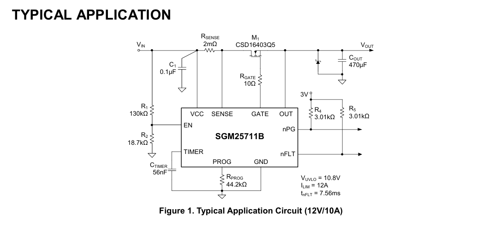
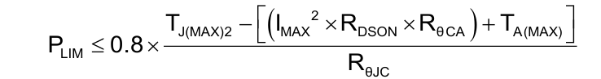
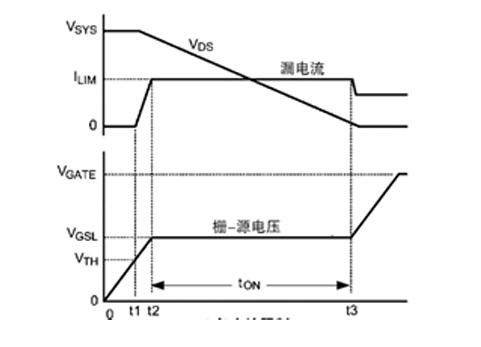
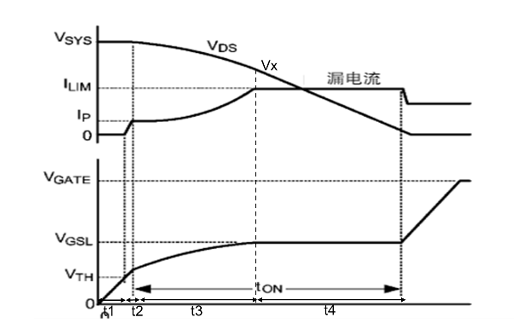

# 热插拔芯片   

## SGM25711   

通常我们使用的热插拔芯片是SGM25711，其典型电路如下   

## 工作原理介绍    

工作原理其实非常简单,就是检测VCC端和Vsense端的电压,通过Rsense两端的电压可以判断是否超出限定的电流大小,检测到小于设定的电流大小,那么在gate脚给出一个电压,使M1的MOS管导通,如果大于设定的电流,那么就关闭MOS管      

芯片还有一个PROG引脚,这个引脚是可编程功耗限制脚,它是用来限制mos管最大功耗的(注意不是用来限制电源功耗的,电源功耗可以大于这个设定的限制功耗),防止MOS管直接被热击穿     

## 计算公式    

限流公式:ILim = 25mv/Rsense      

> 解释:这个这个芯片实现限流就是通过一个比较器,可以简单理解为比较器一端连接25mv电源,一端连接限流电阻的电压,一旦Rsense上的电压超过25mv,比较器就会输出高电平,通知电流超载,所以可以通过设置Rsense的大小来控制ILim  

功率限制公式计算出的限制功率是用来保护MOS管的,所以要求:    

PLim < (Tj(max) - Tc(max))/Rjc,也就是说,要求功率限制小于MOS管热击穿时的功率   

> 其中Rdson是Rds(on),也就是导通状态下源极和漏极的等效电阻I²R就是功率  
>
> 乘0.8是为了给Plim和热击穿功率之间保留一些裕量

由此可以计算出Rprog的电阻大小   

功率限制电阻推导公式:Rprog = 3600/(PLim×Rsense)   

>   注意,这个公式不是推导出来的,而是在数据手册上直接给出的,

## 电流限制保护的作用过程

当通过RSENSE设置的电流限制点小于PLIM/VCC(当系统刚启动，MOS管两端的电压差（VDS）几乎是整个电源电压**VCC**,因为输出端电压接近0V)，说明在整个启机过程中全部由电流限制发挥作用(Plim发挥不出来)，不会触发功率限制。首先GATE引脚给MOS管的栅极充电，当栅-源电压经过t1到达阈值VTH后MOS 管开始导通。在t1到t2时间，漏源电流跟随k(VGS−VTH)2关系增长。t2到t3过程由于TPS24711内 部跨导放大器会将RSENSE电阻上的压降转换为芯片GATE引脚的充电电流，从而将VGS控制在 VGSL，此时漏源电流值为ILIM。如果计算这种情况下的整体启机时间则为：

## 电流限制与功率限制共同作用下开启过程   

当通过RSENSE设置的电流限制点大于PLIM/VCC，在启机过程中漏源电流从0开始增加，首 先由功率限制起作用。首先GATE引脚给MOS管的栅极充电，当栅-源电压经过t1到达阈值VTH后 MOS管开始导通。电流增长并在t2时间点到达图中的IP，此时触发到设置的功率限制点 PLIM。t2 到 t3时间为功率限制过程，该过程中VDS逐渐减小，相对应的漏源电流逐渐增大，直到该电 流增大到ILIM时为t3。t3到t4的过程再次回到限流模式，该过程同情况1）直到输出电容充电至 VCC。

