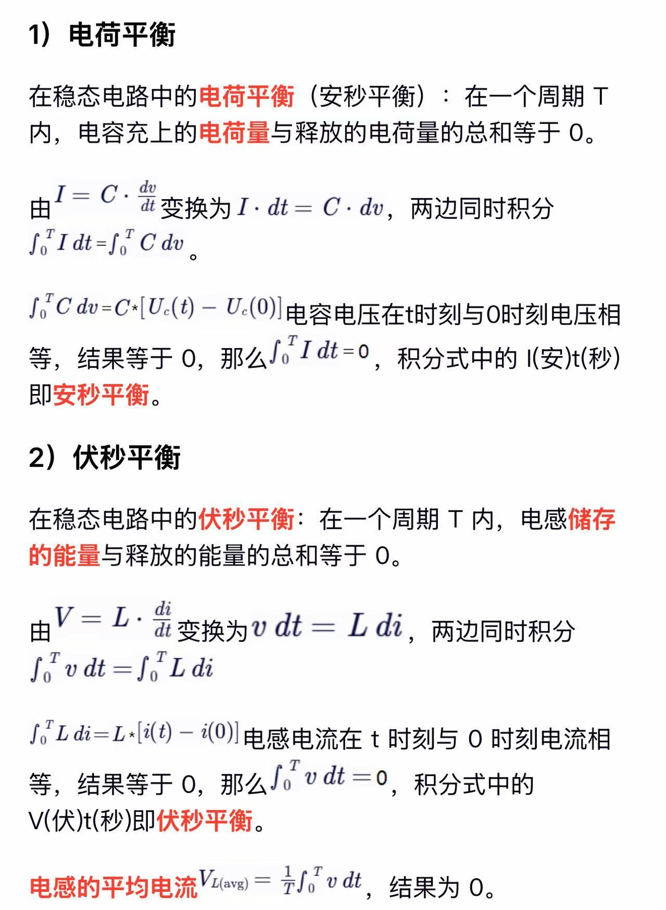

## 电容   
度量式: q = C·U    
微分:I = C·(du/dt)  

### 安秒平衡   
在开关电源(就是类似于50%时间通电，50%时间断电的电源)稳态工作下,电容在一个周期内的充电电流和放电电流的时间积分（即电荷量）必须相等，否则电容电压会持续上升或下降

## 电感    
度量式：磁通量 = L·I    
微分：U（电动势） = L·（di/dt）     

### 伏秒平衡   
在开关电源(就是类似于50%时间通电，50%时间断电的电源)稳态工作下,电感在一个完整开关周期内储存的能量必须等于释放的能量。     
什么是伏秒,伏秒 = 电压（伏特） × 时间（秒），即电压对时间的积分，代表电感中能量的变化量    
伏秒平衡的本质是 电感在稳态下的磁通守恒。电感电流不能突变，因此在一个周期内，正向和反向的电压作用时间必须平衡，否则电流会持续增长或衰减，导致系统不稳定。这是电感特有的性质。  
 

## 平衡计算过程  
