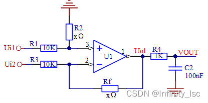
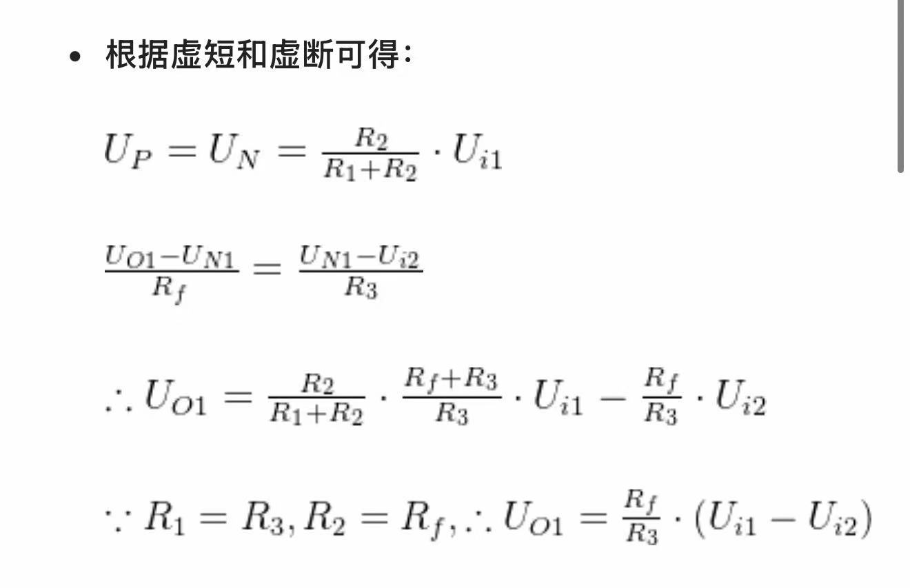
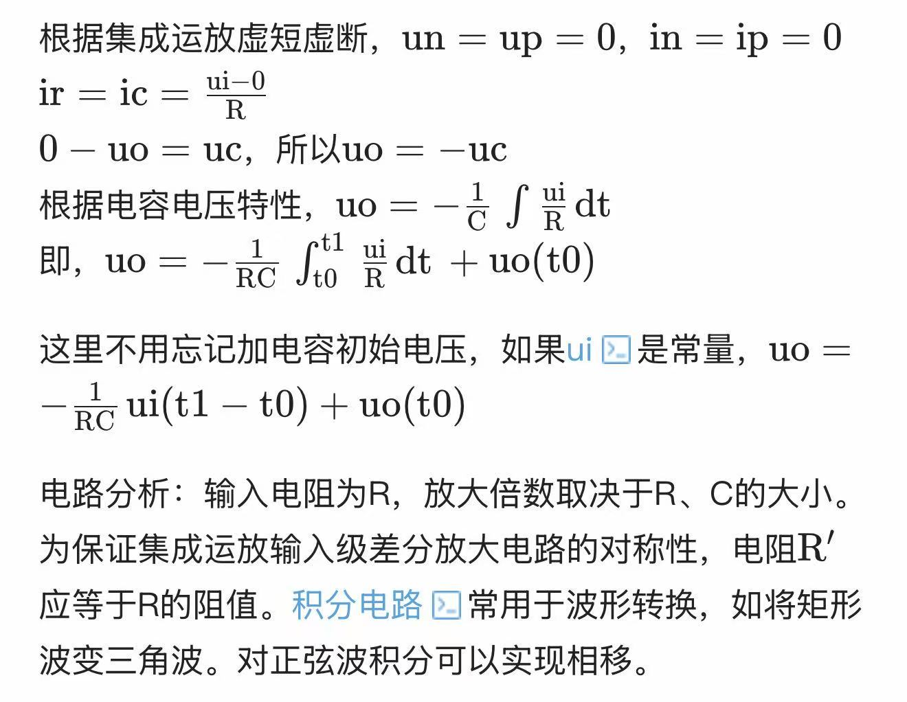
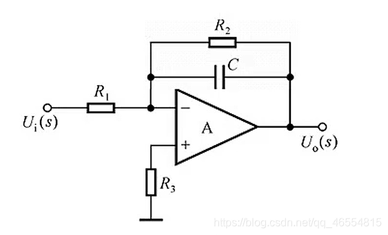
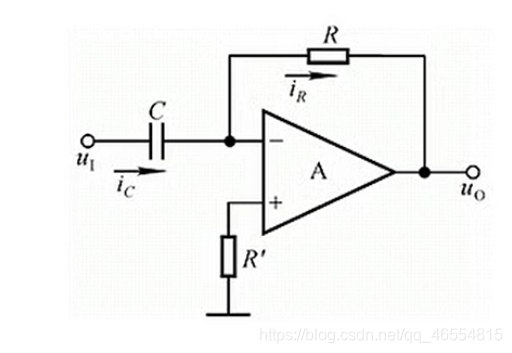
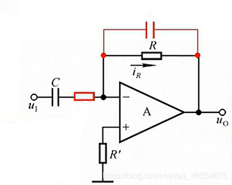
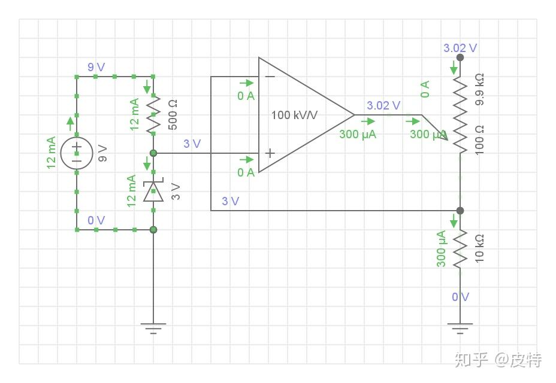
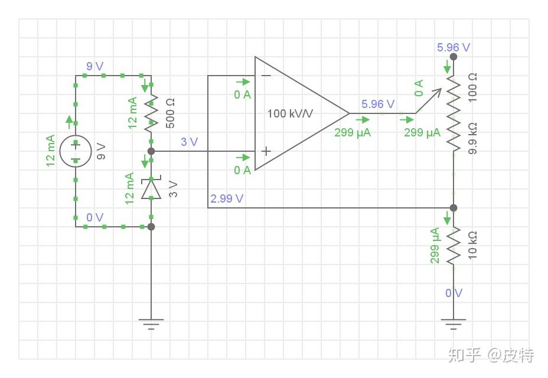
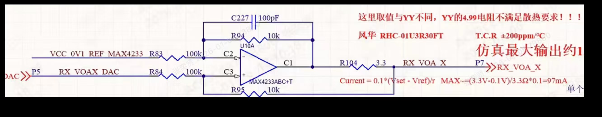

## 运算放大器做差分放大电路   
差分放大电路又称为差动放大电路，当该电路的两个输入端的电压有差别时，输出电压才有变动，因此称为差动     
差分运放的典型电路如下:   
    
其计算过程如下:  
   

## 运算放大器做积分器    
    
计算过程如下:    
     

### 稳定的积分电路      
上述的分析是基于通频带内，如果频率趋于0，电容容抗无穷大，反馈电路近似为开路。反馈电路开路就会导致电压放大倍数无穷大，集成运放电压失调。为了避免低频反馈电阻无穷大，一般会并联上一个电阻.
     
一般取R 2 > 10 R 1 R2>10R1R2>10R1，可见R2也是一个大电阻，但是远比低频电容容抗小。通频带中R2几乎不分流，所以电压增益不会减小太多。分析方式与一般的积分运算电路相同

### 积分器和反向放大器之间的区别    
详细见如下两个网站内容     
https://blog.csdn.net/qq_25814297/article/details/107057204     
https://www.elecfans.com/d/6470398.html

## 运算放大器做微分器   
    
ir=ic=C×
dui/dt
    
uo = − ir × R
      

所以,uo = -RC × dui/dt    
放大倍数取决于R、C大小，为保证对称性R约'等于R     

### 稳定的微分电路       
上面的微分运算电路存在不少问题，实际运用中会发生阻塞和自激振荡。
    
电容电压不会跃变，当输入发生跃变时，电容起不到缓冲作用，跃变电压直接输入到集成运放，导致集成运放中部分三极管进入饱和区或截止区，运放失去放大功能，即出现阻塞。
    
集成运放输入级存在着分布电容和其他电容，这些电容是导致电路自激振荡的原因之一。一般集成运放都会带有补偿电容防止自激振荡，但是微分运算电路在输入级放置电容就很容易发生自激振荡。
一般采用下图电路来解决阻塞和自激振荡。    

   

如图所示在输入级放置一个小电阻可以防止阻塞，当有较大的脉冲时，电阻可以起到缓冲作用。在反馈通路并联一个小电容作为补偿电容可以有效防止自激振荡。补偿电容选取一般3-10pF。当反馈通路并联上一个电容后看上去有点像积分电路，那么如何区分积分还是微分电路呢？可以通过判断电容大小，微分电路输入端的电容远大于反馈通路的电容。
由于加上的都是小电阻和小电容，在分析放大倍数时可以忽略不记，放大倍数与一般的微分运算电路相同

## 运算放大器做恒流源  
运算放大器做恒流源的原理是：   
运算放大器在一个电阻两端设置固定的电压，由欧姆定律和KCL定理可得，流出的电流大小就是恒定的，也因此可以作为恒流源    
    
由图中可得,在电路中利用稳压管将输入电压限制在3V,由于正负端虚短,所以V+ = V-     
由欧姆定理可得,由负端到地的电流为300ua,且由于放大器虚断,不可能有电流流经负端,所以电流只能从运算放大器的输出端流出,由此限制运算放大器的输出电流恒定在300ua.    
> 注意运算放大器在放大状态下只有虚短虚断是恒定,其他条件是围绕这两个进行的     

参考电压3V，限流电阻10KΩ，意味着恒流源电流为0.3mA（300uA）。负载阻值从100Ω到9.9kΩ可调。特别的，在100Ω情况下，运放输出端电压为3V（3.02V）。

将负载阻值调到9.9kΩ，根据仿真结果显示，恒流源电流仍然为0.3mA（299uA），运放输出端电压为5.96V   

由此,负载接在运算放大器的输出端,无论如何变化,通过的电流始终是恒定的.    

### 非常神奇的一个差分放大恒流源电路     
    
前面也有解释,运算放大器在一个电阻两端设置固定的电压，由欧姆定律和KCL定理可得，流出的电流大小就是恒定的，也因此可以作为恒流源.   
这个运算放大器中C227（100pF）,并联在反馈电阻 R94 两端，是相位补偿电容，用于抑制运放高频振荡，保证电路稳定性可以认为几乎不参与运算.     
将R104左边的电压定义为Vc1，右边的电压定义为Vout。    
由虚断虚短得:  
(Vref - V-)/R83 = (V- - Vc1)/R94       
(Vset - V+)/R84 = (V+ - Vout)/R95         
将 R83=R84=100kΩ
、
R94=R95=10kΩ
，将 
R83=R84=R
、
R94=R95=R
f,带入上面两式中可得         
整理得:    
Vset - V+  = 10 × （V+ - Vout） =》 Vset + 10 Vout = 11V+              
Vref - V-  = 10 × （V- - Vc1）  =》 Vref + 10 Vc1 = 11V-   
由于虚断虚断，V+ = V-     
Vset + 10Vout = Vref + 10Vc1     =>   (Vset - Vref)/10 = Vc1 - Vout     

由这些计算过程可得，R104 两端的电压会由运算放大器来恒定，由于反馈回路的电阻非常大（100K和10k），反馈电流相对于干路电流非常小，因此，可以将干路电流大小视为恒定，即为恒流源 