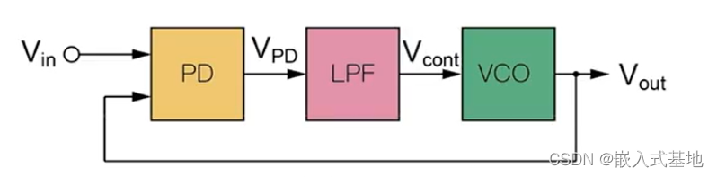
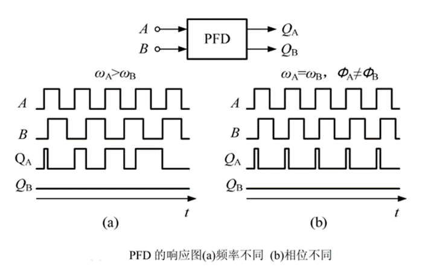
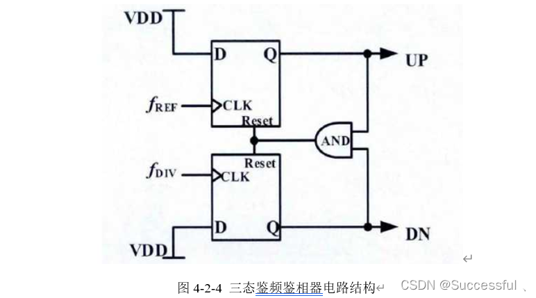

# 锁相环    
   
我TM直接对它的原理进行介绍：  
鉴相器：对两个信号的相位进行比较，根据相位差的大小输出相位电压  
LF低通滤波器：为鉴相器的输出电压进行平滑处理，去除噪声等太高频电压，使压控振荡器能够输出稳定的频率    
压控振荡器：能够根据电压输出不同频率的方波   
进行负反馈，使输出电压和输入电压频率趋同   
首先，我要对相位这个概念进行解释，一个信号sin（Wt+θ1）和另一个信号sin（Ωt+θ2），他们输入鉴相器中比较相位，比较的相位是他们经过这段时间T后的总相位，是WT+θ1和ΩT+θ2。     
为什么压控振荡器可以改变相位呢？用运动来举例
想象一下，您和另一个朋友在环形跑道上跑步。

目标相位差： 您希望和朋友的步调完全一致，即保持一个固定的相对位置（比如肩并肩）。这个“相对位置”就是相位差。

当前状态： 您稍微落后于朋友。

您的角色： 您就是一个压控振荡器（VCO）。您跑步的频率（步频）决定了您的速度。

如何追上（改变相位）？

错误方法： 您不可能“瞬间传送”到朋友身边来直接改变您的位置（相位）。在现实中，没有直接改变“位置”的方法。

正确方法： 为了追上朋友，您会怎么做？您会加快步频（提高频率），跑得比朋友快一点。

在您跑得更快的这几步里，您和朋友之间的相对位置（相位差） 就在逐渐缩小。

当您终于和朋友肩并肩时，您会立刻将步频调整到和朋友一模一样（频率同步），这样就能一直保持肩并肩的状态。

## 鉴相器  
### 1. 原理    

其工作原理如上图，A，B两个输入端口接的是时钟信号；当A时钟信号的上升沿先到，QA升到高电平，直至B时钟信号上升到高电平，QA电平降至低电平，其间保持低电平；B上升沿先到也是同样的逻辑。在上图（理想情形）中展示出了频率不同(a)和相位不同(b)的QA、QB输出波形。QA、QB即为鉴频鉴相器通过比较A、B信号的相位信息给出的电压信息。我们把Fi,Fo(Fi是外部输入信号,Fo是压控振荡器在0电压时的输出信号)分别接在A,B端口，我们就能得到Fi,Fo之间的频率差和相位差的信息了.   
我们可以将QA和QB视为PWM信号,因为Fi和Fo都是有频率的所以肯定有周期(无论Fi与Fo的信号是否分率相同),必然有周期占空比,这个占空比就可以用来转化为电压值给予压控振荡器来输出合适的频率,之后整个电路会一直处在动态平衡之中保持频率稳定.
### 2. 电路实现  
这个锁相环可以用简单的电路来实现  
   