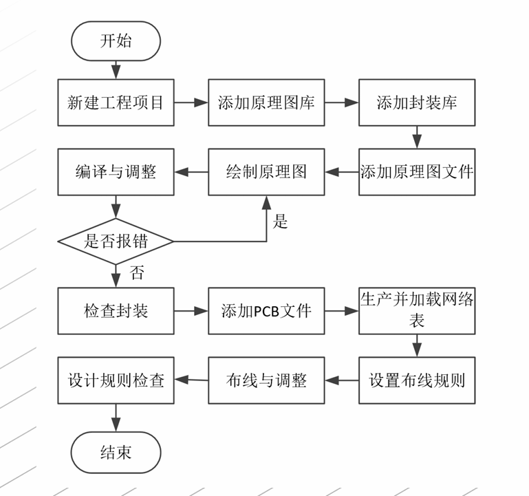
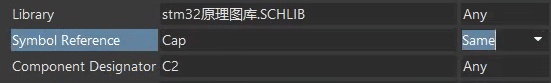
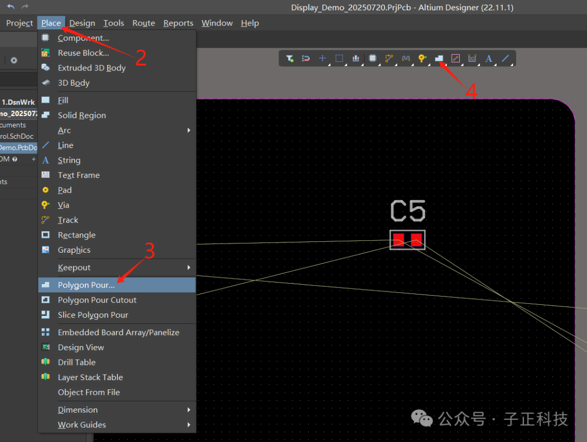
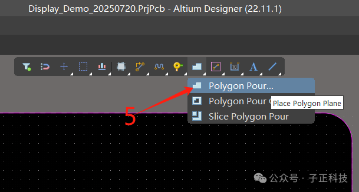
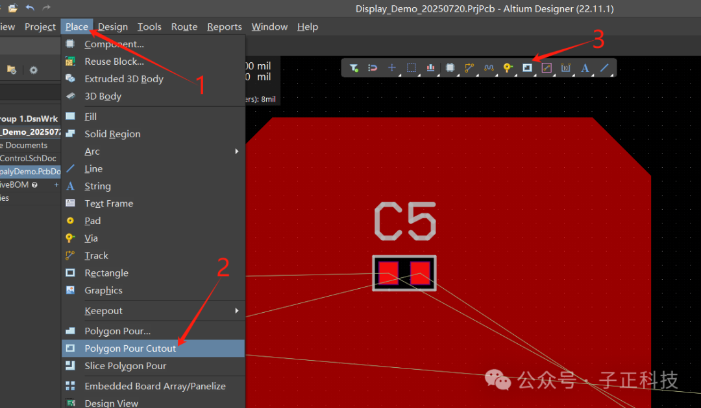
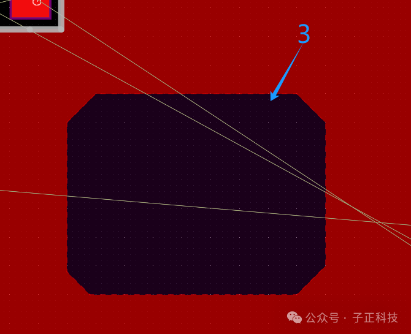
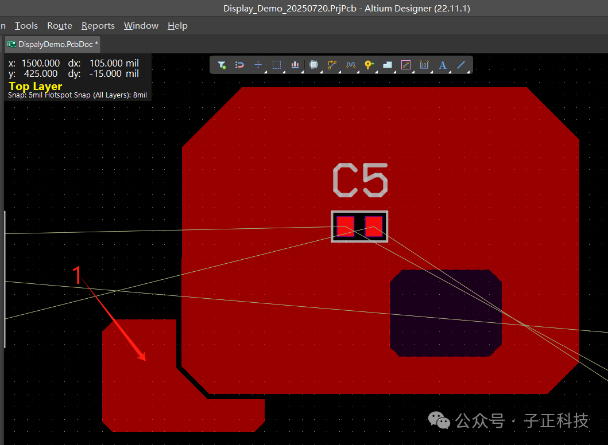
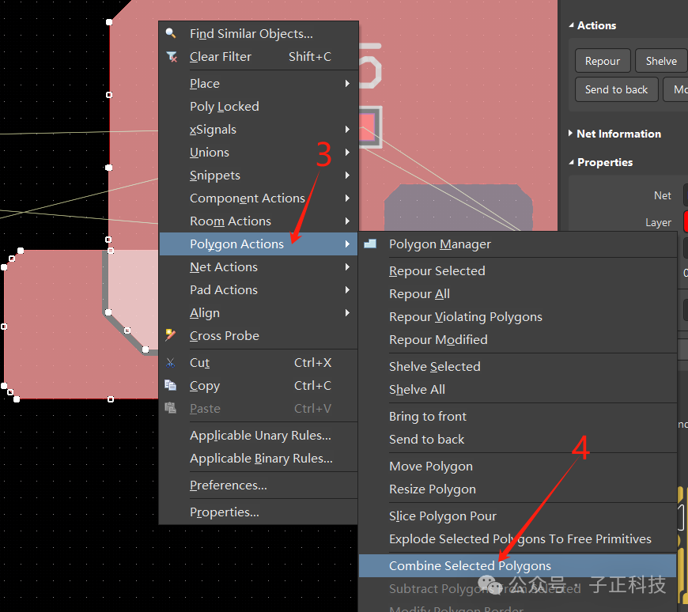
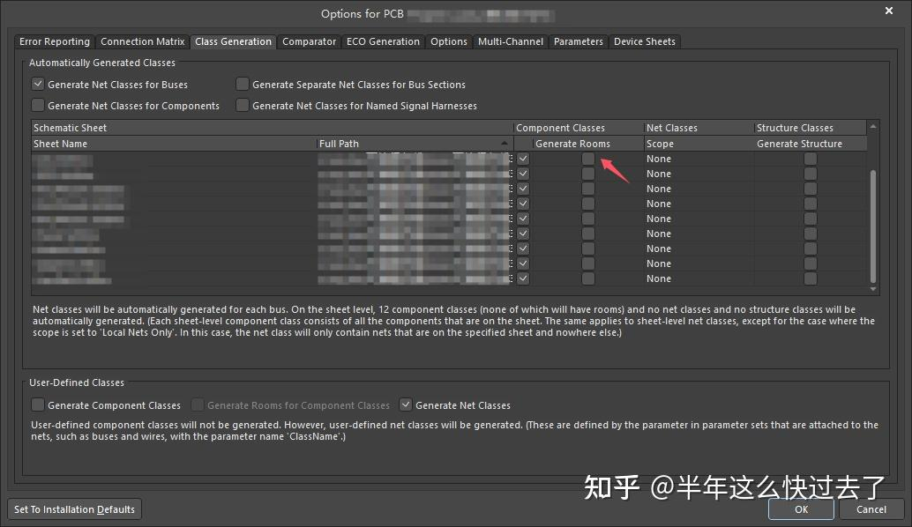

## PCB板绘制流程  

## 工程文件的建立

在new中创建PCB工程  
PrjPCB是总工程的文件后缀  
SchDoc是工程中原理图文件的后缀  
PcbDoc是工程中PCB板图文件的后缀  

## 原理图的绘制   
### 绘制时的常用快捷键  
空格：使元器件90°旋转    
X：使元器件水平翻转180°  
Y：使元器件竖直翻转180°    
在绘制线条的时候，按下空格可以使线条变直，点击左键可以为线条分段  
###  元器件的放置  
点击右侧导航栏的Libraries，选择一个自己需要的图库，如果没有就需要自己导入原理图库进去。  
点击Libraries导航栏下面的libraries，在弹出的窗口处点击install，选择install from file，选择导入自己的PCB库。  
> 在绘制完成后可以点击Design菜单栏中选择Annotation(注释),选择Reset Schematic Designators(注销原理图标志符)，在点击Annotate Schematics quietly(快速注释)，就能够快速为所有元器件进行编号。   
### 元器件连接
放置元器件后，我们需要对元器件的引脚画线，画线后给引脚设置网络编号（net label）  
### 原理图分框  
点击Utility tool 或则drawing tool点击Line 给各个模块进行划分。

## PCB图绘制  

### 元器件封装  

点击器件，弹出properities，点击footprint，选择自己需要的封装，或者点击add选择需要的封装，一般来说可以从外面PcbLib文件中添加所需要的所有封装，当然你也可以自己去设置封装。  

批量选择封装：  

右键要批量选择的元器件，点击Find similar objects，将需要类型的器件处点击为same，点击ok即可选中所有所需的器件。  (cap是电容的意思,当时是选中电容作为演示器件),然后就与上面的封装内容相同.

点击编译,运行成功没有报错,那么就可以开始绘制PCB板了.

### PCB布局

点击T+G打开封装管理器,可以看到原理图使用器件的封装  

在原理图中,点击Design菜单栏,点击update PCB Document弹出窗口,点击Execute change可以将原理图中的器件导入到PCB文件中

> PCB的各层介绍:   
>
> mechanical机械层:又来规划PCB板形状的层.  
>
> Top layer顶层布线层   
>
> Bottom layer底层布线层  
>
>  Top overlay顶层丝印层: 用来标注各种标识,元件号,底层丝印层同理

在mechanical中用线条画出板子所需的形状,点击构建形状的线条(按住shift可以多选线条),点击Design菜单栏,点击Board shape,在点击Define from selected objects,即可构建所需的板子形状.   

### PCB布线  

自动布线:点击Route菜单,点击Auto Route进行自动布线.  

电气规则的修改: 点击Design菜单栏,点击Rules,点击Electrical,点击Clearance(清理,还有间隙的意思),可以用来设置每条线之间的最小间距

###  覆铜

覆铜的意义:散热,还有接地  

在顶层,点击place polygon plane(放置多边形区域)将整个Mechanical覆盖住,选择这个多边形区域右键打开properities,点击net为GND(就是为了给这个多边形区域接地),点击Remove dead copper(去除死铜)去掉没用的铜附着地,点击apply,最后点击Tool菜单栏,点击polygon pours 在点击Repour all, 将铜全部重铺一遍,相当于为前面的操作刷新,随后将这个多变形区域复制,在操作一遍,不同的是将net操作的后一步添加一个将层设置为bottom层,其余操作不变,这下就设置好了覆铜操作.

之后更改元器件在铜层上,只要点击重铺,就可以为元器件留出空间.

   

构造出我们需要的铺铜形状和大小,形成闭合图形后，按下ESC键，即形成我们需要铺铜；       

对于铺铜进行挖空:   

放置在之前铺铜的地方,就会出现一个我们设计的挖空区域

   

铺铜合并:   

使用鼠标左键框选出两个需要合并的铜皮；

即可合并铜皮   

参考文献:[Altium Designer 22使用笔记(10)---PCB铺铜相关操作_ad22铺铜规则设置-CSDN博客](https://blog.csdn.net/weixin_46134133/article/details/150998102)

### 电气规则检查  

这一步是用来,检测PCB布线之类的是否符合规则.  

点击Tool 菜单栏,点击Design rule check,点击Run Design rule check 检查规则.  

有则改之,无则加勉.

### PCB图更新   

Altium Designer 提供了将原理图中的内容更新到PCB图的设计功能，有两种更新方法：

（1）在原理图编辑环境下更新 PCB：切换到原理图编辑界面，执行菜单命令Design（设计）→Update PCB Document（更新PCB文档）。

（2）在PCB编辑环境下更新PCB：切换到PCB编辑界面，执行菜单命令Design（设计）→Import Changes From（引入原理图中的更改）。

注意,要在同一个工程下进行这个操作    

## 出现问题  

### 原理图更改后,更新到PCB图中出现room definition 错误,如何解决

解决方法:删除Room   

1、在原理图或PCB界面，点击顶部菜单 **“工程 (Project)”** -> **“[工程选项] (Project Options)”**。

2、在弹出的对话框中，切换到 **“[Class Generation]”** 。

3、找到关于 **“Room”** 的生成选项

**取消勾选** 这个选项，点击“确定”保存设置。

这样设置后，即使画新的原理图，也不会自动生成Room了。但对于已经存在的Room，需要重新更新PC把或者直接在PCB中将其删除。
