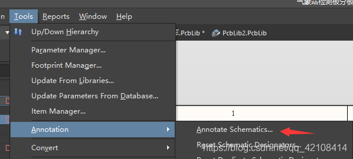
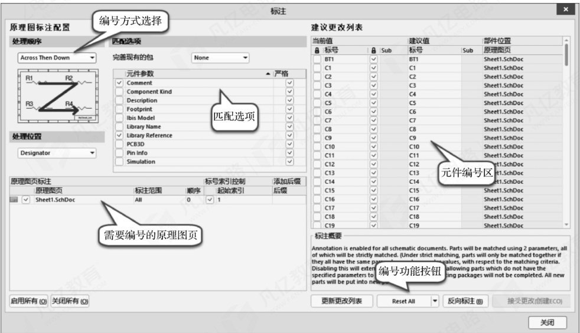
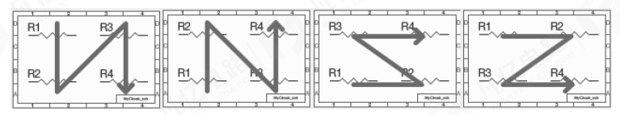
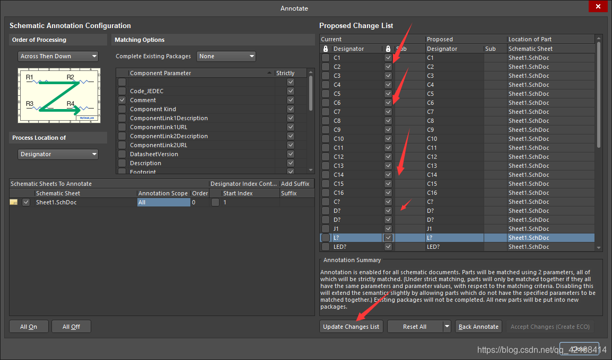
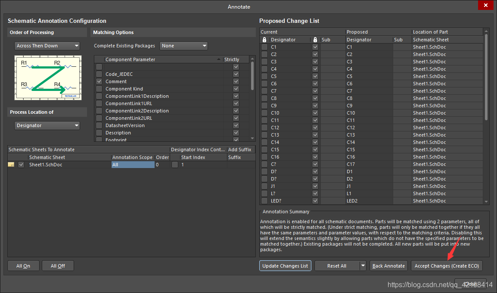
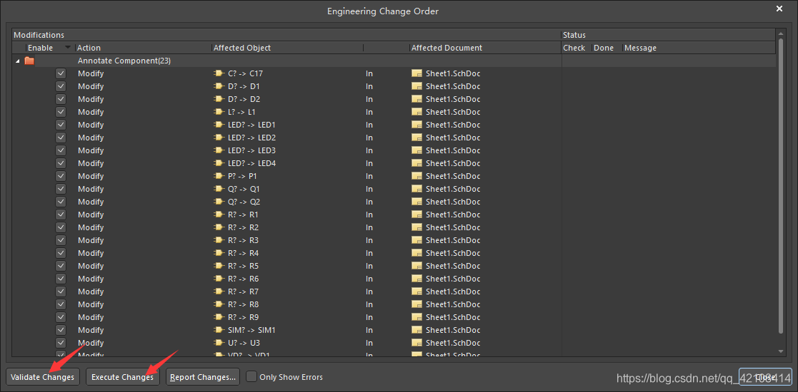
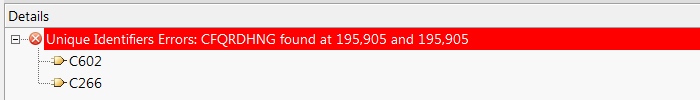
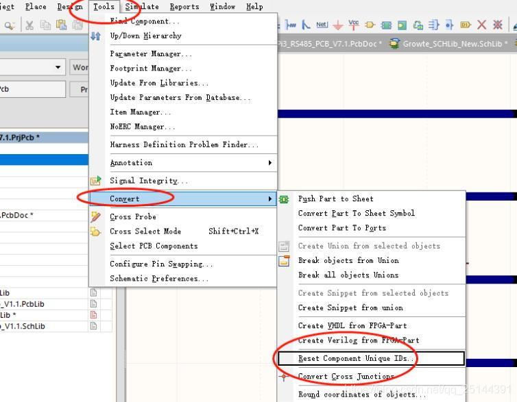
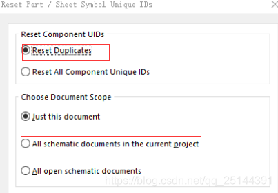

# 元器件自动编号   

你们是否烦恼，每次画原理图的时候，放置器件，比如电阻、电容一类的器件，一张原理图要放很多个，然而每次改名字很费劲，不改又报错，下面给元器件自动编号的技巧会使你事半功倍

## 1. 首先点Tools -> Annotation ->Annotate Schematics   

      

会出现如下界面   

其中,编号方式有这几种分类   

Altium Designer提供4种编号方式。

① Up Then Across：先下而上，后左而右。

② Down Then Across：先上而下，后左而右。

③ Across Then Up：先左而右，后下而上。

④ Across Then Down：先左而右，后上而下。

4种编号方式分别如图所示。可以根据自己的需求进行选择，不过建议常规选择第4种“Across Then Down”方式。

## 2.把需要编号的打钩，选择Update Changes List   

随后,我们就会发现元器件已经自动编号好了    

## 3. 点击Accept Changes后,先点Vailidate Changes 再点 Execute Changes ，最后Close   

# 可能会出现的问题     

##   复制原理图报错 (Unique Identifiers Errors)

如果是直接复制原理图,而不是新建原理图在将器件黏贴上去的话可能会存在这个问题

报错原因:

 原理图模块文件复制粘贴会出现ID相同的情况，即使重新为器件标号，ID确不会改变

  UNIQUE ID在原理图和pcb里面相当于元器件的唯一身份许可，不可相同

解决办法:   

​    操作-TOOL/Convert/Reset Component unique ids

根据弹出对话框选择自己相应的选项

