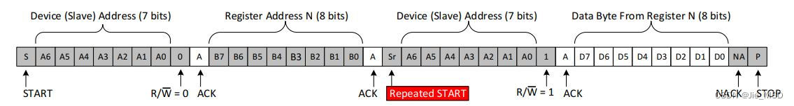

# I2C通信协议介绍  

## 原理  

IIC总线设计的非常的精巧，通过改变SCL和SDA就可以实现设备间的通信，下面三条定义刚好把SCL 和SDA 二条线上会发生的信号变化全部都包括了。

SCL为Low 时，可以改变SDA上的数据值。
SCL为High时，SDA 必须保持数据稳定，不可以改变，以方便对方读取（锁存）数据。
SCL 为High时, 如果SDA有变动则视为特殊状况: Start (启始, SDA 由High 转为Low) 或Stop (结束, SDA 由Low 转为High)
  

其中ACK指应答位置

## 写操作  

要在I2C总线上写入，主机将在总线上发送：一个启动“Start”标志、从机地址、从机地址后的最后一位（R/W位）设置为0，这表示写入。
  从设备发送ACK响应确认后，主设备将发送其希望写入的寄存器的寄存器地址。从设备将再次确认，让主设备知道它已准备就绪。在此之后，主机将开始向从机发送寄存器数据，直到主机发送了它需要的所有数据（有时这只是一个字节），并且主机将以停止条件终止传输。  

## 读操作  

主设备“读”从设备 的操作称为读操作，它和写操作非常相似，但需要一些额外的步骤。（以下master代表主设备，slave代表从设备）
  Master为了读取slave的数据，master必须首先指出希望从slave的哪个寄存器读取数据。这是由master写入slave的“写操作”类似的方式开始传输，通过发送R/W位等于0的地址（表示写入），然后是它希望从中读取的寄存器地址来完成的。
  一旦slave确认该寄存器地址，master将再次发送启动条件，然后发送slave地址，R/W位设置为1（表示读取）。这一次，slave将确认读取请求，master释放SDA总线，但将继续向slave提供时钟。在这部分事务中，master将成为主“接收器”，slave将成为从“发射器”。
  master将继续发送时钟脉冲SCL，但会释放SDA，以便slave可以传输数据。在数据的每个字节结束时，master将向slave发送ACK，让slave知道它已准备好接收更多数据。一旦master接收到预期的字节数，它将发送一个NACK，向slave发送信号以停止通信并释放总线。之后，master将设置停止条件。  

为什么要两次start的理由,因为一次start后其数据传输的方向是固定的,因此想要读取某个地址的数据还得进行一次start来改变方向