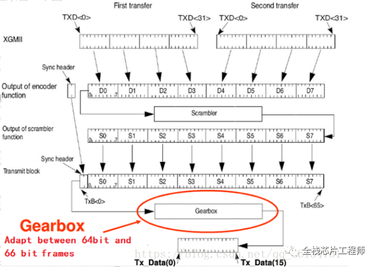
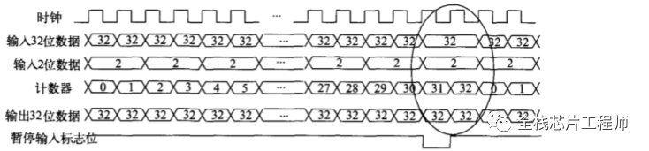

## gearbox原理介绍
本文聊聊GearBox的设计原理。譬如10GBase-R协议中规定64bit数据经过66B编码、扰码后的数据变成64bit的有效数据、2bit的同步头，而Serdes的并行端数据输入的位宽数可能是8bit、10bit、16bit、32bit等等小于66bit的位宽，因此芯片发送数据到Serdes模块时需要进行位宽大到小的转换。同样，芯片从Serdes模块接收数据时，也需要完成数据位宽由小到大的转变。GearBox就是实现任意数据位宽之间转换的变速箱。   
从理解上俩说就是不同位宽之间的接口（或者叫数据线，位宽就相当于数据线两端的接口）   

## gearbox流程介绍   
   
从物理编码子层XGMII传来两个32bit，加在一起64bit，经过encoder进行编码，得到编码后的数据D0-D7，生成同步头01。  
然后，不含同步头的D0-D7，经过扰码器，得到表达式X58+X39+1扰码后的数据S0-S7。之后，将同步头和扰码后的数据S0-S7合并，生成一个传输块，将这个传输块经过GearBox处理后，完成编码。接下来具体说明变速箱GearBox的实现过程，以10GBase-R的物理层为例，若Serdes的位宽要求为32bit，PCS层采用64B/66B的编解码方式，在与Serdes进行数据传输过程中，需要GearBox实现66bit到32bit的转换、32bit到66bit的转换。继续以上图为例子，XGMII层每拍输出32bit数据，每2拍组合成64bit报文，并且需要编码出2bit的同步头，为了简单化，假设待匹配的Serdes只有1个lane，且位宽为32bit，即GearBox输出是每拍32bit。显然，输入带宽是大于输出带宽，属于带宽膨胀，因此输入必须暂停，什么时候停呢，见下图波形所示，每32拍停一拍，即待发送的buffer数据积攒够了32bit，此时，产生暂停输入标志位，也就是“反压”住输入信号，让GearBox可以完成数据完整输出。   
   
> 从流程上可以看出,每两拍包含一个两位宽的同步头,相当于平均每拍有一个位宽的同步头,因此相当于在每32拍后留一拍给前面32拍传输同步头   

Gearbox作为数据速率转换这一个重要的过程的核心组成部分。其基本目的是将一种数据速率转化为另一种，以满足不同设备或网络的要求。   

Gearbox的基本架构主要由以下几个部分组成：

输入端：接收不同速率的数据流。
缓冲区：临时存储数据，以便于速率转换。
速率转换单元：负责实际的速率转换。
输出端：将转换后的数据流输出到目标设备。
这些组件协同工作，以实现高效的数据传输。Gearbox的设计需要确保在转换过程中尽量减少延迟与数据丢包