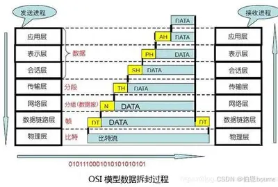
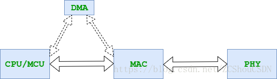
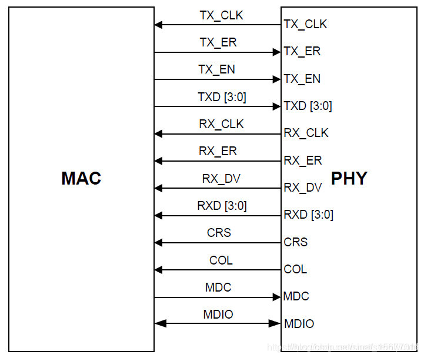
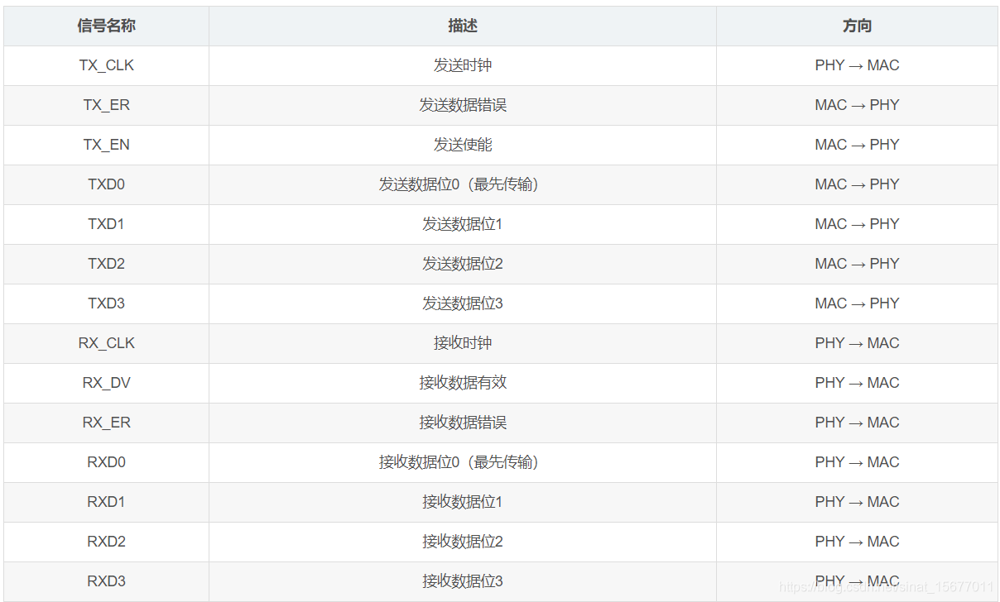
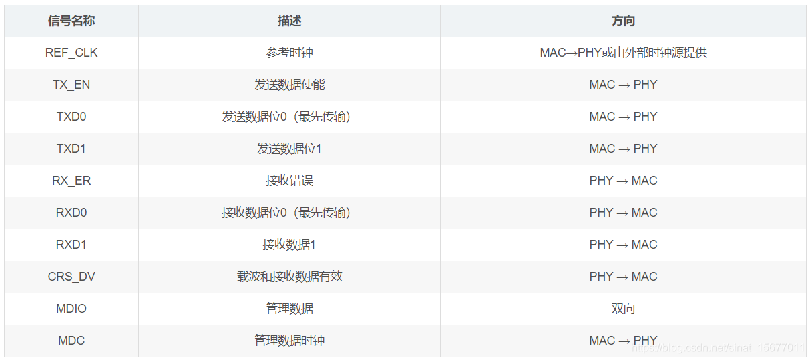
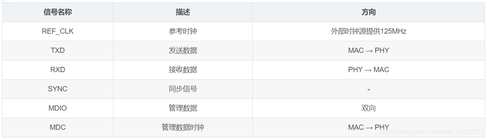
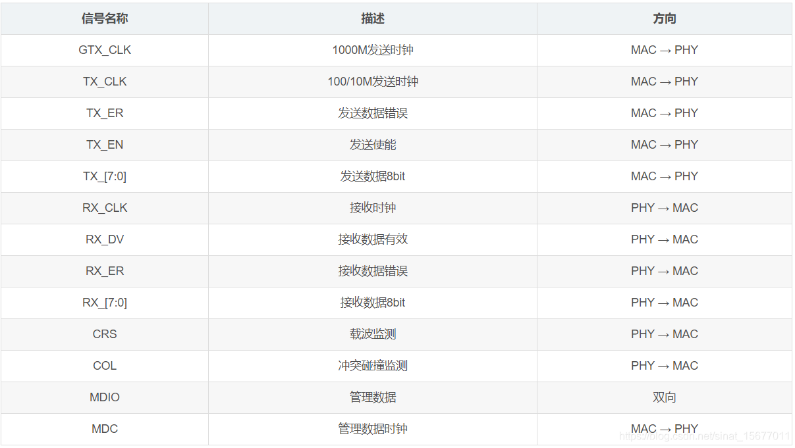
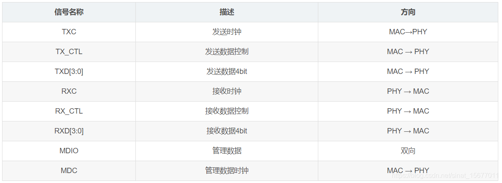
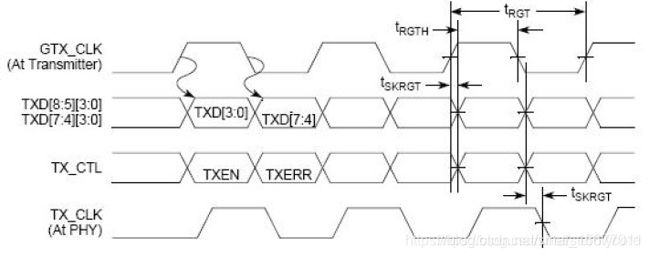

  
# OSI 和 TCP/IP模型  
## OSI七层模型   
OSI（Open System Interconnect）七层模型是一种将计算机网络通信协议划分为七个不同层次的标准化框架。每一层都负责不同的功能，从物理连接到应用程序的处理。这种模型有助于不同的系统之间进行通信时，更好地理解和管理网络通信的过程。  
OSI定义了网络互连的七层框架（物理层、数据链路层、网络层、传输层、会话层、表示层、应用层）      
  
### 应用层：为计算机用户提供服务 
通俗理解  
“用户直接接触的服务窗口”，是用户使用的应用程序，负责接收用户需求并发起通信，相当于“淘宝、微信、浏览器”等你直接操作的软件。  

核心任务  
为用户提供具体的网络服务（如浏览网页、发邮件、聊天）。  
定义应用程序之间的通信规则（协议），确保双方能“听懂”对方的请求。  

### 表示层：数据处理（编解码、加密解密、压缩解压缩） 
通俗理解
“数据的翻译与包装员”，负责将数据转换成双方都能理解的格式，相当于“跨国快递的翻译官+打包员”。  

核心任务  
数据格式转换：统一数据编码（如中文从GBK转UTF-8，确保双方能看懂）。  
数据压缩/解压：压缩文件减小传输体积（如图片压缩成JPG），接收后解压还原。  
数据加密/解密：对敏感数据加密（如网银密码），防止传输中被偷看。  

### 会话层：管理（建立、维护、重连）应用程序之间的会话  
通俗理解:  
“通信的开关与节奏控制”，负责建立、维持和终止两个设备的“通信连接”，相当于“打电话的拨号→聊天→挂断”流程。  

核心任务:    
建立会话：验证双方身份并建立连接（如登录微信时的账号验证）。  
维持会话：通过“心跳检测”保持连接（如长时间不操作时微信的“在线状态”维持）。  
释放会话：通信结束后断开连接，释放资源（如退出登录时关闭连接）。  

### 传输层：为两台主机进程之间的通信提供通用的数据传输服务    
通俗理解:
确保数据从“发送方应用”完整、有序地送到“接收方应用”，相当于快递的“全程跟踪+丢件重发”服务。  

核心任务:
将上层的大文件拆分成“小数据包”（分段），接收后重组为完整文件。  
通过端口号定位目标应用（如浏览器用80端口，微信用专属端口）。  
提供两种传输方式：TCP（可靠传输，丢包重传、有序送达）和UDP（快速传输，允许少量丢包）。  


### 网络层：路由和寻址（决定数据在网络的游走路径）
 通俗理解:  
“跨城运输的导航系统”，负责规划从“起点网络”到“终点网络”的整体路线，相当于“北京→上海”的快递跨省运输规划，中间可能的路线为“北京— 天津 — 济南 — 南京 —上海”。  

核心任务:  
通过IP地址定位目标设备所在的“网络区域”（如“192.168.1.100”对应你家WiFi网络中的设备）。  
计算最优传输路径（路由选择），实现跨网络传输（如从家里WiFi传到公司局域网）。  
拆分大型数据包（如果超过网络层最大传输单位）  


### 数据链路层：帧编码和误差纠正控制    
通俗理解:
“相邻节点的送货员”，负责直接相连设备之间的短途数据传输，相当于“小区快递点→区域集散中心”或 “北京的集散地 —>天津的集散地 ”。

核心任务:
通过MAC地址（MAC地址：设备的“物理身份证”（全球唯一，如“AA:BB:CC:DD:EE:FF”））识别相邻设备（如路由器与电脑、交换机与手机）。  
检测数据传输错误（如信号干扰导致的丢包），并要求重传错误数据。  
将物理层的信号“打包”成有格式的帧（Frame），方便相邻设备识别。  

### 物理层：透明地传送比特流传输   
通俗理解:  
“信号的搬运工”，负责数据在物理介质中的“原始传输”，相当于快递运输的“公路、航线、货车”，只管“怎么传信号”，不管内容。  

核心任务:
将上层传来的二进制数据（0和1）转换成物理信号（电信号、光信号、无线电波）。    
在物理介质（网线、光纤、空气）中传输信号，确保信号能被接收设备识别。  




## 数据在OSI七层模型中的传输变化    
  
数据从应用层（用户需求）向下传递，每层添加自己的“包装”（如头部信息），到物理层转换成信号传输；接收时从物理层向上传递，每层拆去“包装”，最终还原成用户能理解的内容。就像快递从下单到签收，每层只和相邻层协作，分工明确却缺一不可

假设你在浏览器中请求一个网页（HTTP 请求），数据是如何在本机中向下传递的？
1. 应用层：生成原始数据（如 HTTP GET 请求）。  
2. 表示层：对数据进行编码、加密或压缩（如 JSON 编码、SSL 加密）。  
3. 会话层：建立与服务器之间的会话连接（如通过 RPC 或 NetBIOS）。  
4. 传输层：将数据切分并加上端口号等信息，形成段（Segment）（TCP 或 UDP 头部）。  
5. 网络层：添加源和目的 IP 地址，封装成包（Packet）（如 IP 头部）。  
6. 数据链路层：添加源和目的 MAC 地址，封装成帧（Frame）（如 Ethernet 头部），准备在局域网内传输。  
7. 物理层：将帧转换为比特流（0 和 1 的电信号、光信号或无线电波），通过物理介质（如网线、光纤）发送出去  

## TCP/IP 4层模型  
TCP/IP 四层模型是目前被广泛采用的一种模型，由以下 4 层组成：应用层、传输层、网络层、网络接口层  
应用层：将OSI的应用、表示、会话层统合在一起，类似于 OSI 模型中的应用层，负责处理用户与网络应用程序之间的通信。它包括诸如 HTTP、FTP、SMTP 等协议，用于实现不同类型的网络服务和应用    
传输层：就是OSI的传输层，提供端到端的数据传输服务。在 TCP/IP 模型中，主要有两个协议：TCP（传输控制协议）和 UDP（用户数据报协议），用于确保可靠的数据传输和简单的数据传输  
网络层：相当于 OSI 模型中的网络层，负责数据包的路由和转发。它使用 IP（Internet Protocol）协议来定义数据包的传输路径，并处理不同网络之间的通信   
网络接口层： 与 OSI 模型中的数据链路层和物理层相对应，负责管理网络硬件设备和物理媒介之间的通信。它包括以太网、Wi-Fi、蓝牙等各种物理层和数据链路层协议


# 以太网  
以太网(Ethernet)指的是由 Xerox公司创建并由Xerox、Intel和 DEC公司联合开发的基带局域网规范，通用的以太网标准于1980年9月30日出台，是当今现有局域网采用的最通用的通信协议标准。（注意以太网是类似于I2C和SPI类一样的通信协议，这个很重要）    

## 以太网mac  
MAC（Media Access Control）即媒体访问控制层协议。MAC由硬件控制器及MAC通信协议构成。该协议位于OSI七层协议中数据链路层的下半部分，主要负责控制与连接物理层的物理介质。   
在发送数据的时候，MAC协议可以事先判断是否可以发送数据，如果可以发送将给数据加上一些控制信息，最终将数据以及控制信息以规定的格式发送到物理层；  
在接收数据的时候，MAC协议首先判断输入的信息并是否发生传输错误，如果没有错误，则去掉控制信息发送至LLC（逻辑链路控制）层。    

## 以太网phy  
PHY（Physical Layer）是IEEE802.3中定义的一个标准模块，STA（Station Management Entity，管理实体，一般为MAC或CPU）通过MIIM（MIlManageInterface）对PHY的行为、状态进行管理和控制，而具体管理和控制动作是通过读写PHY内部的寄存器实现的。    
PHY在发送数据的时候，收到MAC过来的数据（对PHY来说，没有帧的概念，对它来说，都是数据）然后把并行数据转化为串行流数据，再按照物理层的编码规则把数据编码，再变为模拟信号把数据送出去，收数据时的流程反之。PHY还有个重要的功能就是实现CSMA/CD的部分功能，它可以检测到网络上是否有数据在传送，如果有数据在传送中就等待，一旦检测到网络空闲，再等待一个随机时间后将送数据出去.如果两个碰巧同时送出了数据，那样必将造成冲突，这时候冲突检测机构可以检测到冲突，然后各等待一个随机的时间重新发送数据    




## MII接口介绍:  
Mll（MediaIndependentinterface）即介质无关接口，它是IEEE-802.3定义的行业标准，是MAC与PHY之间的接口。Mll数据接口包含16个信号和2个管理接口信号，如下图所示：  





## RMII接口介绍:  
RMll（ReducedMediaIndependantInterface），精简MIl接口，节省了一半的数据线。RMll收发使用2位数据进行传输，收发时钟均采用50MHz时钟源。信号定义如下：  
  
其中CRSDV是MII中RXDV和CRS两个信号的合并，当物理层接收到载波信号后CRSDV变得有效，将数据发送给RXD。当载波信号消失后，CRSDV会变为无效。   

## SMII接口介绍  
SMII（SerialMediaIndependantInterface），串行MIl接口。它包括TXD，RXD，SYNC三个信号线，共用一个时钟信号，此时钟信号是125MHz，信号线与此时钟同步。信号定义如下：  
   
SYNC是数据收发的同步信号，每10个时钟同步置高一次电平，表示同步。TXD和RXD上的数据和控制信息，以10bit为一组。发送部分波形如下：   
    

## GMII接口介绍  
GMll（GigabitMediaIndependantInterface），干兆Mll接口。GMl采用8位接口数据，工作时钟125MHz，因此传输速率可达1000Mbps。同时兼容MlI所规定的10/100Mbps工作方式。GMIl接口数据结构符合IEEE以太网标准，该接口定义见IEEE802.3-2000。信号定义如下：  
     

## RGMII接口介绍  
RGMll(ReducedGigabitMediaIndependantInterface)，精简GMIl接口。相对于GMl相比，RGMII具有如下特征：
发送/接收数据线由8条改为4条
TX_ER和TX_EN复用，通过TX_CTL传送
RX_ER与RX_DV复用，通过RX_CTL传送
1Gbit/s速率下，时钟频率为125MHz
100Mbit/s速率下，时钟频率为25MHz
10Mbit/s速率下，时钟频率为2.5MHz
   





