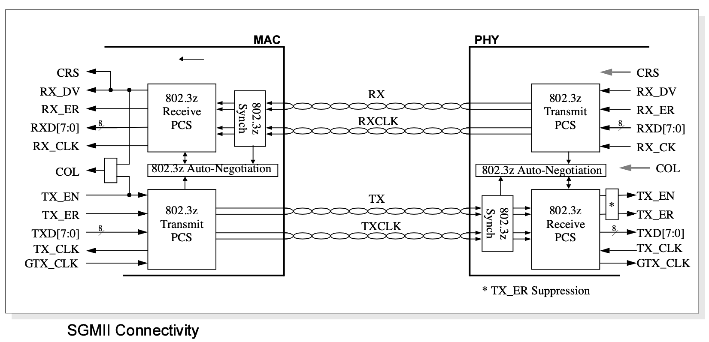

## 通信协议介绍   

### SMI通信协议介绍 
SMI全称是串行管理接口(SerialManagement Interface)。是MII接口中的管理接口。 

SMI接口包括两根信号线：MDC和MDIO，通过它，MAC层芯片（或其它控制芯片）可以访问物理层芯片的寄存器，并通过这些寄存器来对物理层芯片进行控制和管理。SMI管理接口如下： 

MDC：管理接口的时钟，它是一个非周期信号，信号的最小周期（实际是正电平时间和负电平时间之和）为400ns，最小正电平时间和负电平时间为160ns，最大的正负电平时间无限制。它与TX_CLK和RX_CLK无任何关系。 

MDIO是一根双向的数据线。用来传送MAC层的控制信息和物理层的状态信息。MDIO数据与MDC时钟同步，在MDC上升沿有效。 

\### SGMII 协议介绍 
SGMII 有四条线，为RX、RXCL、TX、TXCLK。是ethernet协议里面MAC层和PHY层之间的接口标准之一。 

 